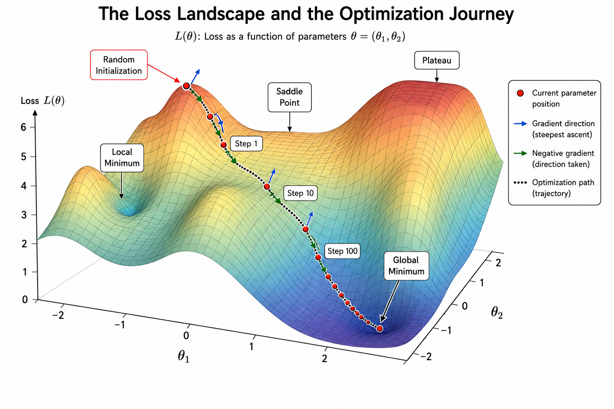
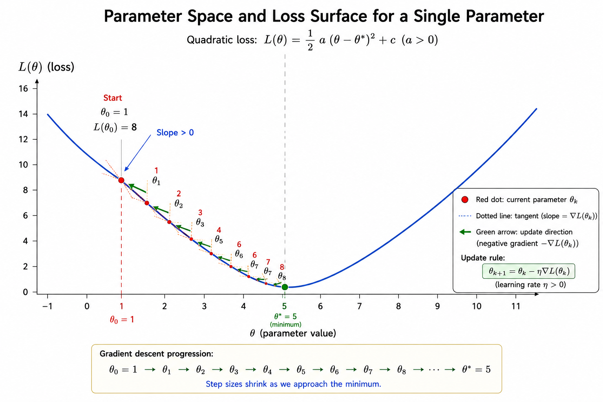
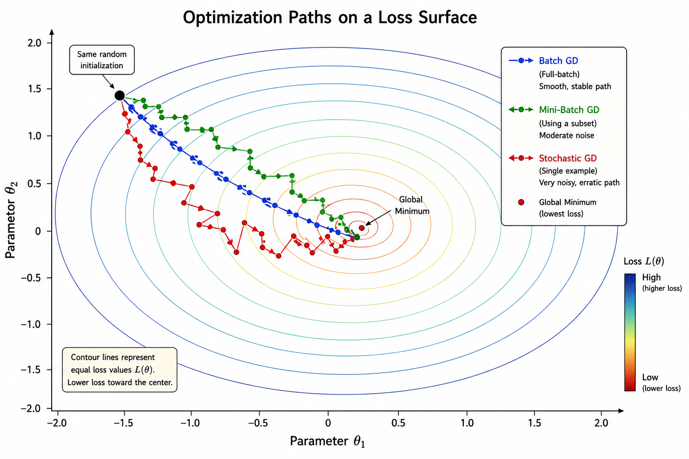
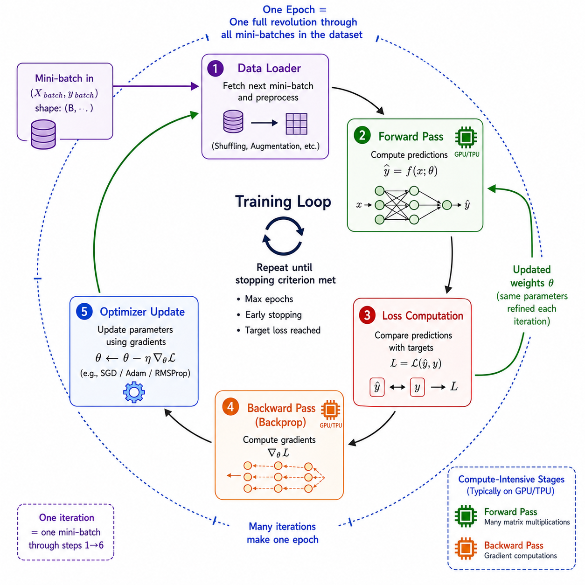
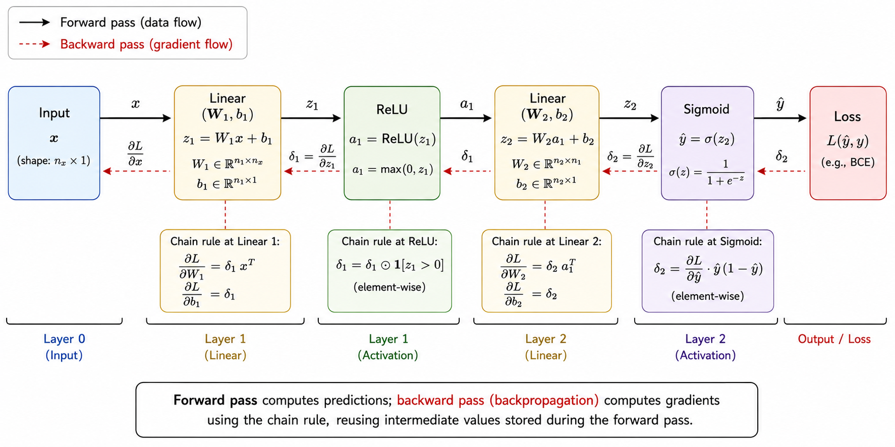
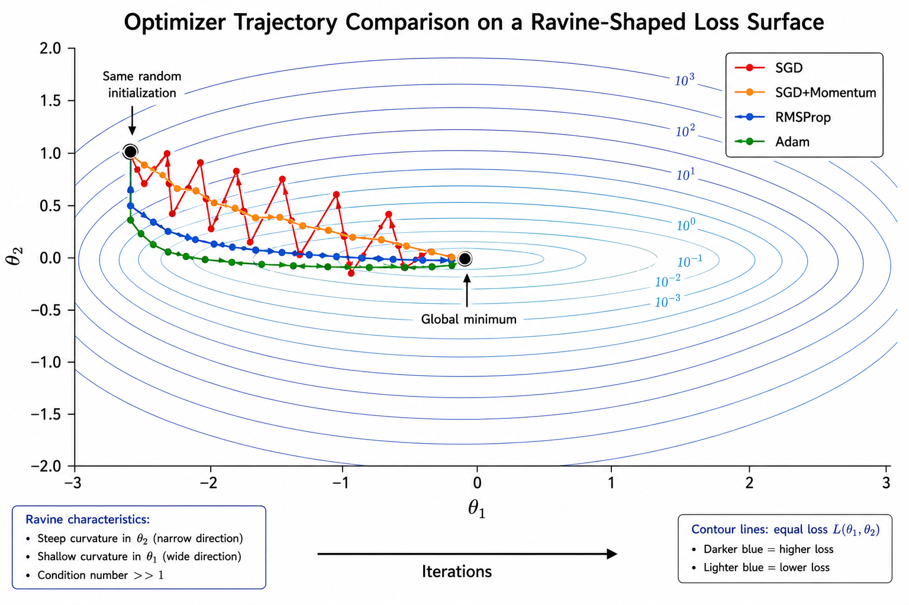
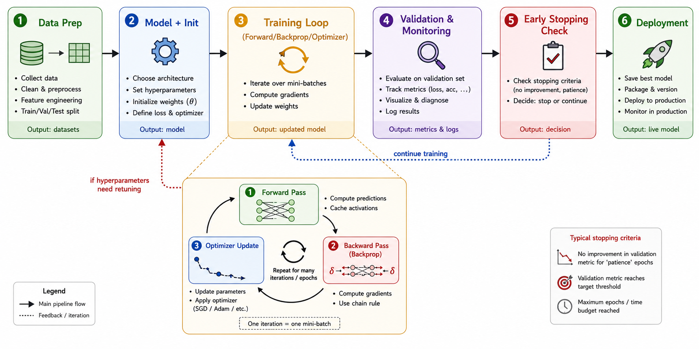
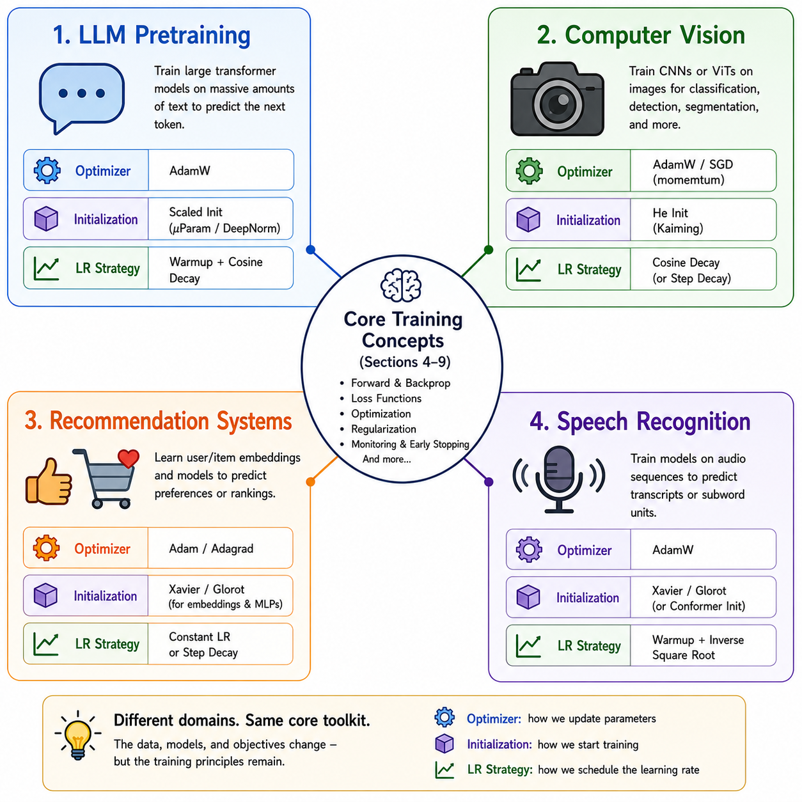

# Module 4: Training Neural Networks

> A complete intuition-to-research guide covering Gradient Descent, Backpropagation, Learning Rate, Epochs & Iterations, Optimizers (SGD, Momentum, RMSProp, Adam, AdamW), and Weight Initialization.

---

## Executive Summary

A neural network's architecture only defines *what it is capable of representing* — a deep stack of layers with millions of parameters means nothing until those parameters are tuned to actually solve a task. **Training** is the process that turns a randomly initialized, useless function approximator into a working model. This module is the single most interview-tested and research-relevant part of deep learning, because almost every practical failure ("my model isn't learning," "my loss exploded to NaN," "training is too slow," "my model overfits") traces back to a training-process decision: the optimizer, the learning rate, the batch size, or the initialization scheme.

This document treats training as what it really is: a **high-dimensional optimization problem** solved iteratively using gradients. We build up from the simplest possible picture (a ball rolling downhill) to the exact mathematics used inside PyTorch and TensorFlow's optimizers, and then to the open research questions that current labs (OpenAI, DeepMind, Google, Meta AI, FAIR, Anthropic) are still working on — including why Adam outperforms SGD in transformers but not always in CNNs, why AdamW is now the de facto default for large language models, and why initialization schemes like He and Xavier still matter even with normalization layers.

Every concept is explained four times, at increasing depth — intuition, technical mechanism, mathematical derivation, and research frontier — so the same document serves a first-year B.Tech student building their first MNIST classifier and a PhD scholar debugging optimizer behavior in a billion-parameter model.

---

## Learning Outcomes

After completing this module, the learner should be able to:

* Explain how gradient descent navigates a loss landscape and derive its parameter update rule from first principles.
* Differentiate batch, stochastic, and mini-batch gradient descent, and justify batch size choices used in real production training pipelines.
* Derive backpropagation using the chain rule and manually trace gradients through a multi-layer network.
* Tune learning rate using fixed, decayed, warmed-up, and cyclical schedules, and diagnose instability caused by poor learning rate choices.
* Distinguish epochs from iterations and compute the number of iterations required for a given dataset size, batch size, and epoch count.
* Compare SGD, Momentum, RMSProp, Adam, and AdamW mathematically and operationally, and justify which optimizer to choose for a given architecture and dataset.
* Apply Xavier/Glorot and He weight initialization correctly based on activation function choice, and explain why poor initialization causes vanishing or exploding activations.
* Diagnose common training pathologies — vanishing/exploding gradients, oscillating loss, divergence, saddle-point stalling — and propose concrete fixes.
* Confidently answer beginner-to-research-level interview questions on every topic in this module.

---

## 1. Introduction

### 1.1 Why This Topic Matters

Ask any ML engineer what separates a model that works from one that doesn't, and the answer is rarely the architecture — it's the training recipe. Two engineers can use the identical ResNet-50 architecture and get wildly different results depending on their choice of optimizer, learning rate schedule, and initialization. This is precisely why "Training Neural Networks" is one of the most heavily tested modules in AI/ML interviews: it separates candidates who memorized architecture diagrams from candidates who actually understand *why* models learn.

In a hiring context, a question like "your validation loss is oscillating wildly — what do you check first?" is really testing whether you understand learning rate, batch size, and gradient behavior — the contents of this exact module.

### 1.2 Historical Background

| Year | Milestone | Why it matters |
|---|---|---|
| 1958 | Rosenblatt's Perceptron | First trainable artificial neuron; used a simple error-correcting update rule, the conceptual ancestor of gradient descent. |
| 1969 | Minsky & Papert's critique | Showed single-layer perceptrons cannot solve non-linearly separable problems (e.g., XOR), stalling neural network research for over a decade. |
| 1986 | Backpropagation popularized (Rumelhart, Hinton, Williams) | Provided an efficient algorithm to compute gradients in multi-layer networks, reviving the field. |
| 1990s | LeCun's LeNet, early CNNs | Demonstrated backprop-trained networks could solve real vision tasks (digit recognition). |
| 2012 | AlexNet wins ImageNet | Combined deep CNNs, ReLU activations, GPU-accelerated SGD with momentum, and dropout — igniting the deep learning boom. |
| 2014–2015 | Adam optimizer published (Kingma & Ba) | Combined momentum and adaptive learning rates, becoming the default optimizer for most deep learning tasks. |
| 2017–2019 | AdamW (decoupled weight decay) published (Loshchilov & Hutter) | Fixed a subtle bug in how Adam interacted with L2 regularization; became the standard for training transformers. |
| 2018–present | Large-batch and large-language-model training | New research on learning rate warmup, layer-wise adaptive rates (LAMB, LARS), and optimizer scaling for models with hundreds of billions of parameters. |

### 1.3 Motivation: Training as Optimization

At its core, training a neural network is nothing more than solving:

$$\theta^{*} = \arg\min_{\theta} \; L(\theta)$$

where $\theta$ represents every weight and bias in the network, and $L(\theta)$ is a loss function measuring how wrong the network's predictions are. The challenge is that $L(\theta)$ is a function of millions (sometimes billions) of variables, it is **non-convex** (full of hills, valleys, plateaus, and saddle points), and we cannot compute it exactly — we can only estimate it from batches of data. Every topic in this module — gradient descent, backpropagation, optimizers, learning rate, initialization — exists to solve this one optimization problem efficiently and reliably.

### 1.4 Real-World Relevance

Every production AI system you have used — voice assistants, recommendation feeds, fraud detectors, ChatGPT-style assistants, self-driving perception stacks — was produced by exactly this training loop running for hours, days, or months on clusters of GPUs/TPUs. The dollar cost of training is dominated by how efficiently this optimization is done: a poorly tuned learning rate doesn't just slow convergence, it can waste tens of thousands of dollars in compute for large models. This is why "training infrastructure" and "optimization" roles are among the highest-paid specializations in AI engineering.




---

## 2. Fundamental Concepts

### 2.1 Intuition

Imagine you are blindfolded and dropped somewhere on a hilly landscape, and your only goal is to reach the lowest point in the valley. You cannot see the terrain, but you can feel the slope of the ground directly beneath your feet. The most sensible strategy: feel which direction is *steepest downhill*, take a small step that way, and repeat. This is gradient descent in one sentence — and almost every concept in this module is a refinement of that one idea: how big should the step be (learning rate), how often should you re-check the slope (epochs/iterations), should you check the slope using the whole landscape map or just the patch under your feet (batch vs. stochastic), and should you remember your previous direction so you don't get stuck in a small dip (momentum/optimizers)?

### 2.2 Technical Explanation

A neural network is a parameterized function $f_\theta(x)$ that maps an input $x$ to a prediction $\hat{y}$. Training consists of:

1. **Parameters ($\theta$)** — the weights and biases the network *learns*. These are adjusted automatically.
2. **Hyperparameters** — settings the engineer *chooses* before training (learning rate, batch size, number of epochs, optimizer type, initialization scheme). These are not learned by the network itself; they are tuned by the practitioner, often via experimentation or search.
3. **Loss function $L(\theta)$** — a scalar measuring how far predictions are from ground truth (e.g., cross-entropy for classification, mean squared error for regression).
4. **Gradient $\nabla_\theta L(\theta)$** — a vector pointing in the direction of steepest *increase* of the loss. Moving in the *opposite* direction decreases the loss fastest, locally.
5. **Optimizer** — the algorithm that uses the gradient to actually update $\theta$ (plain gradient descent, SGD, Momentum, RMSProp, Adam, AdamW, etc.).

The entire training process is just repeated application of: *compute the loss → compute the gradient → update the parameters*, performed thousands to millions of times.

### 2.3 Key Terminology

| Term | Acronym | Meaning |
|---|---|---|
| Gradient Descent | GD | Optimization algorithm that updates parameters in the direction opposite to the gradient of the loss. |
| Stochastic Gradient Descent | SGD | Gradient descent variant that estimates the gradient using a single (or small) sample rather than the full dataset. |
| Learning Rate | LR (often $\eta$ or $\alpha$) | A scalar controlling the size of each parameter update step. |
| Epoch | — | One complete pass through the entire training dataset. |
| Iteration / Step | — | One single parameter update, typically corresponding to one mini-batch. |
| Batch Size | — | Number of training examples used to compute one gradient estimate before an update. |
| Backpropagation | Backprop / BP | Algorithm that efficiently computes gradients of the loss with respect to every parameter using the chain rule. |
| Loss Function | — | A function quantifying the error between predictions and ground truth. |
| Optimizer | — | The update rule/algorithm (SGD, Adam, etc.) that converts gradients into parameter changes. |
| Weight Initialization | Init | The strategy used to assign starting values to weights before training begins. |
| Convergence | — | The state where the loss stops meaningfully decreasing, indicating training has stabilized. |
| Vanishing Gradient | — | A failure mode where gradients become extremely small as they propagate backward through many layers, halting learning in early layers. |
| Exploding Gradient | — | A failure mode where gradients become extremely large, causing unstable, diverging updates. |

### 2.4 Worked Example

Consider a toy 1-parameter model: predict $\hat{y} = \theta \cdot x$, with loss $L(\theta) = (\hat{y} - y)^2$ for a single data point $x = 2, y = 10$.

* Gradient: $\frac{dL}{d\theta} = 2(\theta x - y) \cdot x$
* Suppose $\theta_0 = 1$ (randomly initialized). Then $\hat{y} = 2$, and the gradient is $2(2 - 10)\cdot 2 = -32$.
* With learning rate $\eta = 0.01$: $\theta_1 = \theta_0 - \eta \cdot (-32) = 1 + 0.32 = 1.32$.
* Repeating this update moves $\theta$ progressively toward the true value $\theta^* = 5$ (since $5 \times 2 = 10$), and the loss shrinks toward zero with each step.

This single-variable example scales conceptually to networks with billions of parameters — the math is identical, just applied to a vector $\theta$ instead of a scalar.




---

## 3. Core Architecture: The Training Loop

### 3.1 Components

Every neural network training system, regardless of framework (PyTorch, TensorFlow, JAX) or scale (a laptop or a 10,000-GPU cluster), is built from the same core components:

* **Data Loader** — supplies batches of (input, label) pairs, often with shuffling and augmentation.
* **Forward Pass Engine** — computes predictions $\hat{y} = f_\theta(x)$ by pushing data through the network's layers.
* **Loss Function** — compares predictions to ground truth and outputs a scalar loss.
* **Backward Pass Engine (Autograd)** — computes $\nabla_\theta L$ for every parameter using backpropagation.
* **Optimizer** — consumes the gradients and updates $\theta$ according to its update rule (SGD, Adam, etc.).
* **Learning Rate Scheduler** — adjusts the learning rate over time (decay, warmup, cyclical).
* **Checkpointing / Logging** — saves model state periodically and tracks metrics (loss, accuracy) for monitoring.

### 3.2 Data Flow

```
Raw Dataset
   ↓
Data Loader (shuffle, batch, augment)
   ↓
Mini-Batch (x, y)
   ↓
Forward Pass  →  Predictions ŷ
   ↓
Loss Function L(ŷ, y)
   ↓
Backward Pass (Backpropagation)  →  Gradients ∇θL
   ↓
Optimizer Update Rule  →  New parameters θ
   ↓
Repeat for next mini-batch (next iteration)
   ↓
After full pass over dataset → Epoch complete
   ↓
Validation Pass (no gradient updates) → Track generalization
   ↓
Repeat for N epochs → Checkpoint best model
```

### 3.3 Working Principle

On every iteration, the network sees a mini-batch, makes predictions, measures error, and nudges every single parameter slightly in the direction that would have reduced that error. Because this happens over thousands of mini-batches drawn from a large, diverse dataset, the *accumulated* effect of these small nudges is a network that generalizes — it learns the underlying statistical pattern rather than memorizing any one example (assuming sound regularization and a properly tuned learning rate).

### 3.4 Architecture Breakdown

| Stage | Operation | Computational Cost Driver |
|---|---|---|
| Forward Pass | Matrix multiplications + activations | Number of layers × parameters per layer |
| Loss Computation | Elementwise comparison + reduction | Output dimensionality |
| Backward Pass | Chain-rule gradient computation (reverse-mode autodiff) | Roughly 2× the forward pass cost |
| Optimizer Step | Elementwise parameter update | Number of parameters (negligible compute, but memory-heavy for Adam-style optimizers, which store extra state per parameter) |




---

## 4. Gradient Descent

### 4.1 Intuition

Gradient descent is the blindfolded-hiker strategy formalized into an algorithm: at your current position, feel the slope, and step in the direction that goes downhill fastest. The "slope" in higher dimensions is the **gradient** — a vector containing the slope along every single parameter axis simultaneously. Stepping in the *negative* gradient direction is mathematically guaranteed (for small enough steps) to decrease the loss, at least locally.

### 4.2 Technical Explanation

Gradient descent is an iterative first-order optimization algorithm. "First-order" means it only uses the gradient (first derivative) of the loss, not the curvature (second derivative), which makes it computationally cheap enough to scale to networks with billions of parameters. At each step, every parameter is updated by subtracting a small fraction of its gradient.

### 4.3 Mathematical Foundation

**Update rule:**

$$\theta_{t+1} = \theta_t - \eta \, \nabla_\theta L(\theta_t)$$

| Symbol | Meaning |
|---|---|
| $\theta_t$ | Parameter vector at step $t$ |
| $\eta$ | Learning rate (step size) |
| $\nabla_\theta L(\theta_t)$ | Gradient of the loss with respect to $\theta$, evaluated at $\theta_t$ |
| $\theta_{t+1}$ | Updated parameter vector |

**Derivation intuition:** A first-order Taylor expansion of the loss around $\theta_t$ gives $L(\theta_t + \Delta\theta) \approx L(\theta_t) + \nabla L(\theta_t)^T \Delta\theta$. To minimize this approximation, we want $\Delta\theta$ to point opposite to $\nabla L(\theta_t)$ — choosing $\Delta\theta = -\eta \nabla L(\theta_t)$ guarantees the linear approximation of the loss decreases (for sufficiently small $\eta$), which is exactly the gradient descent update.

**Why it matters:** This single equation is the computational engine behind every deep learning system in existence. Every "optimizer" you will encounter (SGD, Momentum, RMSProp, Adam) is a *modification* of this base equation — they all still compute a gradient and still subtract some function of it from $\theta$.

### 4.4 Architecture / Variants: Batch, Stochastic, and Mini-Batch Gradient Descent

The gradient $\nabla_\theta L(\theta)$ is technically defined as an average over the *entire* training set:

$$\nabla_\theta L(\theta) = \frac{1}{N}\sum_{i=1}^{N} \nabla_\theta \ell(\theta; x_i, y_i)$$

Computing this exactly for every update is the **Batch Gradient Descent** approach — but it is often impractical (a dataset can have millions of examples) and wastes compute, since early in training a rough gradient estimate is often "good enough" to make progress. This motivates three operating modes:

| Variant | Examples per gradient estimate | Update frequency | Gradient noise | Typical use |
|---|---|---|---|---|
| **Batch Gradient Descent** | Entire dataset ($N$) | Once per epoch | Very low (exact gradient) | Small datasets, convex problems, theoretical analysis |
| **Stochastic Gradient Descent (SGD)** | 1 example | Every example | Very high | Online learning, extremely large/streaming datasets |
| **Mini-Batch Gradient Descent** | A subset ($m$, e.g., 32–512) | Every mini-batch | Moderate, controllable | Default choice in virtually all modern deep learning |

**Why mini-batch wins in practice:** Pure batch GD is too slow (one update per full dataset pass) and memory-hungry. Pure SGD (one example) is extremely noisy and cannot exploit GPU parallelism efficiently. Mini-batch gradient descent is the practical compromise — it produces a noisy-but-useful gradient estimate cheaply, and crucially, the noise itself acts as a mild regularizer, helping the optimizer escape shallow local minima and saddle points. Note: in modern deep learning literature and frameworks, "SGD" is used loosely to refer to mini-batch gradient descent (e.g., PyTorch's `torch.optim.SGD` actually operates on mini-batches), so always clarify batch size when this term comes up in interviews.



### 4.5 Workflow

```
Initialize parameters θ (see Section 9: Weight Initialization)
   ↓
For each epoch:
   ↓
   Shuffle training data
   ↓
   For each mini-batch (x, y):
        ↓
        Forward pass → predictions ŷ
        ↓
        Compute loss L(ŷ, y)
        ↓
        Backward pass → gradients ∇θL
        ↓
        Update θ ← θ - η∇θL  (or via chosen optimizer, see Section 8)
   ↓
   Evaluate on validation set
   ↓
Stop when convergence criteria met (or max epochs reached)
```

### 4.6 Real-World Applications

* **Industry:** Every major deep learning framework (PyTorch, TensorFlow, JAX) implements mini-batch gradient descent as the default training mode; recommendation systems at companies like Netflix and YouTube train on mini-batches of millions of user-interaction logs daily.
* **Research:** Large-scale pretraining of foundation models (GPT-style language models, vision transformers) uses extremely large effective batch sizes (often in the thousands) distributed across many GPUs/TPUs, combined with careful learning rate scaling rules.
* **Product:** Mobile keyboard predictive text models are frequently retrained using on-device or federated mini-batch SGD on small batches of user data, balancing personalization with privacy and compute constraints.

### 4.7 Interview Preparation

**Common Interview Questions**
1. What is gradient descent, and why does it use the *negative* gradient?
2. What is the difference between batch, stochastic, and mini-batch gradient descent?
3. Why do we use mini-batches instead of the full dataset on every update?
4. Does SGD guarantee convergence to the global minimum?
5. What happens if the learning rate is too large or too small in gradient descent?

**Answers**
1. The gradient points in the direction of *steepest increase* of the loss; moving opposite to it (negative gradient) decreases the loss fastest locally, which is exactly what we want when minimizing a loss function.
2. They differ in how many examples are used to estimate the gradient before each update: the full dataset (batch), a single example (stochastic), or a small subset (mini-batch) — trading off gradient accuracy against compute efficiency and update frequency.
3. Mini-batches give a "good enough" gradient estimate far more cheaply than the full dataset, exploit GPU parallelism efficiently, and the resulting gradient noise can help escape shallow local minima/saddle points, acting as a mild implicit regularizer.
4. No — for non-convex loss surfaces (true of virtually all deep networks), gradient descent only guarantees convergence to a *local* minimum or stationary point, not necessarily the global minimum. In practice, deep network local minima are usually "good enough" and often comparably good to each other.
5. Too large a learning rate causes the loss to oscillate or diverge (overshooting the minimum repeatedly); too small a learning rate causes painfully slow convergence and risks getting stuck in shallow local minima or plateaus.

**Follow-up Questions**
* How would you choose a batch size for a dataset that doesn't fit in GPU memory?
* Why might increasing batch size require also increasing the learning rate (linear scaling rule)?
* What is the relationship between gradient descent and Newton's method?

**Frequently Asked Mistakes**
* Confusing "epoch" with "iteration" when explaining how many times the gradient is computed (see Section 7 for the precise distinction).
* Claiming gradient descent always finds the global minimum — incorrect for non-convex losses.
* Forgetting that the "gradient" in mini-batch SGD is a *noisy estimate*, not the true gradient — many candidates describe mini-batch SGD as if it were exact batch gradient descent.

### 4.8 Research Perspective

* **Current limitations:** Plain gradient descent is highly sensitive to the loss surface's curvature — it converges slowly along flat directions ("ravines") and can oscillate along steep ones, motivating curvature-aware and adaptive methods (Sections 8.3–8.6).
* **Open research problems:** Understanding *why* SGD-trained deep networks generalize well despite the non-convex, massively over-parameterized loss landscape remains an active theoretical question (related to implicit regularization and the "flat minima" hypothesis).
* **Recent advancements:** Layer-wise adaptive learning rate methods (LARS, LAMB) extend gradient descent to extremely large batch sizes (tens of thousands of examples) without losing accuracy, enabling faster distributed training of large models.
* **Future directions:** Second-order and quasi-second-order methods (e.g., K-FAC, Shampoo) that incorporate curvature information are an active research area, aiming to combine the convergence speed of Newton-like methods with the scalability of first-order gradient descent.

---

## 5. Backpropagation

### 5.1 Intuition

If gradient descent tells you *which direction to step*, backpropagation is the algorithm that tells you *how to compute that direction* efficiently for a network with many layers. Think of a relay race: the error measured at the very end of the network (the output layer) needs to be "blamed" on every single weight in every layer, including the very first one. Backpropagation is the systematic way of passing that blame backward through the network, layer by layer, using the chain rule of calculus — each layer figures out "how much did *I* contribute to the final error?" and passes a refined error signal further backward.

### 5.2 Technical Explanation

Backpropagation is not a separate optimization algorithm — it is an efficient algorithm for computing $\nabla_\theta L$, the gradient needed by gradient descent (or any optimizer). Without backprop, computing gradients for a network with millions of parameters by brute-force numerical differentiation would be computationally infeasible. Backprop exploits the *layered, compositional* structure of neural networks: since the network is a composition of functions, $f(x) = f_L(f_{L-1}(\dots f_1(x)))$, calculus's chain rule lets us compute the gradient with respect to every layer's parameters using only **one forward pass and one backward pass** — a cost roughly proportional to just twice the forward pass.

### 5.3 Mathematical Foundation

Consider a simple feedforward layer: $z^{(l)} = W^{(l)} a^{(l-1)} + b^{(l)}$, followed by activation $a^{(l)} = \sigma(z^{(l)})$. We want $\frac{\partial L}{\partial W^{(l)}}$ for every layer $l$.

**Chain rule decomposition:**

$$\frac{\partial L}{\partial W^{(l)}} = \frac{\partial L}{\partial a^{(l)}} \cdot \frac{\partial a^{(l)}}{\partial z^{(l)}} \cdot \frac{\partial z^{(l)}}{\partial W^{(l)}}$$

| Term | Meaning |
|---|---|
| $\frac{\partial L}{\partial a^{(l)}}$ | How sensitive the final loss is to this layer's output activations — this is the "blame" passed backward from the next layer. |
| $\frac{\partial a^{(l)}}{\partial z^{(l)}}$ | Derivative of the activation function (e.g., $\sigma'(z)$ for sigmoid, or simply 1 / 0 for ReLU depending on sign). |
| $\frac{\partial z^{(l)}}{\partial W^{(l)}}$ | Equals $a^{(l-1)}$, the input to this layer — i.e., gradients depend on what was actually fed into the layer. |

Defining $\delta^{(l)} = \frac{\partial L}{\partial z^{(l)}}$ (the "error signal" at layer $l$), the recursive backward relationship that gives backprop its efficiency is:

$$\delta^{(l)} = \left( (W^{(l+1)})^T \delta^{(l+1)} \right) \odot \sigma'(z^{(l)})$$

where $\odot$ denotes elementwise multiplication. This recursive formula is precisely why backprop is efficient: $\delta^{(l)}$ at any layer can be computed directly from $\delta^{(l+1)}$ of the *next* layer, without ever recomputing earlier layers from scratch. Once $\delta^{(l)}$ is known, the parameter gradients are simply:

$$\frac{\partial L}{\partial W^{(l)}} = \delta^{(l)} (a^{(l-1)})^T \qquad \frac{\partial L}{\partial b^{(l)}} = \delta^{(l)}$$

**Why it matters:** This recursive structure is exactly what "vanishing" and "exploding" gradients refer to — since $\delta^{(l)}$ is a *product* of many terms (one per layer between $l$ and the output), if those terms are consistently $<1$ in magnitude, $\delta^{(l)}$ shrinks exponentially with depth (vanishing gradient); if consistently $>1$, it grows exponentially (exploding gradient). This single insight explains why activation function choice (Section 9 discusses how ReLU mitigates this versus sigmoid) and weight initialization are deeply connected to backprop's mechanics.

### 5.4 Architecture Explanation: The Computational Graph

Modern frameworks (PyTorch, TensorFlow) implement backpropagation via **automatic differentiation (autograd)** over a **computational graph** — a directed graph where each node is an operation (matrix multiply, addition, activation function) and edges represent data flow.

* **Forward pass:** Data flows through the graph left to right, and each node *also* records the local derivative function needed to differentiate itself, building up the graph dynamically (in frameworks like PyTorch) or statically (older TensorFlow 1.x style).
* **Backward pass:** Starting from the loss (a single scalar output node), gradients are propagated right to left, with each node applying the chain rule using its locally recorded derivative and passing the result to its parent nodes.
* **Reverse-mode autodiff:** This right-to-left strategy is called reverse-mode automatic differentiation, and it is what makes backprop efficient for the deep-learning case of "many inputs (parameters), one output (scalar loss)" — the entire gradient vector is computed in a single backward pass, regardless of how many parameters exist.




### 5.5 Workflow

```
Forward Pass:
   Input x
      ↓ (Layer 1: linear + activation)
   a1
      ↓ (Layer 2: linear + activation)
   a2
      ↓ ... (continue through all layers)
   ŷ (final prediction)
      ↓
   Compute Loss L(ŷ, y)

Backward Pass (Backpropagation):
   ∂L/∂ŷ  (gradient at output)
      ↓
   δ_L = ∂L/∂ŷ ⊙ σ'(z_L)   (error signal at last layer)
      ↓
   ∂L/∂W_L = δ_L · a_(L-1)^T   (gradient for last layer's weights)
      ↓
   δ_(L-1) = (W_L^T δ_L) ⊙ σ'(z_(L-1))   (propagate error backward)
      ↓
   ... repeat backward through every layer ...
      ↓
   All gradients ∂L/∂W collected → passed to Optimizer (Section 8)
```

### 5.6 Real-World Applications

* **Industry:** Every deep learning framework's `.backward()` (PyTorch) or `GradientTape` (TensorFlow) call is a direct implementation of this algorithm, used identically whether training a tiny image classifier or a 175-billion-parameter language model.
* **Research:** Backpropagation through time (BPTT) extends this same chain-rule logic to recurrent neural networks for sequence modeling, and "backprop through structure" variants are used in graph neural networks.
* **Product:** Speech recognition systems (e.g., on-device voice assistants) are trained using backprop through deep recurrent or transformer-based acoustic models, with careful gradient clipping to handle long sequences without exploding gradients.

### 5.7 Interview Preparation

**Common Interview Questions**
1. Explain backpropagation in your own words.
2. Derive the gradient of a single weight in a 2-layer network using the chain rule.
3. Why is backpropagation efficient compared to numerically estimating each gradient independently?
4. What causes vanishing and exploding gradients, and how does backprop's structure explain it?
5. What is the difference between automatic differentiation and symbolic/numerical differentiation?

**Answers**
1. Backpropagation computes the gradient of the loss with respect to every parameter in a neural network by applying the chain rule layer by layer, starting from the output error and propagating it backward through the network, reusing values computed during the forward pass.
2. (Worked through explicitly in Section 5.3 above using $\delta^{(l)}$ notation — candidates should be able to reproduce this on a whiteboard.)
3. Backprop computes the *entire* gradient vector in one backward pass with cost proportional to the forward pass, by reusing intermediate computations; naively perturbing each of millions of parameters individually (numerical differentiation) would require millions of separate forward passes.
4. Because the error signal $\delta^{(l)}$ at any layer is a product of terms from every layer above it, if those terms are systematically less than 1 (common with sigmoid/tanh activations whose derivatives are bounded below 0.25), the product shrinks exponentially with depth (vanishing); if systematically greater than 1 (e.g., poorly scaled weights), it grows exponentially (exploding).
5. Automatic differentiation computes exact derivatives by applying the chain rule mechanically through recorded elementary operations (what backprop uses); symbolic differentiation manipulates mathematical expressions directly (can blow up in expression size); numerical differentiation approximates derivatives using finite differences, which is computationally expensive and imprecise for many parameters.

**Follow-up Questions**
* How does gradient clipping help when backprop produces exploding gradients?
* How is backpropagation modified for networks with skip/residual connections?
* Why does batch normalization help mitigate vanishing gradients, mechanically speaking?

**Frequently Asked Mistakes**
* Describing backpropagation as if it *is* the optimization algorithm rather than the gradient-computation algorithm that *feeds* the optimizer.
* Forgetting that intermediate activations must be cached during the forward pass for backprop to reuse them (a common source of "out of memory" errors in practice, addressed by techniques like gradient checkpointing).
* Misapplying the chain rule order (multiplying terms in the wrong order or forgetting the elementwise Hadamard product for activation derivatives).

### 5.8 Research Perspective

* **Current limitations:** Backpropagation requires storing all intermediate activations for the backward pass, creating significant memory pressure for very deep or very wide networks — a major bottleneck for training today's largest models.
* **Open research problems:** Whether the brain implements anything resembling backpropagation is an open and actively debated question in computational neuroscience, motivating biologically plausible alternatives like feedback alignment and predictive coding.
* **Recent advancements:** Gradient checkpointing (trading compute for memory by recomputing activations during the backward pass instead of storing them) and mixed-precision backprop are now standard techniques for training extremely large models within fixed GPU memory budgets.
* **Future directions:** Research into forward-only learning rules (e.g., the "Forward-Forward" algorithm proposed by Geoffrey Hinton) explores whether competitive learning is possible without a traditional backward pass at all, which could have implications for more memory-efficient or biologically inspired training.

---

## 6. Learning Rate

### 6.1 Intuition

The learning rate is the size of each step the blindfolded hiker takes downhill. Take steps that are too large, and you might leap clean over the valley and end up higher on the opposite slope than where you started — or bounce back and forth forever without ever settling. Take steps that are too small, and you will eventually reach the bottom, but it might take an impractically long time, and you risk getting permanently stuck in a shallow dip that isn't really the lowest point.

### 6.2 Technical Explanation

The learning rate $\eta$ is a scalar hyperparameter that scales the gradient before it is subtracted from the parameters. It is, by consensus among practitioners and researchers, the single most important hyperparameter in deep learning — more impactful on final model quality than almost any architectural choice. Because the "right" learning rate depends on the loss landscape's curvature (which differs across layers, across time during training, and across problems), modern training rarely uses a single fixed value; instead, **learning rate schedules** adjust $\eta$ over the course of training.

### 6.3 Mathematical Foundation

**Base role in the update rule:**

$$\theta_{t+1} = \theta_t - \eta_t \, g_t$$

where $g_t$ is the gradient (or optimizer-transformed gradient) at step $t$, and $\eta_t$ may vary with $t$ under a schedule.

**Common schedules:**

| Schedule | Formula | Behavior |
|---|---|---|
| Step decay | $\eta_t = \eta_0 \cdot \gamma^{\lfloor t/k \rfloor}$ | Drops learning rate by factor $\gamma$ every $k$ steps/epochs. |
| Exponential decay | $\eta_t = \eta_0 \cdot e^{-\lambda t}$ | Smooth, continuous decay over time. |
| Cosine annealing | $\eta_t = \eta_{min} + \tfrac{1}{2}(\eta_0 - \eta_{min})\left(1 + \cos\left(\tfrac{t}{T}\pi\right)\right)$ | Smoothly decays following a cosine curve from $\eta_0$ down to $\eta_{min}$ over $T$ total steps; very popular for training transformers. |
| Linear warmup | $\eta_t = \eta_0 \cdot \frac{t}{t_{warmup}}$ for $t < t_{warmup}$ | Gradually increases learning rate from near-zero at the start of training, preventing early instability when weights and optimizer statistics are not yet well-calibrated. |

**Why it matters:** The right learning rate is tightly coupled to the curvature (second derivative) of the loss surface — a learning rate larger than roughly $2/\lambda_{max}$ (where $\lambda_{max}$ is the largest eigenvalue of the loss's local curvature matrix, the Hessian) will cause divergence along that direction. Since this curvature varies across the loss surface and across different parameter groups, no single fixed learning rate is optimal throughout training — this is the entire motivation for both schedules and adaptive optimizers (Section 8).

### 6.4 Architecture / Scheduling Strategies in Practice

* **Warmup + Decay (the modern default for transformers):** Start with a short linear warmup phase (preventing instability from large initial gradients), followed by cosine or linear decay for the remainder of training.
* **Cyclical Learning Rates (CLR):** Oscillate the learning rate between a lower and upper bound, which can help the optimizer escape sharp local minima and has been shown to sometimes speed up convergence.
* **Reduce-on-Plateau:** Monitor validation loss, and reduce the learning rate by a fixed factor whenever it stops improving for a set number of epochs — a reactive, data-driven schedule.
* **Learning Rate Finder:** A diagnostic technique (popularized by the fastai library) that trains for a few iterations while exponentially increasing the learning rate, plotting loss vs. learning rate to visually identify a good starting value before full training begins.

### 6.5 Workflow

```
Choose initial learning rate η0 (often via LR-finder or known defaults, e.g., 1e-3 for Adam, 1e-1 for SGD with momentum)
   ↓
Optionally apply warmup for first k steps
   ↓
Train for several epochs, monitoring training and validation loss
   ↓
If loss oscillates/diverges → learning rate too high → reduce η
   ↓
If loss decreases extremely slowly → learning rate too low → increase η, or switch schedule
   ↓
Apply decay schedule (step/exponential/cosine) as training progresses
   ↓
Fine-tune final learning rate value near convergence (often very small, e.g., 1e-5) for stability
```

### 6.6 Real-World Applications

* **Industry:** Production-grade vision and NLP pipelines (e.g., at Google, Meta) almost always use a warmup-then-decay schedule; the BERT and GPT family of models explicitly publish their learning rate schedules as part of their training recipes.
* **Research:** Studies on "super-convergence" demonstrate that carefully tuned cyclical learning rates can train models to high accuracy in a fraction of the epochs normally required.
* **Product:** On-device model fine-tuning (e.g., personalizing a recommendation model to a single user's recent behavior) typically uses very small, carefully bounded learning rates to avoid catastrophic forgetting of previously learned general patterns.

### 6.7 Interview Preparation

**Common Interview Questions**
1. What happens to training if the learning rate is set too high? Too low?
2. Why do modern transformer training recipes use a learning rate "warmup" phase?
3. Explain cosine annealing and why it's popular.
4. How would you diagnose whether a model's poor performance is due to the learning rate?
5. Is there a single "best" learning rate for all problems?

**Answers**
1. Too high causes the loss to oscillate, spike, or diverge entirely (sometimes producing NaN values) because updates overshoot the minimum; too low causes painfully slow convergence and increases the risk of getting stuck in shallow local minima or plateaus before training time runs out.
2. Early in training, the optimizer's internal statistics (e.g., Adam's moment estimates) and the model's weights are poorly calibrated, so large gradients combined with a full-strength learning rate can cause instability; warmup gradually ramps up the learning rate, giving the model and optimizer time to stabilize before applying full-strength updates.
3. Cosine annealing smoothly reduces the learning rate following a cosine curve from an initial value down to a minimum, avoiding the abrupt jumps of step decay; it is popular because it tends to produce strong final accuracy and pairs well with warmup phases in modern training recipes.
4. Plot training loss curves: erratic spikes or divergence suggest too-high a learning rate; a flat, barely-decreasing loss over many epochs suggests too-low a learning rate (assuming the model has sufficient capacity and data for the task).
5. No — the optimal learning rate depends on the optimizer, batch size, model architecture, and dataset; it is typically found empirically via a learning rate finder, grid/random search, or established defaults from similar published work.

**Follow-up Questions**
* How does batch size interact with the optimal learning rate (the "linear scaling rule")?
* What is gradient clipping, and how does it relate to learning rate stability?
* How would you implement a custom learning rate scheduler in PyTorch or TensorFlow?

**Frequently Asked Mistakes**
* Assuming a single fixed learning rate is used throughout training in modern practice — nearly all state-of-the-art training recipes use a schedule.
* Confusing learning rate decay with weight decay (regularization) — these are entirely different mechanisms (see Section 8.6 on AdamW for the precise distinction).
* Not mentioning warmup when discussing transformer or large-batch training, which is now considered a near-mandatory practice.

### 6.8 Research Perspective

* **Current limitations:** Despite decades of research, choosing the optimal learning rate and schedule still largely requires empirical tuning rather than a closed-form solution, especially for novel architectures or datasets.
* **Open research problems:** Theoretically characterizing the relationship between learning rate, batch size, and generalization (why certain learning-rate/batch-size combinations generalize better than others) remains an active and only partially resolved research area.
* **Recent advancements:** "Learning rate-free" or self-tuning optimizers (e.g., D-Adaptation, Prodigy) attempt to automatically estimate a near-optimal learning rate during training itself, removing the need for manual tuning.
* **Future directions:** As models scale to hundreds of billions of parameters, research into principled learning rate transfer rules (predicting the right learning rate for a large model from experiments on smaller proxy models, as in $\mu$Transfer/$\mu$P) is becoming critical for reducing the cost of hyperparameter search at scale.

---

## 7. Epochs and Iterations

### 7.1 Intuition

If training is a journey across the loss landscape, an **iteration** is a single step, and an **epoch** is a complete lap around the entire training dataset. Students very frequently confuse these two terms in interviews — the distinction is simple but precise, and getting it wrong is one of the most common "easy point lost" mistakes in entry-level ML interviews.

### 7.2 Technical Explanation

* **Iteration (or step):** One forward pass + backward pass + parameter update, performed on a single mini-batch.
* **Epoch:** One complete pass through the *entire* training dataset — i.e., enough iterations to have seen every training example exactly once (assuming no overlap or skipped data).

A model is typically trained for many epochs (e.g., 10, 100, sometimes just a fraction of one for enormous datasets used to train large language models), with the data reshuffled between epochs to ensure the model doesn't learn the specific order in which examples were presented.

### 7.3 Mathematical Relationship

$$\text{Iterations per epoch} = \left\lceil \frac{N}{m} \right\rceil$$

$$\text{Total iterations} = E \times \left\lceil \frac{N}{m} \right\rceil$$

| Symbol | Meaning |
|---|---|
| $N$ | Total number of training examples in the dataset |
| $m$ | Batch size (mini-batch size) |
| $E$ | Total number of epochs |

**Worked example:** A dataset with $N = 50{,}000$ images, trained with batch size $m = 250$, for $E = 20$ epochs:

* Iterations per epoch $= 50{,}000 / 250 = 200$
* Total iterations $= 20 \times 200 = 4{,}000$

This means the optimizer performs exactly 4,000 parameter updates over the full training run, even though the model "sees" the dataset 20 times.

### 7.4 Workflow

```
For epoch = 1 to E:
   ↓
   Shuffle dataset (new random order each epoch)
   ↓
   For iteration = 1 to ⌈N/m⌉:
        ↓
        Draw next mini-batch of size m
        ↓
        Forward + Backward + Optimizer Update (one iteration)
   ↓
   End of epoch reached (all N examples have been seen once)
   ↓
   Run validation pass; log metrics; optionally checkpoint model
   ↓
Repeat until E epochs complete, or early stopping criterion triggered
```

### 7.5 Real-World Applications

* **Industry:** Production training dashboards (e.g., Weights & Biases, TensorBoard) always log both "step" (iteration) and "epoch" metrics, since loss can fluctuate per-iteration but trends are clearer when viewed per-epoch.
* **Research:** Large language model training papers often report compute and progress in terms of total tokens/iterations processed rather than epochs, since web-scale datasets are often so large the model may not even complete a single epoch.
* **Product:** Early stopping mechanisms in deployed training pipelines (e.g., automatically halting training when validation loss stops improving for several consecutive epochs) directly rely on the epoch/iteration distinction to decide when to checkpoint and stop.

### 7.6 Interview Preparation

**Common Interview Questions**
1. What's the difference between an epoch and an iteration?
2. If a dataset has 100,000 samples and batch size is 1,000, how many iterations are in one epoch?
3. Why do we train for multiple epochs instead of just one very long pass?
4. Why is the dataset reshuffled between epochs?
5. What is early stopping, and how does it relate to epochs?

**Answers**
1. An iteration is a single parameter update using one mini-batch; an epoch is one complete pass through the entire training dataset, typically consisting of many iterations.
2. $100{,}000 / 1{,}000 = 100$ iterations per epoch.
3. A single pass is rarely enough for the network to sufficiently minimize the loss; revisiting the data across multiple epochs (with continued small updates) allows the optimizer to converge closer to a good minimum, especially since each individual mini-batch gradient is a noisy estimate.
4. Reshuffling prevents the model from learning spurious patterns tied to data ordering and ensures each epoch's mini-batches are a different random sample of combinations, improving generalization and reducing the chance of the optimizer getting trapped in patterns caused by a fixed ordering.
5. Early stopping monitors validation performance after each epoch and halts training once it stops improving (or starts worsening, indicating overfitting), saving compute and helping select a well-generalizing checkpoint rather than training a fixed, possibly excessive number of epochs.

**Follow-up Questions**
* How does batch size affect the number of iterations per epoch, holding dataset size fixed?
* In distributed training across multiple GPUs, how is "iteration" typically redefined (e.g., per-GPU step vs. global step)?
* Why might a state-of-the-art language model be trained for less than one full epoch over its dataset?

**Frequently Asked Mistakes**
* Using "epoch" and "iteration" interchangeably, which signals a lack of precise understanding to interviewers.
* Forgetting to account for the ceiling function when the dataset size isn't perfectly divisible by the batch size (the last mini-batch in an epoch may be smaller).
* Assuming more epochs always means better performance — beyond a point, additional epochs typically cause overfitting rather than improvement.

### 7.7 Research Perspective

* **Current limitations:** For massive web-scale datasets used in foundation model training, the traditional "epoch" framing becomes less meaningful since models are often trained on a fraction of a single epoch over deduplicated, filtered internet-scale text or image corpora.
* **Open research problems:** Determining optimal "compute-data-parameter" tradeoffs (as formalized by scaling laws such as Chinchilla) — i.e., how many tokens/iterations to train for given a fixed compute budget and model size — is an active research area.
* **Recent advancements:** Curriculum learning and data-mixture scheduling research explore varying *what* data is shown at different iterations/epochs (rather than just shuffling uniformly), aiming to improve sample efficiency.
* **Future directions:** As datasets grow faster than compute budgets, research into more sample-efficient training (extracting more learning signal per iteration, e.g., via better data curation or denser supervision) is increasingly important for sustainable large-model training.

---

## 8. Optimizers

### 8.1 Intuition

Plain gradient descent treats every direction in parameter space identically and has no memory of where it has been. This is like a hiker who, on every single step, forgets which way they were just walking and only reacts to the ground directly underfoot — useful, but inefficient on terrain with long narrow ravines (where they'll zig-zag back and forth across the ravine walls instead of running smoothly along its floor) or flat plateaus (where they'll barely move at all). **Optimizers** are smarter walking strategies layered on top of the basic gradient: some give the hiker *momentum* (remembering recent direction so they barrel through small bumps), others give each direction its *own adaptive step size* (taking bigger steps in directions that have historically been flat, smaller steps in directions that have been steep), and the most popular modern optimizers (Adam, AdamW) combine both ideas.

### 8.2 SGD (Stochastic Gradient Descent, optionally with Momentum)

**Technical Explanation:** "SGD" as implemented in libraries like PyTorch refers to mini-batch gradient descent (Section 4.4), optionally combined with momentum. Plain SGD applies the vanilla update rule directly using the mini-batch gradient estimate.

**Mathematical Foundation:**

$$\theta_{t+1} = \theta_t - \eta\, g_t \qquad \text{where } g_t = \nabla_\theta L(\theta_t; \text{mini-batch})$$

This is identical to the gradient descent rule from Section 4.3, just with $g_t$ understood to be a mini-batch estimate rather than the exact full-dataset gradient.

**Strengths:** Simple, well-understood, low memory overhead (no extra state per parameter), and — with proper tuning — often produces models that generalize as well as or better than adaptive methods, especially for computer vision tasks (e.g., most ResNet ImageNet results use SGD with momentum, not Adam).

**Weaknesses:** Highly sensitive to learning rate choice; struggles on loss surfaces with very different curvature across dimensions (ravines), tending to oscillate.

### 8.3 Momentum

**Technical Explanation:** Momentum addresses SGD's oscillation problem in ravines by accumulating a *running average* of past gradients (analogous to physical momentum — a ball rolling downhill builds speed and isn't easily deflected by small bumps). Directions where the gradient consistently points the same way get amplified (faster movement); directions where the gradient frequently flips sign get dampened (the oscillations partially cancel out).

**Mathematical Foundation:**

$$v_t = \gamma v_{t-1} + g_t \qquad \theta_{t+1} = \theta_t - \eta\, v_t$$

| Symbol | Meaning |
|---|---|
| $v_t$ | "Velocity" — exponentially weighted accumulation of past gradients |
| $\gamma$ | Momentum coefficient (typically $0.9$), controlling how much past velocity is retained |
| $g_t$ | Current mini-batch gradient |

**Why it matters:** Unrolling the recursion shows $v_t = \sum_{k=0}^{t} \gamma^{t-k} g_k$ — an exponentially decaying weighted sum of *all* past gradients, with recent gradients weighted more heavily. This smooths out the noisy zig-zag of plain SGD and accelerates progress along consistent directions, often dramatically speeding up convergence in ravine-like loss surfaces.

### 8.4 RMSProp (Root Mean Square Propagation)

**Technical Explanation:** RMSProp (proposed by Geoffrey Hinton, unpublished but presented in his Coursera course) tackles a different problem: different parameters may need very different step sizes — a parameter with consistently large gradients should take smaller relative steps (to avoid overshooting), while a parameter with consistently small gradients should take larger relative steps (to make meaningful progress). RMSProp achieves this by dividing the learning rate for each parameter by a running estimate of that parameter's recent gradient magnitude.

**Mathematical Foundation:**

$$s_t = \beta s_{t-1} + (1-\beta) g_t^2 \qquad \theta_{t+1} = \theta_t - \frac{\eta}{\sqrt{s_t} + \epsilon}\, g_t$$

| Symbol | Meaning |
|---|---|
| $s_t$ | Exponentially weighted moving average of squared gradients (per parameter) |
| $\beta$ | Decay rate for the moving average (typically $0.9$ or $0.99$) |
| $\epsilon$ | A tiny constant (e.g., $10^{-8}$) added purely to prevent division by zero |

**Why it matters:** $\sqrt{s_t}$ approximates the recent typical magnitude of the gradient for that specific parameter. Dividing by it means parameters with historically large/noisy gradients get their effective learning rate shrunk, and parameters with historically small gradients get their effective learning rate boosted — an *adaptive, per-parameter* learning rate, contrasting with the single global $\eta$ used in plain SGD/Momentum.

### 8.5 Adam (Adaptive Moment Estimation)

**Technical Explanation:** Adam, introduced by Kingma & Ba, directly combines Momentum's idea (tracking a running average of the gradient itself — the "first moment") with RMSProp's idea (tracking a running average of the squared gradient — the "second moment"), then applies a bias-correction step to account for the fact that both running averages start at zero and are therefore initially biased toward zero.

**Mathematical Foundation:**

$$m_t = \beta_1 m_{t-1} + (1-\beta_1) g_t \qquad \text{(first moment: mean of gradients)}$$
$$v_t = \beta_2 v_{t-1} + (1-\beta_2) g_t^2 \qquad \text{(second moment: mean of squared gradients)}$$
$$\hat{m}_t = \frac{m_t}{1-\beta_1^t} \qquad \hat{v}_t = \frac{v_t}{1-\beta_2^t} \qquad \text{(bias correction)}$$
$$\theta_{t+1} = \theta_t - \frac{\eta}{\sqrt{\hat{v}_t} + \epsilon}\, \hat{m}_t$$

| Symbol | Meaning | Typical default |
|---|---|---|
| $\beta_1$ | Decay rate for the first moment (mean of gradients) | $0.9$ |
| $\beta_2$ | Decay rate for the second moment (mean of squared gradients) | $0.999$ |
| $\hat{m}_t, \hat{v}_t$ | Bias-corrected moment estimates | — |
| $\epsilon$ | Numerical stability constant | $10^{-8}$ |

**Derivation intuition for bias correction:** Since $m_0 = v_0 = 0$, early estimates $m_t, v_t$ are biased toward zero (they haven't accumulated enough history yet). Dividing by $(1 - \beta_1^t)$ and $(1 - \beta_2^t)$ exactly corrects for this geometric-series bias, which matters most in the first several iterations of training and becomes negligible as $t$ grows large (since $\beta^t \to 0$).

**Why it matters:** Adam essentially gets "the best of both worlds" — momentum's smoothing/acceleration and RMSProp's per-parameter adaptive scaling — which is why it converges quickly and reliably across a very wide range of problems with minimal tuning, making it the default starting choice for most practitioners, especially for transformers and NLP tasks.

### 8.6 AdamW (Adam with Decoupled Weight Decay)

**Technical Explanation:** AdamW, proposed by Loshchilov & Hutter, fixes a subtle but important flaw discovered in how standard Adam interacts with L2 regularization (weight decay). In plain SGD, adding "weight decay" (shrinking weights toward zero each step) is mathematically equivalent to adding an L2 penalty term to the loss before computing gradients. However, in Adam, because the weight-decay-induced gradient term gets divided by $\sqrt{\hat{v}_t}$ along with the actual task gradient, the effective amount of regularization ends up varying unpredictably per parameter — which weakens and distorts the intended regularization effect. AdamW decouples weight decay from the gradient-based adaptive step entirely, applying it as a separate, direct shrinkage of the weights.

**Mathematical Foundation:**

$$\theta_{t+1} = \theta_t - \eta \left( \frac{\hat{m}_t}{\sqrt{\hat{v}_t} + \epsilon} + \lambda \theta_t \right)$$

| Symbol | Meaning |
|---|---|
| $\lambda$ | Weight decay coefficient, applied directly and proportionally to the current weight value $\theta_t$ |
| (all other terms) | Identical to standard Adam above |

**Why it matters:** This decoupling restores weight decay to behave the way practitioners expect (a clean, predictable, uniform shrinkage toward zero, independent of each parameter's adaptive learning rate scaling) and has been empirically shown to improve generalization meaningfully. AdamW is now the default optimizer for training the vast majority of modern transformer-based models (BERT, GPT-family, vision transformers).

### 8.7 Optimizer Comparison Table

| Optimizer | Tracks Momentum? | Per-Parameter Adaptive LR? | Extra Memory per Parameter | Typical Use Case | Key Risk |
|---|---|---|---|---|---|
| **SGD** | No (unless momentum variant used) | No | None | Simple baselines; CNNs (often with momentum) where careful LR tuning is feasible | Slow on ravine-shaped losses; sensitive to LR |
| **Momentum (SGD+Momentum)** | Yes | No | 1× (velocity $v$) | Computer vision (ResNets, etc.), where it often generalizes better than Adam | Can overshoot if momentum coefficient too high |
| **RMSProp** | No | Yes | 1× (squared-gradient avg $s$) | RNNs, non-stationary objectives | No momentum smoothing on its own |
| **Adam** | Yes | Yes | 2× ($m$ and $v$) | Default for NLP/transformers; fast, robust convergence with minimal tuning | Can generalize slightly worse than well-tuned SGD+Momentum on some vision tasks; weight decay interaction issue (fixed by AdamW) |
| **AdamW** | Yes | Yes | 2× ($m$ and $v$) | De facto standard for transformer pretraining (BERT, GPT, ViT) | Still requires tuning $\lambda$ (weight decay) and learning rate schedule carefully |




### 8.8 Workflow: Choosing and Using an Optimizer

```
Start: Define model and loss function
   ↓
Is this a transformer / NLP / large-scale pretraining task?
   ↓ Yes → Use AdamW with warmup + cosine decay schedule, tune λ (weight decay) and η
   ↓ No
Is this a CNN / vision task where compute allows careful tuning?
   ↓ Yes → Try SGD + Momentum (γ ≈ 0.9) with step/cosine LR decay; often best generalization
   ↓ No
Need a fast, robust default with minimal tuning effort?
   ↓ Yes → Use Adam (β1=0.9, β2=0.999, η≈1e-3) as a strong general-purpose baseline
   ↓
Monitor training/validation loss curves
   ↓
If oscillating/diverging → reduce η or increase β2 (more smoothing)
If converging too slowly → consider switching from SGD to Adam/AdamW, or increase η
   ↓
Finalize optimizer + hyperparameters via validation performance
```

### 8.9 Real-World Applications

* **Industry:** Hugging Face's `transformers` library defaults nearly every pretraining and fine-tuning script to AdamW; PyTorch's vision reference training scripts for ResNet/ImageNet default to SGD with momentum.
* **Research:** The original Adam paper (Kingma & Ba, ICLR 2015) remains one of the most-cited deep learning papers of all time, underscoring how central optimizer choice is to the field's progress; AdamW's introduction at ICLR 2019 directly improved reproducibility and final accuracy across transformer benchmarks.
* **Product:** Large-scale recommendation systems (e.g., ad ranking and feed ranking models at major social platforms) commonly use variants of Adam/AdamW combined with custom learning-rate warmup schedules tuned specifically for their massive, sparse, high-cardinality feature spaces.

### 8.10 Interview Preparation

**Common Interview Questions**
1. Explain the difference between SGD, Momentum, RMSProp, and Adam.
2. Why does Adam combine both momentum and adaptive learning rates?
3. What problem does AdamW solve that Adam doesn't?
4. Why might SGD with momentum sometimes generalize better than Adam, even though Adam converges faster?
5. What are $\beta_1$ and $\beta_2$ in Adam, and what do their typical default values represent?
6. Why do Adam and RMSProp need an $\epsilon$ term?

**Answers**
1. SGD applies the raw mini-batch gradient directly; Momentum adds an exponentially weighted accumulation of past gradients to smooth and accelerate progress; RMSProp adapts the effective learning rate per-parameter based on a running average of squared gradients; Adam combines both momentum (first moment) and RMSProp-style adaptive scaling (second moment), with bias correction.
2. Combining both ideas captures the benefits of each: momentum accelerates and smooths progress along consistent gradient directions, while adaptive per-parameter scaling prevents any single parameter's historically large or small gradients from causing instability or stagnation — together producing fast, robust convergence across a wide range of problems.
3. AdamW decouples weight decay (L2-style regularization) from the adaptive gradient scaling, applying it as a direct, uniform shrinkage of weights rather than letting it get distorted by division through $\sqrt{\hat{v}_t}$, which restores weight decay's intended, predictable regularization effect.
4. Adam's aggressive, per-parameter adaptive scaling can sometimes converge to sharper minima that generalize slightly worse, whereas SGD with momentum's noisier, less-adapted trajectory has been empirically observed (especially in vision tasks) to settle into flatter minima that often generalize better — though this is an active and nuanced research area, not a universal rule.
5. $\beta_1$ (default 0.9) controls the decay rate of the running average of gradients (momentum-like term); $\beta_2$ (default 0.999) controls the decay rate of the running average of squared gradients (adaptive-scaling term); these defaults reflect empirically robust choices found to work well across a very wide range of tasks.
6. $\epsilon$ is a tiny constant added to the denominator purely to prevent division by zero when the accumulated squared-gradient term $\sqrt{\hat{v}_t}$ (or $\sqrt{s_t}$ in RMSProp) is extremely small, which would otherwise cause a numerically unstable, enormous update.

**Follow-up Questions**
* How would you implement Adam from scratch using only NumPy?
* What is the LAMB optimizer, and how does it extend Adam-style updates to very large batch sizes?
* Why does Adam sometimes fail to converge on certain convex problems (as shown in the "On the Convergence of Adam" critique paper), and how does AMSGrad attempt to fix this?

**Frequently Asked Mistakes**
* Stating that Adam is "always better" than SGD — empirically false; the right choice is task- and domain-dependent (Section 8.7's table makes this explicit).
* Confusing weight decay with L2 regularization as if they're always mathematically identical — true for plain SGD, but *not* true for Adam unless using the decoupled AdamW formulation.
* Forgetting the bias-correction step when explaining/deriving Adam, which is required precisely because $m_0 = v_0 = 0$.

### 8.11 Research Perspective

* **Current limitations:** Despite Adam's empirical success, its theoretical convergence guarantees are weaker than originally claimed — a well-known paper (Reddi, Kale & Kumar, 2018) showed cases where Adam fails to converge even on simple convex problems, motivating the AMSGrad variant.
* **Open research problems:** A complete theoretical explanation for *why* Adam-family optimizers work so well in practice, and why different optimizers lead to solutions with different generalization properties, remains incompletely understood — this connects to the broader open question of implicit regularization in deep learning.
* **Recent advancements:** Newer optimizers such as **Lion** (EvoLved Sign Momentum, discovered via program search at Google) and **Sophia** (a lightweight second-order method) claim faster convergence and lower memory footprint than AdamW for large language model training; layer-wise adaptive methods like **LAMB** and **LARS** enable stable training at extremely large batch sizes.
* **Future directions:** As model sizes grow, reducing optimizer memory overhead (Adam-family optimizers require storing two extra tensors per parameter) is an active research area, with techniques like 8-bit Adam and factored second-moment estimates (Adafactor) aiming to make adaptive optimization feasible for ever-larger models without proportionally larger memory budgets.

---

## 9. Weight Initialization

### 9.1 Intuition

Before training begins, every weight in a network must start somewhere. If you initialize every weight to exactly zero, every neuron in a layer computes the exact same thing and receives the exact same gradient — the network becomes permanently "symmetric" and can never learn distinct features (a problem called the **symmetry breaking failure**). If you initialize weights to be too large, activations and gradients can blow up exponentially as they pass through many layers; too small, and they shrink toward zero just as fast. Good initialization is like making sure every hiker in a search party starts spread out across the terrain at a sensible "altitude" — not all crammed at the same spot (zero), and not scattered to wildly extreme, unstable positions.

### 9.2 Technical Explanation

Weight initialization strategies are designed to keep the **variance of activations and gradients roughly constant** as signals pass forward and backward through the network, regardless of how many layers deep the network is. Without this property, a sufficiently deep network would experience vanishing or exploding activations/gradients purely due to initialization, independent of any learning that happens afterward — making the network untrainable from the very first step, before backpropagation (Section 5) even gets a chance to do useful work.

### 9.3 Mathematical Foundation

**General goal:** For a layer with $n_{in}$ input units, choose the variance of each weight, $\text{Var}(W)$, such that the variance of the output activation roughly matches the variance of the input — preventing signals from systematically growing or shrinking layer over layer.

**Xavier / Glorot Initialization** (Glorot & Bengio, 2010) — designed for activations like sigmoid/tanh:

$$\text{Var}(W) = \frac{2}{n_{in} + n_{out}} \qquad \text{(normal variant)}$$
$$W \sim U\left(-\sqrt{\frac{6}{n_{in}+n_{out}}}, \; \sqrt{\frac{6}{n_{in}+n_{out}}}\right) \qquad \text{(uniform variant)}$$

where $n_{in}$ and $n_{out}$ are the number of input and output units of the layer. Averaging over both fan-in and fan-out balances the variance preservation requirement for *both* the forward pass (activations) and the backward pass (gradients).

**He Initialization** (He et al., 2015) — designed specifically for ReLU activations:

$$\text{Var}(W) = \frac{2}{n_{in}} \qquad W \sim \mathcal{N}\left(0, \; \frac{2}{n_{in}}\right)$$

**Derivation intuition:** ReLU zeroes out roughly half of its inputs (everything negative), which effectively *halves* the variance of activations passing through it compared to a linear or symmetric activation. Xavier initialization (derived assuming a roughly linear/symmetric activation) under-compensates for this halving effect in deep ReLU networks, leading to activations that shrink toward zero with depth. He initialization fixes this by doubling the variance ($2/n_{in}$ instead of $1/n_{in}$ or $2/(n_{in}+n_{out})$) to exactly compensate for the variance lost to ReLU's zeroing of negative inputs.

**Why it matters:** Using the wrong initialization scheme for a given activation function (e.g., Xavier with ReLU) can make a 20+ layer network essentially untrainable from the start — gradients vanish or activations collapse before backpropagation even has useful signal to work with, regardless of how good the optimizer or learning rate is.

### 9.4 Initialization Strategy Comparison

| Strategy | Variance Formula | Best Paired With | Key Idea |
|---|---|---|---|
| **Zero Initialization** | $\text{Var}(W) = 0$ | Never (biases only) | Causes symmetry — all neurons learn identically; breaks training entirely for weights. |
| **Random (naive, e.g., small Gaussian)** | Arbitrary, often too small/large | Rarely recommended alone | Can cause vanishing or exploding signals in deep networks without careful scaling. |
| **Xavier / Glorot** | $\frac{2}{n_{in}+n_{out}}$ | Sigmoid, Tanh | Balances variance preservation for both forward and backward passes, assuming roughly linear/symmetric activations. |
| **He** | $\frac{2}{n_{in}}$ | ReLU and ReLU variants (Leaky ReLU, GELU-adjacent) | Compensates for variance reduction caused by ReLU zeroing negative activations. |
| **Orthogonal Initialization** | N/A (orthogonal matrix) | RNNs, very deep networks | Preserves vector norms exactly under repeated multiplication, useful for recurrent architectures prone to vanishing/exploding over long sequences. |

### 9.5 Workflow

```
Choose activation function for each layer (ReLU, sigmoid, tanh, GELU, etc.)
   ↓
Select matching initialization scheme:
   ReLU-family → He initialization
   Sigmoid/Tanh → Xavier/Glorot initialization
   Recurrent/very deep → consider Orthogonal initialization
   ↓
Initialize weights from the chosen distribution; initialize biases to zero (typically safe)
   ↓
Run a few forward passes on a batch (before any training) and check activation statistics
   ↓
If activations are shrinking toward zero across layers → signals vanishing → revisit initialization/activation pairing
If activations are exploding in magnitude across layers → signals exploding → revisit initialization or add normalization
   ↓
Proceed to full training (gradient descent + chosen optimizer)
```

### 9.6 Real-World Applications

* **Industry:** Deep learning frameworks (PyTorch, TensorFlow/Keras) automatically apply Kaiming (He) initialization as the default for `Conv2d`/`Linear` layers when paired with ReLU-family activations, reflecting how essential correct initialization is considered for any production-grade architecture.
* **Research:** The original He initialization paper directly enabled training of substantially deeper convolutional networks (30+ layers) than were previously trainable with Xavier initialization alone, an important stepping stone toward today's very deep architectures.
* **Product:** Transfer learning workflows (fine-tuning a pretrained model on a new task) implicitly rely on initialization theory — newly added layers (e.g., a new classification head) still need a sensible initialization scheme even though the backbone network's weights are already pretrained.

### 9.7 Interview Preparation

**Common Interview Questions**
1. Why can't all weights be initialized to zero?
2. What problem does Xavier initialization solve, and what assumption does it rely on?
3. Why was He initialization specifically developed, given that Xavier already existed?
4. How does batch normalization reduce sensitivity to weight initialization?
5. How would you initialize the biases in a neural network, and why?

**Answers**
1. Zero initialization makes every neuron in a layer compute identical outputs and receive identical gradients during backpropagation, so the network has no way to break this symmetry — every neuron in a layer would learn the exact same feature forever, drastically limiting the network's capacity.
2. Xavier initialization solves the vanishing/exploding signal problem in deep networks by choosing weight variance to keep the variance of activations (forward pass) and gradients (backward pass) roughly stable across layers; it assumes activations behave roughly linearly/symmetrically around zero, which holds reasonably well for sigmoid/tanh but not for ReLU.
3. ReLU zeroes out all negative pre-activations, which effectively halves the variance passing through compared to Xavier's assumption; without compensating for this halving, networks using Xavier initialization with ReLU activations experience activations and gradients shrinking toward zero as depth increases, so He initialization doubles the variance term specifically to correct for this.
4. Batch normalization explicitly re-centers and re-scales activations at every layer during training, which directly controls the variance of signals passing through the network — this reduces (but does not eliminate) the network's sensitivity to the exact initial weight variance, since BatchNorm can partially correct poor scaling on the fly.
5. Biases are typically initialized to zero (sometimes small positive values for ReLU, to ensure neurons start "active"), since unlike weights, biases don't cause the symmetry-breaking problem — all neurons still receive different weighted inputs even with identical zero biases.

**Follow-up Questions**
* How does LSUV (Layer-Sequential Unit-Variance) initialization differ from Xavier/He, and what problem does it address?
* Why might initialization matter less for networks using extensive normalization (BatchNorm, LayerNorm) and residual connections, compared to older plain deep networks?
* How is weight initialization handled differently for transformer architectures versus CNNs?

**Frequently Asked Mistakes**
* Believing initialization "doesn't matter much anymore" because of normalization layers — it still meaningfully affects training stability and speed, especially early in training and in very deep networks.
* Mixing up Xavier and He initialization's intended activation pairing (a very common, easily-corrected interview slip).
* Forgetting that initialization variance formulas depend on $n_{in}$ (and sometimes $n_{out}$), not just a fixed constant — candidates sometimes state the formulas without referencing layer dimensions at all.

### 9.8 Research Perspective

* **Current limitations:** Most classical initialization theory (Xavier, He) assumes simple feedforward architectures without normalization or skip connections; deriving precise initialization theory for complex modern architectures (transformers with attention, deep residual networks) is significantly more involved and less settled.
* **Open research problems:** The "lottery ticket hypothesis" raises deep open questions about whether specific initializations contain trainable "winning" sub-networks from the start, with implications for both initialization theory and network pruning.
* **Recent advancements:** Initialization schemes tailored specifically for transformer architectures (e.g., scaled initialization in GPT-2/3, where weight variance is scaled down with network depth to maintain stable residual stream variance) have become standard practice for training very deep transformer stacks.
* **Future directions:** As models grow extremely deep and wide, research into initialization-free or self-normalizing architectures (where the architecture itself, rather than careful initialization, guarantees stable signal propagation) continues to be explored as a way to reduce the fragility of large-scale training.

---

## 10. End-to-End Workflow

This section ties together every concept from Sections 4–9 into the complete, real training pipeline used in practice.

```
1. Data Preparation
   Collect data → Clean/preprocess → Split into train/validation/test → Build data loader with shuffling
   ↓
2. Model Definition
   Choose architecture → Select activation functions per layer
   ↓
3. Weight Initialization (Section 9)
   Apply He init (ReLU-family) or Xavier init (sigmoid/tanh) as appropriate
   ↓
4. Choose Loss Function
   Cross-entropy (classification), MSE (regression), etc.
   ↓
5. Choose Optimizer (Section 8)
   SGD+Momentum, Adam, or AdamW based on task/architecture
   ↓
6. Choose Learning Rate + Schedule (Section 6)
   Initial η, warmup, decay strategy (cosine/step/plateau)
   ↓
7. Set Batch Size and Epoch Count (Sections 4 & 7)
   Balance compute, memory, and convergence needs
   ↓
8. Training Loop (Sections 3, 4, 5)
   For each epoch:
       For each mini-batch:
           Forward pass → Loss → Backward pass (Backprop) → Optimizer step
       Validate at epoch end → Log metrics → Checkpoint if best so far
   ↓
9. Monitor & Diagnose (Section 15)
   Watch for vanishing/exploding gradients, overfitting, oscillating loss
   ↓
10. Early Stopping / Convergence Check
    Stop when validation metric plateaus or starts degrading
   ↓
11. Final Evaluation on Test Set
   ↓
12. Deployment
   Export model → Optimize for inference → Serve in production
```




## 11. Implementation Perspective

### 11.1 How It Is Implemented in Practice

Modern deep learning frameworks abstract almost everything in this module into a handful of API calls, but understanding what happens underneath each call is exactly what separates a strong interview candidate from a memorized-syntax candidate.

```python
import torch
import torch.nn as nn

model = MyNetwork()                                  # weights auto-initialized (e.g., Kaiming/He by default for many layers)
criterion = nn.CrossEntropyLoss()                     # loss function
optimizer = torch.optim.AdamW(model.parameters(),     # optimizer (Section 8)
                               lr=1e-3, weight_decay=0.01)
scheduler = torch.optim.lr_scheduler.CosineAnnealingLR(optimizer, T_max=num_epochs)  # LR schedule (Section 6)

for epoch in range(num_epochs):                       # epoch loop (Section 7)
    for x_batch, y_batch in train_loader:              # iteration loop (Section 7), batching (Section 4)
        optimizer.zero_grad()                          # clear old gradients
        y_pred = model(x_batch)                        # forward pass (Section 3)
        loss = criterion(y_pred, y_batch)               # compute loss
        loss.backward()                                 # backpropagation (Section 5) — autograd computes all gradients
        optimizer.step()                                # optimizer update rule applied (Section 8)
    scheduler.step()                                    # advance the learning rate schedule (Section 6)
```

### 11.2 Industry Tools

| Tool / Library | Role |
|---|---|
| PyTorch / TensorFlow / JAX | Core frameworks providing autograd (backprop), built-in optimizers, and initialization utilities. |
| Weights & Biases / TensorBoard / MLflow | Experiment tracking — logging loss curves, learning rate schedules, and gradient statistics per iteration/epoch. |
| Hugging Face `transformers` / `accelerate` | Pre-built training loops, default AdamW configurations, and distributed training utilities for large models. |
| NVIDIA Apex / PyTorch AMP | Mixed-precision training utilities that interact closely with gradient scaling to prevent underflow during backprop. |
| Optuna / Ray Tune | Hyperparameter search tools used to tune learning rate, batch size, and optimizer settings systematically. |

### 11.3 Best Practices

* Always start with established defaults for your domain (AdamW + warmup + cosine decay for transformers; SGD + momentum + step decay for CNNs) before customizing.
* Log gradient norms, not just loss, during early experimentation — this is the most direct way to catch vanishing/exploding gradients before wasting compute.
* Use gradient clipping (capping the gradient norm) whenever training RNNs or any architecture prone to exploding gradients.
* Always pair initialization scheme with activation function explicitly (He for ReLU-family, Xavier for sigmoid/tanh) rather than relying blindly on framework defaults without checking they match your architecture.
* Re-verify learning rate and batch size together when scaling up training across more GPUs — they are coupled, not independent choices (see the linear scaling rule referenced in Section 4.8).

---

## 12. Real World Applications

### Application 1: Large Language Model Pretraining
Training models like GPT-style transformers involves AdamW optimization, linear warmup followed by cosine decay, careful weight initialization scaled by network depth, and mini-batch (often very large, distributed) gradient descent across thousands of GPUs/TPUs simultaneously — directly applying nearly every concept in this module at extreme scale.

### Application 2: Computer Vision (Image Classification / Object Detection)
Production vision models (ResNets, YOLO-family detectors) commonly use SGD with momentum and step-based or cosine learning rate decay, paired with He initialization for their ReLU-based convolutional layers, often training for dozens to hundreds of epochs over large labeled image datasets.

### Application 3: Recommendation Systems
Ranking and recommendation models (e.g., for video, e-commerce, or social feeds) are continuously retrained on streaming mini-batches of fresh user interaction data, frequently using Adam-family optimizers tuned for sparse, high-cardinality categorical features, with careful learning rate scheduling to balance responsiveness to new trends against stability.

### Application 4: Speech Recognition and Audio Models
Sequence models for speech-to-text rely heavily on gradient clipping (to handle occasional exploding gradients common in recurrent/attention-based sequence architectures), orthogonal or scaled initialization for stability over long sequences, and Adam-family optimizers combined with warmup schedules to handle the high variance of mini-batch gradients from variable-length audio inputs.




---

## 13. Advantages

* Gradient-based training scales gracefully from tiny models with a few hundred parameters to models with hundreds of billions of parameters, using fundamentally the same mathematics (just more compute).
* Backpropagation makes gradient computation efficient enough that training deep, highly expressive models is computationally feasible at all — without it, deep learning as a field would not exist in its current form.
* Adaptive optimizers (Adam/AdamW) dramatically reduce the amount of manual hyperparameter tuning required compared to plain gradient descent, making deep learning accessible to practitioners without extensive optimization expertise.
* Mini-batch training enables effective use of parallel hardware (GPUs/TPUs), making large-scale training economically and practically feasible.
* Well-understood initialization and learning rate strategies (Sections 6 and 9) allow even very deep networks (50+ layers) to be trained reliably and reproducibly today, a problem considered extremely difficult just over a decade ago.

## 14. Limitations

* Gradient descent and its variants only find local minima or stationary points for non-convex losses — there is no general guarantee of finding the global optimum.
* Training remains highly sensitive to hyperparameter choices (learning rate, batch size, initialization, optimizer); poor choices can make a perfectly good architecture appear to "not work."
* Backpropagation's memory requirements (storing activations for the backward pass) scale with network depth and batch size, creating a hard practical ceiling on model size for any given hardware budget.
* Adaptive optimizers like Adam carry extra memory overhead (storing two additional tensors per parameter), which becomes significant at the scale of billions of parameters.
* No optimizer or initialization scheme fully eliminates the risk of vanishing/exploding gradients in sufficiently deep or poorly designed architectures — these techniques mitigate, but do not entirely solve, the underlying problem.

## 15. Common Challenges

| Challenge | Symptom | Likely Cause | Typical Fix |
|---|---|---|---|
| Vanishing gradients | Early layers' weights barely change; loss plateaus early | Poor initialization, saturating activations (sigmoid/tanh) in deep networks, learning rate too low | Switch to ReLU-family activations + He init; use residual/skip connections; use batch/layer normalization |
| Exploding gradients | Loss suddenly becomes NaN/Inf; weights blow up | Poor initialization, learning rate too high, long sequences (RNNs) | Gradient clipping; reduce learning rate; better initialization; normalization layers |
| Oscillating loss | Loss bounces up and down without clearly decreasing | Learning rate too high for the chosen optimizer | Reduce learning rate; add/extend warmup; switch optimizer |
| Slow convergence | Loss decreases extremely slowly over many epochs | Learning rate too low; poor optimizer choice for the loss surface's curvature | Increase learning rate; switch from plain SGD to Momentum/Adam; use an LR finder |
| Stuck on plateau / saddle point | Loss stops improving for many iterations, then suddenly drops or stays flat | Flat regions in the non-convex loss surface; momentum insufficient to push through | Use momentum-based or adaptive optimizers; consider warm restarts or cyclical learning rates |
| Overfitting (train loss falls, validation loss rises) | Good training metrics, poor validation/test metrics | Too many epochs, model too large relative to data, insufficient regularization | Early stopping; weight decay (correctly via AdamW); dropout; more/better data; data augmentation |

---

## 16. Interview Preparation Section (Consolidated)

### Beginner Questions

1. **What is the difference between a parameter and a hyperparameter?**
   Parameters (weights, biases) are learned automatically during training via gradient updates; hyperparameters (learning rate, batch size, number of epochs, optimizer choice) are set by the practitioner before or between training runs.

2. **What is an epoch?**
   One complete pass of the training algorithm through the entire training dataset.

3. **Why do we need an activation function, and how does it relate to backpropagation?**
   Activation functions introduce non-linearity, allowing networks to model complex functions beyond simple linear combinations; their derivatives are a required term in every backpropagation chain-rule computation (Section 5.3).

4. **What does the learning rate control?**
   The size of each parameter update step taken in the direction opposite to the gradient.

### Intermediate Questions

5. **Walk through what happens during one full training iteration, from data loading to weight update.**
   (See Section 3.2's data flow diagram — data loading → forward pass → loss computation → backward pass/backprop → optimizer update.)

6. **Why is mini-batch gradient descent preferred over full-batch gradient descent in practice?**
   It balances gradient estimate quality against computational efficiency, enables GPU parallelism, and its inherent noise can help escape shallow local minima (Section 4.4).

7. **Compare SGD with momentum versus Adam.**
   (See Section 8.10, Q1/Q4 — momentum smooths/accelerates via gradient history; Adam additionally adapts per-parameter step sizes; each has different generalization tendencies depending on the task.)

8. **What is the purpose of weight decay, and how does AdamW change it?**
   Weight decay regularizes by shrinking weights toward zero; AdamW decouples this shrinkage from the adaptive gradient scaling so it behaves predictably, unlike standard Adam with L2 regularization folded into the gradient (Section 8.6).

### Advanced Questions

9. **Derive the bias-correction terms in Adam and explain why they're necessary.**
   (See Section 8.5 — because $m_0=v_0=0$, early moment estimates are biased toward zero; dividing by $(1-\beta^t)$ exactly corrects this geometric bias.)

10. **Explain why He initialization uses a different constant than Xavier initialization, mathematically.**
    (See Section 9.3 — ReLU halves the variance of activations by zeroing negative inputs, so He compensates with double the variance Xavier would assign.)

11. **How would you diagnose whether a training failure is due to the optimizer, the learning rate, or the initialization?**
    Inspect loss curves and gradient/activation statistics at the very first few iterations: initialization issues manifest as instability or stagnation before any meaningful learning happens; learning rate issues manifest as oscillation (too high) or painfully slow progress (too low) throughout training; optimizer mismatches typically manifest as poor final convergence quality despite a reasonable-looking loss curve, often diagnosed by trying an alternative optimizer with otherwise identical settings.

12. **Explain the linear scaling rule for learning rate and batch size.**
    When increasing batch size by a factor $k$, the gradient estimate's variance decreases roughly by $k$, so the learning rate can often be scaled up by approximately the same factor $k$ to maintain a similar effective step size in expectation, though this typically requires accompanying warmup to remain stable.

### Research Questions

13. **Why does Adam sometimes fail to converge even on simple convex problems, and how does AMSGrad address this?**
    (See Section 8.11 — Reddi, Kale & Kumar's analysis identified cases where Adam's adaptive learning rate can increase rather than decrease over time on certain convex problems; AMSGrad maintains a maximum of past squared-gradient estimates to ensure the effective learning rate is non-increasing.)

14. **Discuss the "flat minima generalize better" hypothesis and its connection to optimizer choice.**
    The hypothesis suggests minima in flatter regions of the loss landscape generalize better than sharp, narrow minima, since small perturbations (e.g., from a slightly different test distribution) cause less change in loss; some research links SGD's gradient noise to a bias toward flatter minima compared to more aggressively adaptive optimizers, though this remains debated and not fully settled.

15. **What are scaling laws, and how do they relate to choices made in this module (batch size, learning rate, epochs)?**
    Scaling laws (e.g., Chinchilla, Kaplan et al.) empirically characterize how model performance improves as a function of model size, dataset size, and compute budget, and are used to derive principled choices for batch size, total training iterations, and learning rate schedules at a given compute budget, rather than relying purely on ad hoc tuning.

### Scenario-Based Questions

16. **"Your model's training loss decreases smoothly, but validation loss starts increasing after epoch 15. What do you do?"**
    This is a classic overfitting signature; appropriate responses include applying early stopping around the point validation loss begins rising, increasing weight decay (via AdamW) or other regularization (dropout, data augmentation), or reducing model capacity/gathering more data if available.

17. **"Your loss becomes NaN after a few hundred iterations. Walk through your debugging process."**
    First check for exploding gradients (log gradient norms); if confirmed, apply gradient clipping and/or reduce the learning rate; also verify initialization scheme matches the activation functions used, and check for numerical issues like division by zero or log of zero in the loss function itself (e.g., unclipped probabilities in cross-entropy).

18. **"You're scaling training from 8 GPUs to 64 GPUs and increasing batch size 8×. Training becomes unstable. What do you check?"**
    Check whether the learning rate was scaled accordingly (linear scaling rule, Section 4.8) and whether a sufficient warmup phase was added, since large effective batch sizes without compensating learning rate adjustments and warmup are a very common cause of instability in distributed training.

19. **"You're choosing between SGD+Momentum and AdamW for a new image classification model. How do you decide?"**
    Consider available tuning budget (AdamW is more forgiving of imperfect learning rate choice, useful with limited tuning time), the architecture (transformer-heavy architectures, including vision transformers, often favor AdamW; pure CNNs often still benefit from well-tuned SGD+Momentum's generalization advantage), and time/compute constraints (Adam-family optimizers often converge in fewer epochs, which may matter under a fixed compute budget).

---

## 17. Industry Perspective

**How companies use it:** Every organization training neural networks — from a two-person startup fine-tuning an open-source model to a major AI lab pretraining frontier models — relies on the exact mechanics described in this module. What differs at scale is not the underlying math but the engineering around it: companies like Google, Meta, and OpenAI invest heavily in distributed optimizer implementations (sharding optimizer state across thousands of devices), custom learning rate schedules tuned via extensive ablation studies, and automated hyperparameter search infrastructure (e.g., population-based training) to find strong training recipes before committing to an expensive full-scale training run.

**Production considerations:** In production settings, training is rarely a one-time event — models are frequently retrained on fresh data (continual/online learning), which raises additional concerns specific to this module, such as choosing learning rates low enough to avoid catastrophically overwriting previously learned patterns ("catastrophic forgetting") while still adapting to new trends quickly enough to remain useful.

**Scaling challenges:** As batch sizes and model sizes grow, naive scaling of learning rate or optimizer settings tuned for smaller-scale experiments frequently fails to transfer directly; this has motivated dedicated scaling research (linear scaling rules, layer-wise adaptive optimizers like LAMB/LARS, and parameterization techniques like $\mu$P) specifically aimed at making hyperparameters tuned on small models transfer reliably to much larger ones, saving enormous amounts of compute that would otherwise be spent re-tuning from scratch at full scale.

---

## 18. Research Perspective

**Recent breakthroughs:**
* AdamW's decoupled weight decay (2017–2019) became foundational to virtually all modern transformer training.
* Learning rate transfer techniques (e.g., $\mu$Transfer/$\mu$P) allow hyperparameters tuned on small proxy models to transfer reliably to far larger models, substantially reducing tuning costs for frontier-scale training.
* Memory-efficient optimizers (8-bit Adam, Adafactor) have made adaptive optimization practical even for models with hundreds of billions of parameters.

**Current trends:** Research increasingly treats the *entire* training recipe (optimizer + learning rate schedule + batch size + initialization) as a jointly-optimized system rather than independently tuned knobs, driven by the recognition that these hyperparameters interact strongly (e.g., the batch-size/learning-rate coupling discussed in Section 4.8 and 16.12).

**Open problems:** A complete theoretical account of why certain optimizer/initialization/schedule combinations generalize better than others — connecting optimization dynamics to generalization theory — remains unresolved, as does a fully principled (rather than largely empirical) approach to hyperparameter selection at the largest model scales.

**Future research directions:** Continued work on optimizers that reduce memory overhead while retaining Adam-like robustness (Lion, Sophia, and successors), automated/self-tuning learning rate methods that remove manual tuning entirely, and a deeper theoretical bridge between optimization trajectories and generalization are all active, fast-moving areas likely to shape how the next generation of models is trained.

---

## 19. Summary

Training a neural network is, at its core, the repeated application of one idea: estimate the gradient of a loss function, and move the parameters a small step in the direction that reduces it. Every concept in this module is a refinement of that single idea. Backpropagation is the algorithm that makes computing that gradient efficient. Learning rate controls how big each step is, and scheduling makes that step size sensible over the lifetime of training. Epochs and iterations are simply the units in which this repeated process is measured. Batch size determines how the gradient itself is estimated — trading exactness for speed and parallelism. Optimizers (SGD, Momentum, RMSProp, Adam, AdamW) are progressively smarter strategies for turning a raw gradient into an actual update, accounting for momentum and per-parameter adaptivity. And weight initialization ensures the entire process even has a viable, stable starting point. Mastery of this module is what allows a practitioner to move from "running someone else's training script" to genuinely understanding — and being able to diagnose, fix, and improve — how and why a neural network learns.

## Key Takeaways

* Training = iterative optimization: compute gradient → update parameters → repeat.
* Backpropagation efficiently computes gradients via the chain rule and a computational graph; it is not itself an optimizer.
* Mini-batch gradient descent is the practical default, balancing gradient accuracy, compute efficiency, and parallel hardware utilization.
* Learning rate is the single most impactful hyperparameter; modern practice almost always uses a schedule (often warmup + decay), not a fixed value.
* Epochs (full dataset passes) and iterations (single mini-batch updates) are related by $\text{iterations} = E \times \lceil N/m \rceil$ — a frequently tested, easy-to-get-wrong distinction.
* Adam-family optimizers (Adam, AdamW) combine momentum and adaptive per-parameter scaling; AdamW's decoupled weight decay fixed a real flaw in how Adam interacted with regularization and is now the default for transformer training.
* Weight initialization (He for ReLU, Xavier for sigmoid/tanh) prevents vanishing/exploding signals from the very first forward pass, before any learning even begins.
* Most "my model isn't training" production failures trace back to a mismatch among these exact components — learning rate too high/low, wrong optimizer-initialization-activation pairing, or batch size/learning rate scaled inconsistently.

---

## References for Further Study

**Research Papers**
* Kingma, D. P., & Ba, J. — *Adam: A Method for Stochastic Optimization* (ICLR 2015)
* Loshchilov, I., & Hutter, F. — *Decoupled Weight Decay Regularization* (ICLR 2019) — introduces AdamW
* Glorot, X., & Bengio, Y. — *Understanding the Difficulty of Training Deep Feedforward Neural Networks* (AISTATS 2010) — introduces Xavier initialization
* He, K., Zhang, X., Ren, S., & Sun, J. — *Delving Deep into Rectifiers* (ICCV 2015) — introduces He initialization
* Rumelhart, D., Hinton, G., & Williams, R. — *Learning Representations by Back-Propagating Errors* (Nature, 1986)
* Reddi, S., Kale, S., & Kumar, S. — *On the Convergence of Adam and Beyond* (ICLR 2018) — introduces AMSGrad
* Smith, L. N. — *Cyclical Learning Rates for Training Neural Networks* (WACV 2017)

**Books**
* Goodfellow, I., Bengio, Y., & Courville, A. — *Deep Learning* (MIT Press) — especially the optimization chapters
* Bishop, C. — *Pattern Recognition and Machine Learning* — for foundational optimization theory

**University Lectures**
* Stanford CS231n (Convolutional Neural Networks for Visual Recognition) — lectures on optimization and training dynamics
* MIT 6.S191 (Introduction to Deep Learning) — foundational training-loop lectures
* DeepLearning.AI (Andrew Ng) — Optimization Algorithms course within the Deep Learning Specialization

**Blogs / Documentation**
* PyTorch official documentation on `torch.optim` (optimizer implementations and parameters)
* TensorFlow/Keras documentation on optimizers and initializers
* Sebastian Ruder's blog post series, "An overview of gradient descent optimization algorithms" (widely referenced introductory resource)
* Distill.pub visual explainers on momentum and optimization landscapes

---

*End of Module 4: Training Neural Networks*
