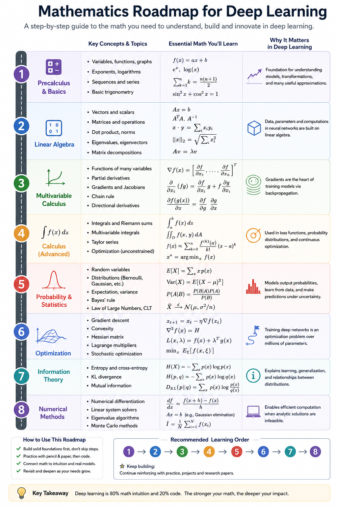
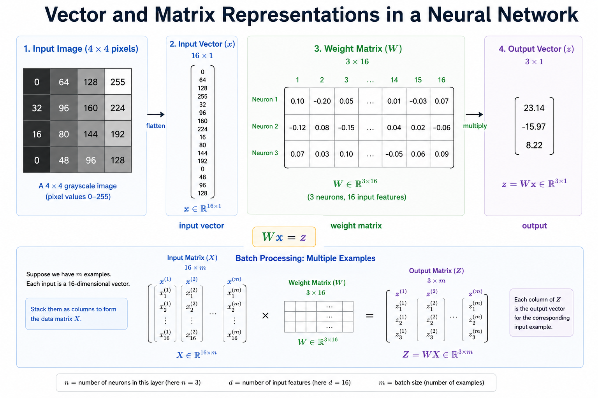

# Module 2: Mathematics for Deep Learning
### A Comprehensive Technical Reference for Students, Engineers, and Researchers

---

## Executive Summary

Every deep learning model — from a simple image classifier to a massive language model — is built on a foundation of mathematics. This document demystifies that foundation.

You do not need to be a mathematics professor to understand deep learning. But you do need to understand **why** the math exists: why we multiply matrices instead of looping through arrays, why we take derivatives when training a network, why probability helps a model handle uncertainty, and why the softmax function turns raw numbers into meaningful predictions.

This document covers all the mathematics you will encounter in deep learning: linear algebra (vectors, matrices, dot products, matrix multiplication, linear transformations, eigenvalues), calculus (derivatives, partial derivatives, the chain rule, gradients), probability (basics, Gaussian distribution, logarithms), and the softmax function. Every concept is explained intuitively first, then mathematically, then connected directly to its role in neural networks.

---

## Learning Outcomes

After reading this document, the learner should be able to:

- Represent data, weights, and transformations as vectors and matrices.
- Perform matrix multiplication and explain why it is the engine of every neural network forward pass.
- Compute and interpret the dot product geometrically and algebraically.
- Explain linear transformations and their relationship to weight matrices.
- Understand eigenvalues intuitively and where they appear in deep learning (PCA, covariance, stability analysis).
- Compute derivatives and partial derivatives and explain what they measure.
- Apply the chain rule to trace how gradients flow backward through a neural network.
- Construct and interpret a gradient vector for a multi-variable function.
- Understand basic probability: events, distributions, expectation, and variance.
- Describe the Gaussian distribution and explain why it appears everywhere in ML.
- Use logarithms fluently in loss function calculations.
- Derive the softmax function and explain its role in multi-class classification.
- Confidently answer beginner-to-advanced interview questions on ML mathematics.

---

## Table of Contents

1. [Introduction — Why Mathematics Matters in Deep Learning](#1-introduction)
2. [Vectors and Matrices](#2-vectors-and-matrices)
3. [Matrix Multiplication](#3-matrix-multiplication)
4. [Dot Product](#4-dot-product)
5. [Linear Transformations](#5-linear-transformations)
6. [Eigenvalues — Intuition and Applications](#6-eigenvalues)
7. [Derivatives](#7-derivatives)
8. [Partial Derivatives](#8-partial-derivatives)
9. [The Chain Rule](#9-chain-rule)
10. [Gradients](#10-gradients)
11. [Probability Basics](#11-probability-basics)
12. [The Gaussian Distribution](#12-gaussian-distribution)
13. [Logarithms in Deep Learning](#13-logarithms)
14. [Softmax — Intuition and Derivation](#14-softmax)
15. [End-to-End: How the Math Fits Together in a Neural Network](#15-end-to-end)
16. [Interview Preparation Section](#16-interview-preparation)
17. [Research Perspective](#17-research-perspective)
18. [Summary and Key Takeaways](#18-summary)
19. [References for Further Study](#19-references)

---

## 1. Introduction

### 1.1 Why Mathematics Matters in Deep Learning

Imagine you are trying to teach a computer to recognise handwritten digits. You feed it a 28×28 pixel image — that is 784 numbers. The computer needs to somehow transform those 784 numbers into a single answer: "this is the digit 7."

How? Through a cascade of mathematical operations:
- The 784 pixel values are stored as a **vector**.
- Weight matrices **multiply** that vector to produce new representations.
- **Derivatives** and the **chain rule** tell us how to adjust those weights when the model makes mistakes.
- **Gradients** tell us the direction of steepest improvement.
- **Softmax** converts the final output into probabilities over 10 digit classes.
- **Logarithms** make the loss function numerically stable and differentiable.

Mathematics is not decoration in deep learning. It is the mechanism. Every line of PyTorch or TensorFlow code is executing mathematical operations at its core.

### 1.2 How to Use This Document

This document is designed to be read sequentially, as each topic builds on the previous one. However, each section is also self-contained enough to serve as a reference. Beginners should focus on the **Intuition** subsections first, then return for the **Technical Explanation** and **Mathematical Foundation** on a second pass.

### 1.3 Prerequisites

No advanced mathematics is assumed. A working knowledge of:
- Basic algebra (variables, equations).
- High school arithmetic.

Everything else is built from scratch.

---



---

## 2. Vectors and Matrices

### 2.1 Vectors

#### Intuition

A vector is a list of numbers with a direction. Think of it as a set of coordinates in space: the point (3, 4) in 2D space is a vector with x-component 3 and y-component 4.

In deep learning, almost everything is represented as a vector:
- An image is a vector of pixel values.
- A word in NLP (Natural Language Processing) is a vector of numbers (an embedding).
- A data sample with 5 features is a 5-dimensional vector.

#### Technical Explanation

A vector **x** in n-dimensional space is an ordered list of n real numbers:

```
x = [x₁, x₂, x₃, ..., xₙ]ᵀ
```

The superscript T denotes the **transpose** — turning a row vector into a column vector. In deep learning, vectors are almost always treated as **column vectors** by convention.

**Types of vectors in deep learning:**

| Vector Type | Example | Meaning |
|-------------|---------|---------|
| Input vector | x ∈ ℝ⁷⁸⁴ | A flattened 28×28 pixel image |
| Weight vector | w ∈ ℝ⁷⁸⁴ | Parameters connecting one neuron to all inputs |
| Bias vector | b ∈ ℝⁿ | Shift terms added at each layer |
| Gradient vector | ∇L ∈ ℝⁿ | Direction to update weights |
| Embedding vector | e ∈ ℝ³⁰⁰ | A word represented in 300-dimensional space |

#### Mathematical Foundation

**Vector addition:** Add element-by-element.
```
a + b = [a₁+b₁, a₂+b₂, ..., aₙ+bₙ]ᵀ
```

**Scalar multiplication:** Multiply every element by a scalar λ.
```
λa = [λa₁, λa₂, ..., λaₙ]ᵀ
```

**Vector magnitude (L2 norm):**
```
||x||₂ = √(x₁² + x₂² + ... + xₙ²)
```
This measures the "length" of a vector. In gradient descent, we sometimes clip gradients when their norm exceeds a threshold.

---

### 2.2 Matrices

#### Intuition

A matrix is a 2D grid of numbers — like a spreadsheet. In deep learning:
- A **weight matrix** W stores the parameters connecting one layer to the next.
- A **batch of images** is a matrix where each row is one image.
- An **attention matrix** in a Transformer shows how much each word attends to every other word.

#### Technical Explanation

A matrix **A** of shape m×n has m rows and n columns:

```
A = | a₁₁  a₁₂  ...  a₁ₙ |
    | a₂₁  a₂₂  ...  a₂ₙ |
    | ...                  |
    | aₘ₁  aₘ₂  ...  aₘₙ |
```

**Important matrix operations:**

| Operation | Notation | Use in Deep Learning |
|-----------|----------|---------------------|
| Transpose | Aᵀ | Swapping rows and columns; used in backpropagation |
| Element-wise multiply | A ⊙ B | Used in LSTM gates, attention masks |
| Matrix multiply | AB | Core forward pass computation |
| Inverse | A⁻¹ | Solving linear systems; used in second-order optimisation |
| Determinant | det(A) | Measures volume scaling; used in normalising flows |

#### Key Deep Learning Matrix Shapes

```
Weight matrix, layer l:   W⁽ˡ⁾ ∈ ℝ^(nˡ × nˡ⁻¹)
Bias vector, layer l:     b⁽ˡ⁾ ∈ ℝ^(nˡ)
Input batch:              X ∈ ℝ^(batch_size × features)
```

---



---

### 2.3 Interview Questions — Vectors and Matrices

**Q: What is the difference between a vector and a scalar?**
A: A scalar is a single number (e.g., the loss value 0.42). A vector is an ordered list of numbers with both magnitude and direction (e.g., a weight vector [0.3, -0.1, 0.7]).

**Q: Why do we represent images as vectors?**
A: Neural networks require numerical input in a fixed format. Flattening a 2D image into a 1D vector creates a consistent-length input regardless of content. (Convolutional networks preserve 2D structure instead.)

**Q: What is a transpose and when is it used in backpropagation?**
A: Transposing a matrix swaps its rows and columns: (Aᵀ)ᵢⱼ = Aⱼᵢ. During backpropagation, we compute ∂L/∂x = Wᵀ · ∂L/∂z to propagate gradients backward through a linear layer.

**Common mistake:** Confusing shape conventions. NumPy stores vectors as (n,) — a 1D array — while deep learning frameworks often expect (n, 1) column vectors or (1, n) row vectors. Always check `.shape`.

---

## 3. Matrix Multiplication

### 3.1 Intuition

Matrix multiplication is the single most important operation in deep learning. Every forward pass through a neural network is a sequence of matrix multiplications.

Think of it as a systematic dot product factory: you take each row of the first matrix, pair it with each column of the second matrix, and compute a dot product for each pair. The results form the new matrix.

Analogy: Imagine a restaurant menu in matrix form. Rows = meal options, columns = ingredients. A second matrix maps ingredients to costs. Matrix multiplication gives you the cost of every meal — all combinations, computed simultaneously.

### 3.2 Technical Explanation

Given matrix **A** of shape (m × k) and matrix **B** of shape (k × n):

```
C = A × B,    where C has shape (m × n)
```

**Rule:** The number of columns in A must equal the number of rows in B.

**Element formula:**
```
Cᵢⱼ = Σ(r=1 to k) Aᵢᵣ × Bᵣⱼ
```

The element at row i, column j of the result is the dot product of row i of A and column j of B.

### 3.3 Mathematical Foundation

**Example (2×2 case):**
```
A = | 1  2 |    B = | 5  6 |
    | 3  4 |        | 7  8 |

C = A × B

C₁₁ = (1×5) + (2×7) = 5 + 14 = 19
C₁₂ = (1×6) + (2×8) = 6 + 16 = 22
C₂₁ = (3×5) + (4×7) = 15 + 28 = 43
C₂₂ = (3×6) + (4×8) = 18 + 32 = 50

C = | 19  22 |
    | 43  50 |
```

**Key properties:**
- Matrix multiplication is **NOT commutative**: AB ≠ BA in general.
- It IS **associative**: (AB)C = A(BC).
- It IS **distributive**: A(B + C) = AB + AC.

### 3.4 The Neural Network Forward Pass as Matrix Multiplication

In a fully connected (dense) neural network layer:

```
z = W · x + b
```

Where:
- x ∈ ℝⁿ: input vector (n features)
- W ∈ ℝ^(m×n): weight matrix (m neurons, each connected to n inputs)
- b ∈ ℝᵐ: bias vector
- z ∈ ℝᵐ: pre-activation output

**Why this is powerful:** A single matrix multiply computes ALL neurons in a layer simultaneously. On a GPU (Graphics Processing Unit), this is done in massively parallel hardware — making it thousands of times faster than computing neuron by neuron.

**Batched forward pass:**
```
Z = X · Wᵀ + b
```
Where X ∈ ℝ^(B×n) is a batch of B data samples. All B samples are processed in one matrix multiplication.

---


---

### 3.5 Interview Questions — Matrix Multiplication

**Q: Why can we not always compute AB and BA?**
A: Matrix multiplication requires the inner dimensions to match. If A is (m×k) and B is (k×n), then AB is valid (m×n). BA requires B to be (k×m) and A to be (m×n) — a different shape requirement. Only square matrices of equal size can always be multiplied in either order.

**Q: What is computational complexity of matrix multiplication?**
A: Naively O(m·k·n) for (m×k)×(k×n). For square n×n matrices, this is O(n³). Modern algorithms (Strassen: O(n^2.81), advanced: O(n^2.37)) reduce this, and GPU parallelism dramatically speeds up the constant factor.

**Q: What is a batch matrix multiplication and why is it important?**
A: Processing multiple input vectors simultaneously as a matrix X ∈ ℝ^(B×n), rather than one-by-one. This is crucial for GPU utilisation — GPUs are optimised for large, regular matrix operations. Batch size selection is a key hyperparameter balancing training speed and gradient noise.

**Common mistake:** Getting matrix shapes wrong during layer design. Always track shapes explicitly. A layer with 512 inputs and 256 outputs has a weight matrix W ∈ ℝ^(256×512) — output dimension first.

---

## 4. Dot Product

### 4.1 Intuition

The dot product takes two vectors of the same length and produces a single number — a scalar. This number captures how much the two vectors "agree" or "point in the same direction."

Think of it as a similarity score:
- If two vectors point in exactly the same direction: large positive dot product.
- If they are perpendicular (90° apart): dot product is zero.
- If they point in opposite directions: large negative dot product.

**Deep learning use:** In attention mechanisms (like in Transformer models), the dot product between a query vector and a key vector measures how relevant one word is to another.

### 4.2 Mathematical Foundation

**Algebraic definition (sum of element-wise products):**
```
a · b = Σᵢ aᵢbᵢ = a₁b₁ + a₂b₂ + ... + aₙbₙ
```

**Geometric definition (angle between vectors):**
```
a · b = ||a|| · ||b|| · cos(θ)
```

Where θ is the angle between the two vectors.

**Connecting the two:**
```
cos(θ) = (a · b) / (||a|| · ||b||)
```

This ratio is the **cosine similarity**, used extensively in NLP (Natural Language Processing) to measure similarity between word embeddings.

**Example:**
```
a = [1, 2, 3]
b = [4, 5, 6]

a · b = (1×4) + (2×5) + (3×6) = 4 + 10 + 18 = 32
```

### 4.3 Geometric Interpretation

| Condition | Dot Product | Meaning |
|-----------|-------------|---------|
| θ = 0° (same direction) | a·b = \|\|a\|\|·\|\|b\|\| | Maximum similarity |
| θ = 90° (perpendicular) | a·b = 0 | No relationship |
| θ = 180° (opposite) | a·b = −\|\|a\|\|·\|\|b\|\| | Maximum dissimilarity |

### 4.4 Applications in Deep Learning

**1. Neuron computation:**
Each neuron computes a dot product between its weight vector w and the input vector x, then adds a bias:
```
z = w · x + b
```

**2. Attention mechanism (Transformer):**
```
score(q, k) = q · k / √d_k
```
Where q is the query vector and k is the key vector. The scaling by √d_k (square root of the key dimension) prevents the dot products from growing too large when dimensions are high.

**3. Cosine similarity for embeddings:**
```
similarity(a, b) = (a · b) / (||a|| · ||b||)
```
Used to find similar words, sentences, or images in embedding space.

---


---

### 4.5 Interview Questions — Dot Product

**Q: What does a dot product of zero mean?**
A: The two vectors are orthogonal (perpendicular) — they share no component in common. In feature representations, this means the features capture completely independent information.

**Q: How is the dot product related to matrix multiplication?**
A: Matrix multiplication is a structured collection of dot products. Element Cᵢⱼ of the product AB is the dot product of row i of A and column j of B.

**Q: Why is cosine similarity preferred over Euclidean distance for comparing embeddings?**
A: Cosine similarity measures the angle between vectors, ignoring magnitude. Two embeddings might be far apart in Euclidean distance but point in very similar directions — cosine similarity captures this directional agreement. It is also bounded between -1 and 1, making comparisons across different vectors consistent.

---

## 5. Linear Transformations

### 5.1 Intuition

A linear transformation is a special kind of function that takes a vector as input and produces a new vector as output, in a way that preserves structure: straight lines stay straight, the origin stays at the origin.

Think of it as reshaping space: stretching, rotating, reflecting, or squishing a coordinate system — while keeping the grid lines straight and evenly spaced.

In a neural network, every weight matrix W performs a linear transformation: it maps the input vector from one vector space (the input space) into a new vector space (the representation space of that layer).

### 5.2 Technical Explanation

A function T: ℝⁿ → ℝᵐ is a **linear transformation** if and only if:

1. **Additivity:** T(u + v) = T(u) + T(v) for all vectors u, v
2. **Scalar homogeneity:** T(λu) = λT(u) for all scalars λ

Every linear transformation can be represented as a matrix multiplication:
```
T(x) = Wx
```

This is profound: any linear transformation, no matter how complex, can be captured in a matrix.

### 5.3 Mathematical Foundation

**Common linear transformations and their matrices:**

**Scaling by factor s:**
```
W = | s  0 |
    | 0  s |
```
Scales all vectors by s.

**Rotation by angle θ:**
```
W = | cos θ  -sin θ |
    | sin θ   cos θ |
```

**Projection onto x-axis:**
```
W = | 1  0 |
    | 0  0 |
```
Collapses the y-component to zero.

**Reflection across x-axis:**
```
W = | 1   0 |
    | 0  -1 |
```

### 5.4 Why Linear Transformations Are Not Enough Alone

A critical insight: **a stack of linear transformations is still a linear transformation.**

Suppose you have two weight matrices W₁ and W₂. Then:
```
W₂(W₁x) = (W₂W₁)x = W₃x
```

No matter how many linear layers you stack, the result is equivalent to a single linear transformation. This is why **non-linear activation functions** (ReLU, sigmoid, tanh) are essential — they break this linearity and allow the network to learn complex, non-linear mappings.

---


---

### 5.5 Interview Questions — Linear Transformations

**Q: Why can't a neural network without activation functions learn non-linear patterns?**
A: Without activation functions, each layer performs a linear transformation. A composition of linear transformations is itself linear (W₂W₁ = W₃). No matter how many linear layers you add, the network can only represent linear input-output relationships, which are insufficient for most real-world tasks.

**Q: What does a neural network weight matrix "do" geometrically?**
A: It performs a linear transformation — rotating, stretching, reflecting, or projecting the input vector into a new representation space. The network learns to find weight matrices that transform inputs in ways that make the classification task easier.

**Q: What is the rank of a matrix and why does it matter?**
A: The rank is the number of linearly independent rows (or columns). A weight matrix with rank lower than its dimension introduces information bottlenecks — some directions in the input space are collapsed. This is exploited in techniques like Low-Rank Adaptation (LoRA) for efficient fine-tuning of large models.

---

## 6. Eigenvalues

### 6.1 Intuition

Most vectors, when multiplied by a matrix, rotate and change direction. But for some special vectors — called **eigenvectors** — the matrix multiplication only scales them; it does not rotate them at all.

The **eigenvalue** λ tells you how much the eigenvector v is scaled:
```
Av = λv
```

Analogy: Imagine a rubber sheet with arrows drawn on it. When you stretch the sheet, most arrows change direction. But one or two arrows — pointing along the "natural stretching directions" — only get longer or shorter without rotating. Those are the eigenvectors. The amount they stretch is the eigenvalue.

### 6.2 Mathematical Foundation

**Definition:** For a square matrix A ∈ ℝⁿˣⁿ, a non-zero vector v and scalar λ satisfy:
```
Av = λv
```

v is the **eigenvector**, λ is the **eigenvalue**.

**Finding eigenvalues — characteristic equation:**
```
det(A - λI) = 0
```

Where I is the identity matrix and det denotes the determinant. Solving this polynomial equation for λ gives the eigenvalues.

**Example (2×2 matrix):**
```
A = | 3  1 |
    | 0  2 |

det(A - λI) = det | 3-λ   1  |
                  |  0   2-λ |
             = (3-λ)(2-λ) - (0)(1)
             = (3-λ)(2-λ) = 0

Eigenvalues: λ₁ = 3, λ₂ = 2
```

### 6.3 Applications in Deep Learning

| Application | How Eigenvalues Are Used |
|-------------|--------------------------|
| PCA (Principal Component Analysis) | Eigenvectors of the covariance matrix define the principal components; eigenvalues give the variance explained by each component |
| Training Stability | The largest eigenvalue of the Hessian (second derivative matrix) governs the maximum safe learning rate |
| Batch Normalisation | Understanding the spectral properties of weight matrices informs initialisation strategies |
| Graph Neural Networks | Graph Laplacian eigenvalues encode structural properties of the graph |
| Recurrent Networks | Eigenvalues of recurrent weight matrices determine stability and the vanishing/exploding gradient problem |

### 6.4 Eigenvalues and the Vanishing Gradient Problem

In Recurrent Neural Networks (RNNs), the same weight matrix W is multiplied repeatedly across time steps:
```
h_t = W · h_{t-1} + ...
```

After T time steps, the gradient involves Wᵀ (W to the power T). If the dominant eigenvalue of W is:
- > 1: gradients **explode** (become astronomically large)
- < 1: gradients **vanish** (become effectively zero)
- = 1: gradients remain stable

This insight directly motivates architectures like LSTMs (Long Short-Term Memory) and GRUs (Gated Recurrent Units).

---


---

### 6.5 Interview Questions — Eigenvalues

**Q: What are eigenvalues and eigenvectors without using equations?**
A: Eigenvectors are the "special directions" of a matrix transformation — vectors that only get scaled, not rotated. The eigenvalue is the scaling factor. They reveal the natural axes of a transformation.

**Q: How are eigenvalues used in PCA?**
A: PCA computes the covariance matrix of the data, then finds its eigenvalues and eigenvectors. The eigenvectors become the new axes (principal components). Projecting data onto the eigenvectors with the largest eigenvalues retains most variance while reducing dimensionality.

**Q: What causes the vanishing gradient problem and how do eigenvalues explain it?**
A: Repeated matrix multiplication in RNNs raises the weight matrix to a high power. If the dominant eigenvalue is less than 1, the product shrinks exponentially → gradients vanish and early time steps are not learned. If eigenvalue > 1, gradients explode. LSTM gates keep eigenvalues near 1 along important paths.

---

## 7. Derivatives

### 7.1 Intuition

A derivative tells you the **rate of change** of a function at a specific point. It answers: "if I change the input slightly, how much does the output change?"

Analogy: Imagine you are hiking up a mountain. The derivative of your elevation with respect to your horizontal position tells you how steep the slope is at any given point. If the derivative is large, the hill is steep. If it is zero, you are on flat ground (at a peak, valley, or plateau).

In deep learning, the derivative of the loss function with respect to a weight tells us: "if I increase this weight slightly, does the loss go up or down — and by how much?"

### 7.2 Mathematical Foundation

**Definition (limit form):**
```
f'(x) = df/dx = lim_{h→0} [f(x+h) - f(x)] / h
```

This is the slope of the tangent line to f(x) at point x.

**Notation:**
- Leibniz notation: df/dx or dy/dx
- Lagrange notation: f'(x)
- Newton notation: ẋ (used in physics)

### 7.3 Derivatives of Common Functions

| Function f(x) | Derivative f'(x) | Deep Learning Relevance |
|--------------|-----------------|------------------------|
| xⁿ | nxⁿ⁻¹ | Polynomial layers |
| eˣ | eˣ | Exponential in softmax |
| ln(x) | 1/x | Log-loss gradient |
| sin(x) | cos(x) | Periodic activations |
| σ(x) = 1/(1+e⁻ˣ) | σ(x)(1−σ(x)) | Sigmoid activation gradient |
| max(0, x) — ReLU | 0 if x<0, 1 if x>0 | ReLU activation gradient |
| tanh(x) | 1 − tanh²(x) | Tanh activation gradient |

### 7.4 Derivatives of Activation Functions in Detail

**Sigmoid derivative:**
```
σ(x) = 1 / (1 + e⁻ˣ)
σ'(x) = σ(x)(1 − σ(x))
```

Note: The maximum value of σ'(x) is 0.25 (at x = 0). This means the gradient is always small — contributing to the vanishing gradient problem in deep sigmoid networks.

**ReLU (Rectified Linear Unit) derivative:**
```
ReLU(x) = max(0, x)
ReLU'(x) = { 0 if x ≤ 0
            { 1 if x > 0
```

ReLU's derivative is either 0 or 1 — no gradient squashing for positive inputs. This is why ReLU greatly reduced the vanishing gradient problem compared to sigmoid.

**Tanh derivative:**
```
tanh(x) = (eˣ − e⁻ˣ) / (eˣ + e⁻ˣ)
tanh'(x) = 1 − tanh²(x)
```

Maximum gradient is 1 (at x = 0), compared to sigmoid's 0.25. Still can vanish for large |x|.

---


---

### 7.5 Interview Questions — Derivatives

**Q: What does a derivative tell us in the context of training a neural network?**
A: The derivative of the loss L with respect to a weight w (i.e., ∂L/∂w) tells us the direction and magnitude in which to adjust w to reduce L. A positive derivative means increasing w increases loss — so we should decrease w. The learning rate η scales how large a step we take.

**Q: Why does the sigmoid activation cause vanishing gradients?**
A: The sigmoid derivative is σ'(x) = σ(x)(1-σ(x)), which has a maximum of 0.25. When many sigmoid layers are stacked, the gradients are multiplied together through the chain rule, and repeated multiplication of numbers less than 1 drives the gradient exponentially toward zero. Weights in early layers receive near-zero gradient updates — they do not learn.

**Q: What is the derivative of ReLU and what is the "dead neuron" problem?**
A: ReLU'(x) = 1 for x > 0 and 0 for x ≤ 0. A "dead neuron" occurs when a neuron's pre-activation is always negative for all training examples — its gradient is always 0, so its weights never update. This can happen with a large learning rate that sets weights very negative. Leaky ReLU (f'(x) = 0.01 for x < 0) addresses this.

---

## 8. Partial Derivatives

### 8.1 Intuition

Most functions in deep learning depend on thousands — or billions — of variables simultaneously (all the weights). A **partial derivative** measures how the function changes when you vary just one variable, holding all others constant.

Analogy: Imagine a landscape with hills and valleys defined by two variables (latitude and longitude). The partial derivative with respect to latitude tells you: "how steep is the slope if I move north-south while staying at the same longitude?"

### 8.2 Mathematical Foundation

**Definition:** For a function f(x₁, x₂, ..., xₙ), the partial derivative with respect to xᵢ is:
```
∂f/∂xᵢ = lim_{h→0} [f(x₁, ..., xᵢ+h, ..., xₙ) - f(x₁, ..., xᵢ, ..., xₙ)] / h
```

**Example:** f(x, y) = 3x² + 2xy + y³

```
∂f/∂x = 6x + 2y    (treat y as a constant)
∂f/∂y = 2x + 3y²   (treat x as a constant)
```

### 8.3 Partial Derivatives in Neural Networks

For a neural network with loss function L(w₁, w₂, ..., wₙ) depending on all weights:

- ∂L/∂w₁ tells us: "How does the loss change if we adjust weight w₁?"
- ∂L/∂w₂ tells us: "How does the loss change if we adjust weight w₂?"
- ...and so on for all weights.

Stacking all these partial derivatives into a single vector gives the **gradient** (see Section 10).

**Concrete example — single neuron:**
```
z = w₁x₁ + w₂x₂ + b
L = (z - y)²   (mean squared error for a target y)

∂L/∂w₁ = 2(z - y) · x₁
∂L/∂w₂ = 2(z - y) · x₂
∂L/∂b  = 2(z - y)
```

Each partial derivative tells us exactly how sensitive the loss is to that specific parameter.

---

### 8.4 Interview Questions — Partial Derivatives

**Q: How many partial derivatives does a typical deep learning model have?**
A: One per parameter. GPT-3 has approximately 175 billion parameters — so computing its gradient means computing 175 billion partial derivatives simultaneously. This is done efficiently via automatic differentiation (autograd), which is what PyTorch and TensorFlow provide.

**Q: What is the difference between a derivative and a partial derivative?**
A: A derivative applies to a function of one variable. A partial derivative applies to a function of multiple variables — it measures the rate of change with respect to one variable while treating all others as constants.

---

## 9. The Chain Rule

### 9.1 Intuition

The chain rule answers a seemingly simple question: "if x affects y, and y affects z, how does x affect z?"

The answer: the effect of x on z is the product of the effect of x on y and the effect of y on z.

This is exactly what backpropagation does: it traces the chain of dependencies from the loss back to every weight, multiplying derivatives along the way.

### 9.2 Mathematical Foundation

**Single-variable chain rule:**
```
If z = f(y) and y = g(x), then:
dz/dx = dz/dy · dy/dx
```

**Example:**
```
y = x², z = sin(y)
dz/dx = dz/dy · dy/dx = cos(y) · 2x = cos(x²) · 2x
```

**Multi-variable chain rule:**
```
If z = f(y₁, y₂, ..., yₘ) and each yᵢ = gᵢ(x₁, ..., xₙ):
∂z/∂xⱼ = Σᵢ (∂z/∂yᵢ · ∂yᵢ/∂xⱼ)
```

### 9.3 Backpropagation Is Chain Rule Applied Repeatedly

Consider a two-layer neural network:
```
x → [Layer 1: z₁ = W₁x + b₁] → [Activation: a₁ = ReLU(z₁)] → [Layer 2: z₂ = W₂a₁ + b₂] → Loss L
```

To compute ∂L/∂W₁ (how the loss changes with respect to weights in layer 1):

```
∂L/∂W₁ = ∂L/∂z₂ · ∂z₂/∂a₁ · ∂a₁/∂z₁ · ∂z₁/∂W₁
```

This is the chain rule applied four times. For a 100-layer network, it is the chain rule applied 100+ times.

**Backpropagation algorithm:**
```
Forward pass:   x → z₁ → a₁ → z₂ → a₂ → ... → L    (store intermediate values)
Backward pass:  ∂L/∂aₙ → ∂L/∂zₙ → ∂L/∂aₙ₋₁ → ... → ∂L/∂W₁  (apply chain rule backward)
```

### 9.4 Numerical Example

```
Network: z = w·x,  a = ReLU(z),  L = (a - y)²
Values:  w = 0.5, x = 2, y = 3

Forward pass:
z = 0.5 × 2 = 1
a = ReLU(1) = 1
L = (1 - 3)² = 4

Backward pass (chain rule):
∂L/∂a = 2(a - y) = 2(1 - 3) = -4
∂a/∂z = ReLU'(z) = 1  (since z=1 > 0)
∂z/∂w = x = 2

∂L/∂w = ∂L/∂a · ∂a/∂z · ∂z/∂w = (-4) · (1) · (2) = -8

Update: w_new = w - η · ∂L/∂w = 0.5 - 0.01 × (-8) = 0.58
```

The weight w increased from 0.5 to 0.58, which will increase z and a, moving the prediction closer to the target y = 3.

---


---

### 9.5 Interview Questions — Chain Rule

**Q: Explain backpropagation to a 5-year-old.**
A: When the network makes a wrong guess, we need to fix it. We look at the last decision it made and ask "did this make things worse?" Then we look at the second-to-last decision: "did that make things worse?" We keep going backward, asking this question at each step, until we have a plan for fixing every decision. That is backpropagation.

**Q: What is the time complexity of backpropagation?**
A: The same order as the forward pass — O(number of parameters). This is because each gradient computation reuses the intermediate values stored during the forward pass. The memory cost is higher because we must store all intermediate activations.

**Q: What is the difference between automatic differentiation and symbolic differentiation?**
A: Symbolic differentiation (like a CAS: Computer Algebra System) derives an analytical formula for the derivative. Automatic differentiation (used by PyTorch/TensorFlow) numerically evaluates derivatives by applying the chain rule at each operation during computation, tracking a computation graph. Automatic differentiation is exact (not approximate like numerical differentiation) and efficient (not expression-swell like symbolic).

**Common mistake:** Confusing "gradient" (a vector of partial derivatives) with "derivative" (for functions of a single variable). The loss in a neural network is a function of millions of variables, so we always work with gradients, not scalar derivatives.

---

## 10. Gradients

### 10.1 Intuition

The gradient is a vector that contains all the partial derivatives of a function. It is the multi-variable generalisation of the derivative.

The gradient has a profound geometric meaning: **it points in the direction of steepest increase.**

If we stand at a point on a mountainous landscape and want to climb as steeply as possible, we walk in the direction of the gradient. If we want to descend as steeply as possible (which is what training does — we want to minimise the loss), we walk in the **negative** gradient direction.

This is **gradient descent** in one sentence: repeatedly take small steps in the direction of the negative gradient.

### 10.2 Mathematical Foundation

**Definition:** For f: ℝⁿ → ℝ, the gradient at point x is:
```
∇f(x) = [∂f/∂x₁, ∂f/∂x₂, ..., ∂f/∂xₙ]ᵀ
```

**Properties:**
- The gradient is a vector in the same space as x.
- ∇f(x) points in the direction of steepest increase.
- −∇f(x) points in the direction of steepest decrease.
- ||∇f(x)|| is the rate of steepest increase.
- At local minima, maxima, and saddle points: ∇f(x) = 0.

### 10.3 Gradient Descent

**Update rule:**
```
w_new = w_old − η · ∇_w L
```

Where:
- η (eta) is the **learning rate** — how large a step to take.
- ∇_w L is the gradient of the loss with respect to all weights.

**Variants of gradient descent:**

| Variant | Gradient Computed Over | Properties |
|---------|----------------------|------------|
| Batch GD | Entire training set | Exact gradient, slow per update |
| Stochastic GD (SGD) | One sample at a time | Noisy but fast updates, can escape local minima |
| Mini-batch GD | Small batch (32-256) | Best of both: reasonable noise, efficient GPU use |
| Adam | Mini-batch + adaptive learning rate | Most popular in practice; adapts lr per weight |

### 10.4 Why Gradient Direction Matters — The Loss Landscape

The loss function of a neural network defines a high-dimensional landscape:
- **Valleys** (local minima): gradient = 0, loss is locally low.
- **Peaks** (local maxima): gradient = 0, loss is locally high.
- **Saddle points:** gradient = 0, but neither a minimum nor maximum.
- **Flat regions (plateaus):** gradient ≈ 0, training stalls.

Modern deep networks are so over-parameterised that local minima are rarely a problem — saddle points and ill-conditioning are bigger challenges.

---


---

### 10.5 Interview Questions — Gradients

**Q: What is the gradient and why does it point "uphill"?**
A: The gradient ∇f(x) is a vector of partial derivatives. It points in the direction of steepest increase because: for any unit direction vector v, the directional derivative is v·∇f(x), which is maximised (by Cauchy-Schwarz inequality) when v = ∇f(x)/||∇f(x)||.

**Q: What happens if the learning rate is too large or too small?**
A: Too large: the steps overshoot the minimum, and training oscillates or diverges. Too small: training converges very slowly, potentially getting stuck. Techniques like learning rate scheduling (warm-up, cosine annealing) and adaptive optimisers (Adam, RMSProp) address this.

**Q: What is gradient clipping and when is it used?**
A: Gradient clipping caps the gradient norm at a threshold before updating weights: if ||∇L|| > threshold, rescale the gradient. It prevents exploding gradients, which are common in RNNs and Transformers with long sequences.

**Q: What is a vanishing gradient and how does it affect training?**
A: When gradients become extremely small during backpropagation (due to repeated multiplication of values < 1), early layers receive near-zero updates. These layers effectively stop learning. Solutions include: ReLU activations, batch normalisation, residual connections (ResNets), careful weight initialisation (Xavier/He), and LSTM/GRU architectures.

---

## 11. Probability Basics

### 11.1 Intuition

Probability measures how likely something is to happen. Deep learning models are probabilistic at their core: instead of saying "this is a cat," they say "I am 94.3% confident this is a cat." Understanding probability helps us interpret model outputs, design loss functions, and reason about uncertainty.

### 11.2 Core Concepts

#### Sample Space and Events

- **Sample space Ω:** The set of all possible outcomes. For a coin flip: Ω = {Heads, Tails}.
- **Event A:** A subset of outcomes. P(A) gives the probability of event A.

**Axioms of Probability:**
1. P(A) ≥ 0 for any event A.
2. P(Ω) = 1 (something always happens).
3. For mutually exclusive events: P(A ∪ B) = P(A) + P(B).

#### Random Variables

A **random variable** X maps outcomes to numbers. For a die roll: X ∈ {1, 2, 3, 4, 5, 6}.

- **Discrete:** Takes countable values (e.g., class labels 0, 1, 2, ..., K).
- **Continuous:** Takes any real value (e.g., a weight value, a pixel intensity).

#### Probability Distributions

A **probability distribution** describes the probability of each possible value:
- **Discrete:** Probability Mass Function (PMF): P(X = x).
- **Continuous:** Probability Density Function (PDF): p(x), where P(a ≤ X ≤ b) = ∫ₐᵇ p(x)dx.

### 11.3 Key Concepts for Deep Learning

**Conditional Probability:**
```
P(A|B) = P(A ∩ B) / P(B)
```
"Probability of A given that B has occurred." Neural network classifiers model P(class | input).

**Bayes' Theorem:**
```
P(A|B) = P(B|A) · P(A) / P(B)
```
Foundational for Bayesian neural networks and probabilistic generative models.

**Independence:**
A and B are independent if P(A ∩ B) = P(A)·P(B). Assumed between training samples in most ML settings.

**Expectation (Mean):**
```
E[X] = Σₓ x · P(X=x)        (discrete)
E[X] = ∫ x · p(x) dx         (continuous)
```
The average value of X. The loss function we minimise is the expected loss over the training distribution.

**Variance:**
```
Var(X) = E[(X - E[X])²] = E[X²] - (E[X])²
```
Measures how spread out the distribution is. High variance in gradients leads to noisy training.

### 11.4 Maximum Likelihood Estimation (MLE)

A fundamental principle: **choose model parameters that maximise the probability of observing the training data.**

```
θ_MLE = argmax_θ P(data | θ) = argmax_θ Π P(xᵢ | θ)
```

Taking logarithms (which turns products to sums and does not change the argmax):
```
θ_MLE = argmax_θ Σ log P(xᵢ | θ)
```

Minimising the **negative log-likelihood** is equivalent to MLE — and this is exactly what cross-entropy loss does.

---


---

### 11.5 Interview Questions — Probability

**Q: Why does a classifier output probabilities rather than hard class labels?**
A: Probabilities convey confidence. A model that is 51% confident vs. 99% confident both produce the same hard label, but the confidence information is critical in practice — for example, flagging uncertain predictions for human review in medical applications.

**Q: What is the connection between MLE and cross-entropy loss?**
A: For a classification problem, MLE says: find parameters that maximise P(labels | inputs, parameters). For a categorical distribution, this log-likelihood equals −cross-entropy. So minimising cross-entropy loss IS maximum likelihood estimation.

**Q: What does it mean for a model to be "calibrated"?**
A: A calibrated model's confidence scores match empirical accuracy: when it says "90% confidence", it should be correct 90% of the time. Modern deep networks are often overconfident (poorly calibrated). Temperature scaling is a common post-processing technique to improve calibration.

---

## 12. The Gaussian Distribution

### 12.1 Intuition

The Gaussian (or Normal) distribution is the famous "bell curve." It describes many natural phenomena: the height of people in a population, measurement errors, noise in signals.

For deep learning, the Gaussian appears everywhere:
- **Weight initialisation:** Weights are often drawn from a Gaussian distribution.
- **Data noise:** Real sensor data often contains Gaussian noise.
- **Latent spaces:** In Variational Autoencoders (VAEs), the latent variable is modelled as a Gaussian.
- **Batch Normalisation:** Normalises activations to have approximately Gaussian distribution.

### 12.2 Mathematical Foundation

**Probability Density Function:**
```
p(x | μ, σ²) = (1 / √(2πσ²)) · exp(−(x−μ)² / (2σ²))
```

**Parameters:**
- μ (mu): the **mean** — the centre of the bell curve.
- σ² (sigma squared): the **variance** — how wide the bell curve is.
- σ: the **standard deviation** — the square root of variance.

**The Standard Normal:** N(0, 1) — mean 0, variance 1. Often denoted Z.

**The 68-95-99.7 Rule:**
- 68% of data falls within μ ± σ.
- 95% of data falls within μ ± 2σ.
- 99.7% of data falls within μ ± 3σ.

### 12.3 Why Gaussian Appears Everywhere — Central Limit Theorem

**Central Limit Theorem (CLT):** The sum (or average) of a large number of independent, identically distributed random variables converges to a Gaussian distribution, regardless of the original distribution.

This explains why so many real-world quantities are approximately Gaussian — they are the result of many small, independent factors summing together.

### 12.4 Gaussian in Neural Network Weight Initialisation

Initialising weights from N(0, σ²):

**Xavier/Glorot Initialisation:**
```
σ² = 2 / (n_in + n_out)
```
Designed for sigmoid/tanh activations. Keeps variance of activations and gradients roughly constant across layers.

**He/Kaiming Initialisation:**
```
σ² = 2 / n_in
```
Designed for ReLU activations. Accounts for ReLU zeroing half the inputs.

**Why this matters:** Poor initialisation leads to either vanishing activations (weights too small) or exploding activations (weights too large), making training impossible for deep networks.

### 12.5 Multivariate Gaussian

For a vector x ∈ ℝⁿ:
```
p(x | μ, Σ) = (1 / ((2π)^(n/2) |Σ|^(1/2))) · exp(−(1/2)(x−μ)ᵀ Σ⁻¹ (x−μ))
```

Where Σ (Sigma, not summation here) is the **covariance matrix**. The diagonal elements are variances; off-diagonal elements are covariances between dimensions.

---


---

### 12.6 Interview Questions — Gaussian Distribution

**Q: Why do we initialise neural network weights from a Gaussian distribution?**
A: Random Gaussian initialisation breaks symmetry (if all weights were equal, all neurons would learn the same thing), keeps initial activations in a reasonable range, and, with Xavier/He scaling, maintains gradient magnitudes across layers to enable stable training.

**Q: What is the Central Limit Theorem and why does it matter for ML?**
A: The CLT states that the sum of many independent random variables converges to a Gaussian. It justifies using Gaussian assumptions for noise models and explains why many real datasets have approximately Gaussian features. It also underpins confidence interval calculations and hypothesis testing used to compare model performances.

**Q: What is batch normalisation and how does it use Gaussian statistics?**
A: Batch normalisation normalises each feature's activations across a mini-batch to have mean 0 and variance 1, then applies learned scale (γ) and shift (β) parameters. This prevents internal covariate shift, allows higher learning rates, and acts as a regulariser.

---

## 13. Logarithms in Deep Learning

### 13.1 Intuition

A logarithm answers the question: "what power do I raise this base to, in order to get this number?"

```
log_b(x) = y  ↔  bʸ = x
```

In deep learning, we almost always use the **natural logarithm** (base e ≈ 2.718), denoted ln(x) or simply log(x).

Logarithms are everywhere in deep learning because:
1. They convert products into sums (easier to compute and differentiate).
2. They compress very large and very small numbers into a manageable range.
3. They appear naturally in probability and information theory.

### 13.2 Mathematical Properties of Logarithms

| Property | Formula | Use in Deep Learning |
|----------|---------|---------------------|
| Product rule | log(ab) = log(a) + log(b) | Turns MLE product into a sum |
| Quotient rule | log(a/b) = log(a) - log(b) | KL divergence computation |
| Power rule | log(aⁿ) = n·log(a) | Simplifying expressions |
| Chain rule | d/dx log(x) = 1/x | Deriving cross-entropy gradients |
| log(1) = 0 | — | Zero log-likelihood at perfect prediction |
| log(x) → -∞ as x → 0⁺ | — | Heavy penalty for confident wrong predictions |
| log(eˣ) = x | — | Simplifying softmax computations |

### 13.3 The Log-Likelihood and Cross-Entropy Loss

**Why log-likelihood?** The probability of the training data under the model is:
```
P(data | θ) = P(x₁|θ) × P(x₂|θ) × ... × P(xₙ|θ)
```

For n = 1,000,000 samples, this is a product of 1,000,000 probabilities (each < 1), which quickly becomes numerically zero — underflow. Taking the log converts this to a sum:
```
log P(data | θ) = Σᵢ log P(xᵢ | θ)
```

**Cross-entropy loss for binary classification:**
```
L = −[y·log(p̂) + (1−y)·log(1−p̂)]
```

Where p̂ is the predicted probability and y ∈ {0, 1} is the true label.

**Behaviour:**
- If y = 1 and p̂ = 0.99: L = −log(0.99) ≈ 0.01  (low loss, correct confident prediction)
- If y = 1 and p̂ = 0.01: L = −log(0.01) ≈ 4.61  (high loss, wrong confident prediction)

**Cross-entropy for multi-class (K classes):**
```
L = −Σ_{k=1}^{K} y_k · log(p̂_k)
```

Where y_k is 1 for the true class and 0 otherwise (one-hot encoding), and p̂_k is the predicted probability for class k.

### 13.4 Log-Sum-Exp Trick (Numerical Stability)

When computing log(Σ eˣⁱ), if any xᵢ is very large, eˣⁱ overflows to infinity. The log-sum-exp trick:
```
log(Σ eˣⁱ) = c + log(Σ e^(xᵢ - c)),    where c = max(xᵢ)
```

Setting c = max makes all exponents ≤ 0, preventing overflow. PyTorch's `F.cross_entropy` uses this internally.

---


---

### 13.5 Interview Questions — Logarithms

**Q: Why do we use log-loss (cross-entropy) instead of squared error for classification?**
A: Cross-entropy is derived from the MLE principle for categorical distributions. It penalises confident wrong predictions much more severely than squared error — logarithm diverges to -∞ as predicted probability → 0 for the true class. It also produces better-calibrated gradients for sigmoid/softmax outputs.

**Q: What is the KL divergence and where does it appear in deep learning?**
A: KL (Kullback-Leibler) divergence measures how different one probability distribution P is from another Q:
```
KL(P || Q) = Σ P(x) log(P(x)/Q(x))
```
It equals cross-entropy minus entropy. Used in: VAE loss functions (regularise latent distribution to N(0,I)), knowledge distillation (match student to teacher distribution), and RLHF (Reinforcement Learning from Human Feedback) to prevent the fine-tuned model from drifting too far from the base model.

---

## 14. Softmax — Intuition and Derivation

### 14.1 Intuition

After a neural network computes its final layer outputs — called **logits** — these are raw, unconstrained numbers. They can be positive, negative, very large, or very small. We need to convert them into a valid probability distribution: all values between 0 and 1, summing to 1.

**Softmax does exactly this.** It takes a vector of K raw scores and converts them into K probabilities.

The name "softmax" comes from the fact that it is a "soft" (differentiable) version of the argmax function. Argmax gives 1 to the largest element and 0 to everything else. Softmax gives a high probability to the largest element, lower probabilities to others — but never exactly 0.

### 14.2 Mathematical Foundation

**Softmax function:**
```
softmax(z)_k = e^{z_k} / Σ_{j=1}^{K} e^{z_j}
```

For input vector z = [z₁, z₂, ..., z_K]:
- Numerator e^{z_k}: amplifies larger values exponentially.
- Denominator Σ e^{z_j}: normalises all values so they sum to 1.

**Properties:**
- All outputs are in (0, 1). (Never exactly 0 or 1, because eˣ > 0 for all x.)
- All outputs sum to 1: Σ softmax(z)_k = 1.
- Invariant to constant shift: softmax(z + c) = softmax(z) for any scalar c.
- Monotonically preserving: the largest logit gets the highest probability.

### 14.3 Numerical Example

```
Logits z = [2.0, 1.0, 0.1]   (raw neural network outputs for 3 classes)

e^2.0 = 7.389
e^1.0 = 2.718
e^0.1 = 1.105

Sum = 7.389 + 2.718 + 1.105 = 11.212

softmax(z) = [7.389/11.212, 2.718/11.212, 1.105/11.212]
           = [0.659, 0.242, 0.099]

Interpretation:
- Class 0 (logit 2.0): 65.9% probability
- Class 1 (logit 1.0): 24.2% probability
- Class 2 (logit 0.1):  9.9% probability
- Sum: 65.9 + 24.2 + 9.9 = 100% ✓
```

### 14.4 Derivative of Softmax (Jacobian)

The derivative of softmax is a matrix (Jacobian) because the output is a vector:

```
∂softmax(z)_k / ∂z_j = softmax(z)_k · (δ_{kj} - softmax(z)_j)
```

Where δ_{kj} is the Kronecker delta (1 if k=j, 0 otherwise).

In practice, when computing the gradient of cross-entropy loss with respect to logits, the softmax Jacobian and cross-entropy gradient combine beautifully:

```
∂L/∂z_k = softmax(z)_k − y_k = p̂_k − y_k
```

This is an elegantly simple result: the gradient is just (predicted probability − true label). This makes training classification networks with cross-entropy + softmax very efficient.

### 14.5 Temperature Scaling

Softmax has a **temperature parameter** T:
```
softmax(z/T)_k = e^{z_k/T} / Σ e^{z_j/T}
```

- **T → 0:** Output becomes a hard argmax (all probability on the maximum).
- **T = 1:** Standard softmax.
- **T → ∞:** Output becomes a uniform distribution (maximum uncertainty).

Temperature is used in:
- **Knowledge distillation:** High temperature softens the teacher's probability distribution, providing richer training signal.
- **Language model sampling:** Temperature controls the randomness of generated text.
- **Contrastive learning (InfoNCE loss).**

---


---

### 14.6 Softmax vs Sigmoid

| Feature | Sigmoid | Softmax |
|---------|---------|---------|
| Input | Single value | Vector of K values |
| Output | Single value ∈ (0,1) | K values summing to 1 |
| Use case | Binary classification | Multi-class classification |
| Competition | None — independent | Outputs compete (increasing one decreases others) |
| Formula | 1/(1+e⁻ˣ) | e^{zₖ}/Σe^{zⱼ} |
| Relationship | Sigmoid is softmax for K=2 | Generalisation of sigmoid |

### 14.7 Interview Questions — Softmax

**Q: Why can't we just normalise logits by dividing by their sum (z_k / Σz_j) instead of using softmax?**
A: Several reasons: (1) Logits can be negative; dividing by their sum gives undefined or negative probabilities. (2) Linear normalisation has poor gradient behaviour for training. (3) Softmax (via the exponential) naturally amplifies differences between classes, making predictions more decisive.

**Q: What is the "softmax bottleneck" problem in language models?**
A: For a language model with vocabulary size V and hidden dimension d, the softmax output matrix is V×d. If d is small, the matrix is rank-deficient and cannot represent arbitrary distributions over V words. This motivated higher-dimensional architectures and Mixture of Softmaxes.

**Q: How do you implement numerically stable softmax?**
A: Subtract the maximum logit before exponentiating:
```python
def stable_softmax(z):
    z = z - max(z)      # Prevents overflow; doesn't change output
    exp_z = exp(z)
    return exp_z / sum(exp_z)
```
This uses the invariance property: softmax(z) = softmax(z - c).

**Common mistake:** Applying sigmoid for multi-class classification. Sigmoid outputs are independent and do not sum to 1. For multi-class classification with mutually exclusive classes, always use softmax. For multi-label problems (where multiple classes can be true simultaneously), use sigmoid independently for each class.

---

## 15. End-to-End: How the Math Fits Together

### 15.1 The Complete Forward Pass

```
Input x ∈ ℝ⁷⁸⁴  (flattened 28×28 image)
    ↓
z₁ = W₁ · x + b₁          [Matrix multiplication + bias]
    ↓
a₁ = ReLU(z₁)              [Element-wise non-linearity]
    ↓
z₂ = W₂ · a₁ + b₂         [Matrix multiplication + bias]
    ↓
a₂ = ReLU(z₂)              [Element-wise non-linearity]
    ↓
z₃ = W₃ · a₂ + b₃         [Matrix multiplication — final logits]
    ↓
p̂ = softmax(z₃)            [Convert logits to probabilities]
    ↓
L = CrossEntropy(p̂, y)     [Compute loss using log-likelihood]
```

### 15.2 The Complete Backward Pass (Backpropagation)

```
∂L/∂z₃ = p̂ − y             [Softmax + cross-entropy gradient]
    ↓
∂L/∂W₃ = ∂L/∂z₃ · a₂ᵀ    [Chain rule: gradient w.r.t. weights]
∂L/∂a₂ = W₃ᵀ · ∂L/∂z₃    [Chain rule: gradient w.r.t. layer input]
    ↓
∂L/∂z₂ = ∂L/∂a₂ ⊙ ReLU'(z₂)  [Element-wise: gradient through ReLU]
    ↓
∂L/∂W₂ = ∂L/∂z₂ · a₁ᵀ    [Chain rule: gradient w.r.t. weights]
∂L/∂a₁ = W₂ᵀ · ∂L/∂z₂    [Chain rule: gradient w.r.t. layer input]
    ↓
∂L/∂z₁ = ∂L/∂a₁ ⊙ ReLU'(z₁)
    ↓
∂L/∂W₁ = ∂L/∂z₁ · xᵀ     [Gradient w.r.t. first layer weights]
```

### 15.3 Weight Update

```
For each weight W:
W ← W − η · ∂L/∂W
```

Repeat for tens of thousands of batches. Gradually, the weights align so the network maps inputs to correct outputs.

---

## 16. Interview Preparation Section

### 16.1 Beginner Questions

**Q: What is a vector in the context of deep learning?**
A: A vector is an ordered list of numbers. In deep learning, inputs, activations, weights for a single neuron, and gradient updates are all represented as vectors. A vector has both a magnitude (length) and direction in high-dimensional space.

**Q: What is the difference between a scalar, vector, matrix, and tensor?**
A: A scalar is a single number (0D). A vector is a 1D array of numbers. A matrix is a 2D grid of numbers. A tensor is an N-dimensional generalisation — a 3D tensor could be a batch of images (batch × height × width), a 4D tensor could include colour channels.

**Q: Why do we use matrix multiplication in neural networks?**
A: It efficiently computes all neuron activations in a layer simultaneously. Each row of the weight matrix W represents one neuron's weights. Multiplying W × x computes all neuron activations in one highly optimised GPU operation.

**Q: Explain the chain rule in plain language.**
A: If A affects B, and B affects C, then the effect of A on C is (effect of A on B) × (effect of B on C). In backpropagation, we chain together these influence factors from the loss backward to each weight.

**Q: What is the softmax function and when do you use it?**
A: Softmax takes K raw scores (logits) and converts them into a probability distribution — all values between 0 and 1, summing to 1. Use it in the output layer for multi-class classification problems.

---

### 16.2 Intermediate Questions

**Q: Derive the gradient of cross-entropy loss with respect to the softmax input (logits).**
A: Given L = −Σₖ yₖ log(p̂ₖ) and p̂ₖ = softmax(z)ₖ:

The cross-entropy with respect to zₖ simplifies to:
```
∂L/∂zₖ = p̂ₖ − yₖ
```
This result comes from the interaction between the log in cross-entropy and the exponentials in softmax, which cancels many terms. The gradient is simply the prediction error: predicted probability minus true label.

**Q: Why does ReLU help avoid the vanishing gradient problem?**
A: ReLU'(x) = 1 for x > 0. Unlike sigmoid (max derivative 0.25) or tanh (derivative < 1 for |x| > 0), ReLU passes gradients unchanged for positive activations. Deep networks with ReLU avoid the exponential shrinkage of gradients that plagued earlier sigmoid networks.

**Q: What is the Jacobian and when is it used in backpropagation?**
A: The Jacobian is a matrix of all partial derivatives of a vector-valued function: Jᵢⱼ = ∂fᵢ/∂xⱼ. In backpropagation, when computing gradients through a layer that maps ℝⁿ → ℝᵐ, the chain rule involves multiplying by the Jacobian transpose. In practice, frameworks never explicitly form the full Jacobian — they use vector-Jacobian products (VJPs), which are much more efficient.

**Q: Why is weight initialisation important?**
A: At initialisation, if weights are too large, activations and gradients explode during forward and backward passes. If too small, they vanish. Xavier/He initialisation sets variance of initial weights to keep activation and gradient magnitudes stable across all layers, enabling training of deep networks from scratch.

**Q: What is the difference between gradient descent, SGD, and Adam?**

| Method | Update Rule | Advantage | Disadvantage |
|--------|------------|-----------|--------------|
| Batch GD | w ← w − η∇L_full | Exact gradient | Slow for large datasets |
| SGD | w ← w − η∇L_sample | Fast, noisy updates | Requires careful tuning |
| Adam | Adaptive per-weight lr | Fast convergence | Higher memory, can generalise worse |

---

### 16.3 Advanced Questions

**Q: What is automatic differentiation and how is it implemented?**
A: Automatic differentiation (autograd) tracks all operations applied to tensors in a computation graph. During the forward pass, the graph records each operation. During the backward pass, it applies the chain rule at each node using pre-computed local Jacobians. PyTorch uses dynamic computation graphs (traced at runtime); TensorFlow 2.x (with `tf.GradientTape`) does similarly. This is distinct from symbolic differentiation (CAS-like manipulation) and numerical differentiation (finite differences).

**Q: What is second-order optimisation and why is it not commonly used?**
A: First-order methods (SGD, Adam) use only gradients (first derivatives). Second-order methods (Newton's method, natural gradient) use the Hessian matrix H = ∂²L/∂w² to account for curvature. For a model with n parameters, the Hessian is n×n — for GPT-3 with 175B parameters, this is computationally intractable. Approximations (K-FAC, Shampoo) exist but are still expensive. First-order methods with adaptive learning rates approximate curvature cheaply.

**Q: What is the condition number of a matrix and why does it matter for optimisation?**
A: The condition number κ = λ_max / λ_min is the ratio of the largest to smallest eigenvalue of the Hessian. A high condition number means the loss surface is very elongated — steep in some directions, flat in others. SGD struggles: to avoid overshooting in steep directions, you must use a small learning rate, which makes progress slow in flat directions. Adam partially addresses this by adapting the learning rate per parameter. Preconditioning transforms coordinates to reduce the condition number.

---

### 16.4 Research-Level Questions

**Q: What is the Neural Tangent Kernel (NTK) and what does it reveal?**
A: The NTK describes the training dynamics of infinitely wide neural networks. In the infinite-width limit, the network behaves like a linear model trained with a kernel determined by the network architecture. This reveals that overparameterised networks can converge reliably to zero training loss and helps explain generalisation behaviour. Key work by Jacot et al. (2018).

**Q: What are the open challenges in understanding the geometry of deep learning loss landscapes?**
A: Key open questions: (1) Why do flat minima generalise better than sharp minima? (2) How does depth affect the connectivity of minima — are they connected by low-loss paths (mode connectivity)? (3) Why does SGD noise bias toward wider minima? (4) How do residual connections change the landscape geometry? These have significant implications for generalisation theory.

---

### 16.5 Scenario-Based Questions

**Q: You notice your model's training loss decreases but validation loss increases after epoch 5. What could explain this?**
A: Classic overfitting. The model is memorising training data rather than learning generalisable patterns. Possible causes: model too large for dataset size, insufficient regularisation, data distribution mismatch. Solutions: early stopping, L2 regularisation (weight decay), dropout, data augmentation, reducing model capacity.

**Q: Your gradients are NaN after a few training steps. What do you investigate?**
A: Check for: (1) Learning rate too large — reduce by 10×. (2) Exploding gradients — add gradient clipping. (3) Log of zero — ensure model predictions never reach exactly 0 before log. (4) Division by zero in normalisation layers — add ε (small constant). (5) Numerical instability in loss — use log-sum-exp stable implementations.

**Q: Two models achieve the same validation accuracy, but one converges in 10 epochs and the other in 100 epochs. What mathematical differences might explain this?**
A: The faster model likely has better-conditioned loss landscape (lower condition number Hessian), better weight initialisation (activations in correct range), adaptive optimiser (Adam vs SGD), batch normalisation smoothing the landscape, or residual connections providing gradient highways through depth.

---

### 16.6 Frequently Made Mistakes in Interviews

| Mistake | Correction |
|---------|-----------|
| Saying "gradient is a derivative" | Gradient is a vector of partial derivatives; derivative is for single-variable functions |
| Confusing AB and BA in matrix multiplication | Matrix multiplication is not commutative; shape rules must be checked |
| Using sigmoid for multi-class output | Use softmax for multi-class; sigmoid is for binary or multi-label |
| Thinking deeper networks always learn better linear combinations | Without activation functions, depth adds nothing — only non-linearity creates representation power |
| Saying "softmax outputs probabilities" without qualification | Softmax outputs are not calibrated probabilities; they represent confidence, which may not match empirical accuracy |
| Confusing variance and standard deviation | σ is standard deviation (same units as data), σ² is variance (squared units) |
| Forgetting the log-sum-exp trick | Naively computing softmax can overflow for large logits — always subtract max |

---

## 17. Research Perspective

### 17.1 Current Limitations

**1. Poorly Understood Loss Landscapes:**
Despite decades of research, we do not fully understand why gradient descent finds good solutions in highly non-convex loss landscapes with billions of parameters. Empirically it works; theoretically it is not well explained.

**2. Discrete Operations Break Differentiability:**
Backpropagation requires differentiable operations everywhere. Discrete operations — like sampling from a distribution, sorting, or searching — are not differentiable. Workarounds (Straight-Through Estimator, Gumbel-Softmax, REINFORCE) exist but are imperfect.

**3. Quaternionic and Geometric Algebra Extensions:**
Standard neural networks operate in real-valued Euclidean spaces. Many physical systems have inherent geometric structure (rotations, symmetries). Adapting the mathematical framework to preserve these symmetries (equivariant neural networks, geometric deep learning) is an active area.

**4. Scalability of Second-Order Methods:**
Second-order optimisation has far superior convergence properties in theory, but is computationally intractable at scale. Efficient approximate curvature methods (K-FAC, Shampoo, Sophia) are an active research frontier.

### 17.2 Recent Advances (2022–2025)

- **Flash Attention:** Rewrites the attention computation to exploit GPU memory hierarchy (SRAM vs HBM), reducing memory from O(n²) to O(n) and achieving 2-4× speedup without changing the mathematical operation.
- **INT8/FP8 Training:** Training and inference in lower-precision integer/float formats, exploiting properties of the softmax and layer normalisation to maintain stability at 8-bit precision.
- **Muon Optimiser:** Based on the mathematical insight that gradients should be "whitened" (decorrelated) before being applied to weights. Uses Nesterov momentum combined with a Newton-Schulz approximation of the matrix square root for efficient preconditioning.
- **RoPE (Rotary Position Embeddings):** Encodes positional information as rotations in the complex plane, providing a theoretically motivated position encoding with better length generalisation than learned embeddings.

### 17.3 Open Research Problems

- **Implicit Regularisation of SGD:** Why does SGD with mini-batches prefer flat minima, which generalise better? The mathematical explanation is incomplete.
- **Lottery Ticket Hypothesis:** Do all large networks contain small "winning ticket" subnetworks that could be trained to the same accuracy in isolation? How to find them efficiently?
- **Mechanistic Interpretability:** What specific mathematical operations and circuits inside a trained network implement learned algorithms (e.g., modular arithmetic, in-context learning)?
- **Softmax Alternatives at Scale:** At vocabulary sizes of 100K+, the softmax denominator's sum over all tokens is computationally expensive. Hierarchical softmax, sampled softmax, and sparse alternatives remain active areas.
- **Theoretical Generalisation Bounds:** Classical statistical learning theory (VC dimension, Rademacher complexity) gives vacuous bounds for deep networks. Explaining why overparameterised networks generalise well remains a major open problem.

### 17.4 Future Directions

- **Neuromorphic and Analogue Computing:** Moving neural network matrix multiplications from digital GPUs to analogue circuits (which naturally perform weighted summation via Ohm's law), potentially enabling 1000× energy efficiency.
- **Quantum Machine Learning:** Quantum computers can represent exponentially large Hilbert spaces as matrices. Quantum versions of linear algebra operations may provide speedups for certain tensor operations.
- **Formal Verification of Mathematical Properties:** Proving that a trained neural network satisfies mathematical properties (monotonicity, Lipschitz bounds, equivariance) relevant for safety-critical applications.

---

## 18. Summary and Key Takeaways

### 18.1 The Mathematical Toolbox of Deep Learning

```
TOPIC                   ROLE IN DEEP LEARNING
─────────────────────────────────────────────────────────────────────
Vectors                 Represent data, weights, embeddings, gradients
Matrices                Store layer weights, represent transformations
Matrix Multiplication   Core of every forward pass (Wx + b)
Dot Product             Neuron computation, attention scoring, similarity
Linear Transformations  What each weight matrix geometrically "does"
Eigenvalues             PCA, stability analysis, gradient flow in RNNs
Derivatives             Measure how loss changes with each weight
Partial Derivatives     Extend derivatives to multi-variable loss functions
Chain Rule              Enables backpropagation through composed functions
Gradients               Vector guiding weight updates in gradient descent
Probability             Model outputs as distributions; MLE training objective
Gaussian Distribution   Weight initialisation, noise models, VAE latent space
Logarithms              Numerical stability, cross-entropy loss, KL divergence
Softmax                 Convert logits to probabilities; multi-class output
─────────────────────────────────────────────────────────────────────
```

### 18.2 Key Takeaways

- **A neural network forward pass is matrix multiplications followed by non-linearities.** Without understanding matrix multiplication, you cannot understand neural networks.

- **The dot product is the fundamental similarity measure.** It appears in every neuron, every attention head, and every embedding comparison.

- **Linear transformations need non-linearity to become useful.** Stacking linear layers gives you one linear layer. Activation functions are what give depth its power.

- **Derivatives measure sensitivity.** In training, ∂L/∂w tells us exactly how to adjust each weight to reduce the loss.

- **The chain rule is backpropagation.** Understanding chain rule IS understanding backpropagation — they are the same thing, applied to a computational graph.

- **Gradients point uphill.** We minimise loss by following the negative gradient — this is gradient descent.

- **Probability turns classification into a principled framework.** Cross-entropy loss emerges naturally from maximum likelihood estimation over categorical distributions.

- **The Gaussian is the default distribution.** It appears in weight initialisation, data noise, and generative models — mastering it gives insight into many ML decisions.

- **Logarithms prevent numerical disasters.** They convert products to sums, handle extreme values, and are the foundation of all likelihood-based loss functions.

- **Softmax is the final translator.** It converts arbitrary real-valued logits into a valid probability distribution, making model outputs interpretable.

---


---

## 19. References for Further Study

### Research Papers (Foundational)

- **LeCun, Y., Bottou, L., Orr, G., Müller, K.** (1998). "Efficient BackProp." *Neural Networks: Tricks of the Trade.* Springer. — The definitive practical guide to implementing backpropagation.
- **Glorot, X., Bengio, Y.** (2010). "Understanding the Difficulty of Training Deep Feedforward Neural Networks." *AISTATS.* — Introduced Xavier initialisation and analysed vanishing/exploding gradients.
- **He, K., Zhang, X., Ren, S., Sun, J.** (2015). "Delving Deep into Rectifiers." *ICCV.* — Introduced He (Kaiming) initialisation for ReLU networks.
- **Jacot, A., Gabriel, F., Hongler, C.** (2018). "Neural Tangent Kernel: Convergence and Generalisation in Neural Networks." *NeurIPS.* — Theoretical analysis via infinite-width kernel.
- **Goodfellow, I., Vinyals, O., Saxe, A.** (2015). "Qualitatively Characterising Neural Network Optimisation Problems." *ICLR.* — Landscape analysis for deep networks.

### Books

- **Goodfellow, I., Bengio, Y., Courville, A.** — *Deep Learning* (MIT Press, 2016). Chapters 2 (Linear Algebra), 3 (Probability), 4 (Numerical Computation), 6 (Deep Networks). Free at deeplearningbook.org.
- **Strang, G.** — *Introduction to Linear Algebra* (Wellesley-Cambridge Press, 5th ed., 2016). The best linear algebra textbook for ML practitioners.
- **Spivak, M.** — *Calculus* (Publish or Perish, 4th ed.). Rigorous calculus from first principles.
- **Bishop, C.** — *Pattern Recognition and Machine Learning* (Springer, 2006). Chapters 1–2 on probability, distributions, and information theory.
- **Zhang, A., Lipton, Z., Li, M., Smola, A.** — *Dive into Deep Learning.* Free at d2l.ai. Chapter 2 covers all the mathematics here with interactive code.

### University Course Materials

- **3Blue1Brown — "Essence of Linear Algebra" (YouTube):** The best visual introduction to vectors, matrices, transformations, and eigenvalues. Start here.
- **3Blue1Brown — "Essence of Calculus" (YouTube):** Geometric intuition for derivatives, chain rule, and gradients.
- **Khan Academy — Multivariable Calculus:** Free, thorough coverage of partial derivatives and gradients.
- **Stanford CS229 (Andrew Ng) — Linear Algebra and Probability Review:** cs229.stanford.edu. Concise review notes specifically tailored to ML.
- **MIT 18.06 (Gilbert Strang) — Linear Algebra:** Full lecture series available on MIT OpenCourseWare.
- **fast.ai Computational Linear Algebra Course:** Practical, code-first linear algebra for ML.

### Online Platforms and Tools

- **Numpy Documentation:** numpy.org — The reference for all vectorised linear algebra in Python.
- **PyTorch Autograd Tutorial:** pytorch.org/tutorials/beginner/basics/autogradqs_tutorial.html
- **TensorFlow Differentiation Guide:** tensorflow.org/guide/advanced_autodiff
- **Wolfram Alpha:** Quick symbolic derivative checking.
- **Desmos:** Interactive function graphing for visualising derivatives and loss curves.

### Blogs and Articles

- **Colah's Blog — Backpropagation, Derivatives of Neural Networks:** colah.github.io — The clearest visual explanation of backpropagation available.
- **Karpathy — "Hacker's Guide to Neural Networks":** karpathy.github.io/neuralnets — Step-by-step derivation of backpropagation with numerical examples.
- **Distill.pub — "A Visual Exploration of Gaussian Processes":** Beautiful interactive visualisation.
- **The Matrix Calculus You Need for Deep Learning — Parr & Howard:** arxiv.org/abs/1802.01528 — Excellent reference for matrix derivatives in backpropagation.
- **Sebastian Ruder — "An Overview of Gradient Descent Optimisation Algorithms":** ruder.io/optimizing-gradient-descent — The definitive survey.

---

*Document prepared for B.E. AIML Placement Preparation — Module 2: Mathematics for Deep Learning.*

*Next Module: Perceptrons, Activation Functions, and Training Fundamentals.*
