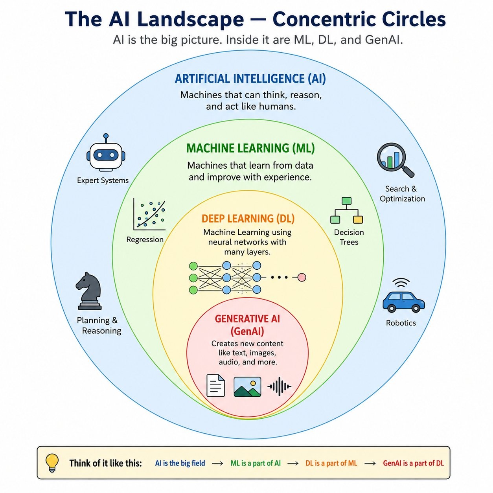
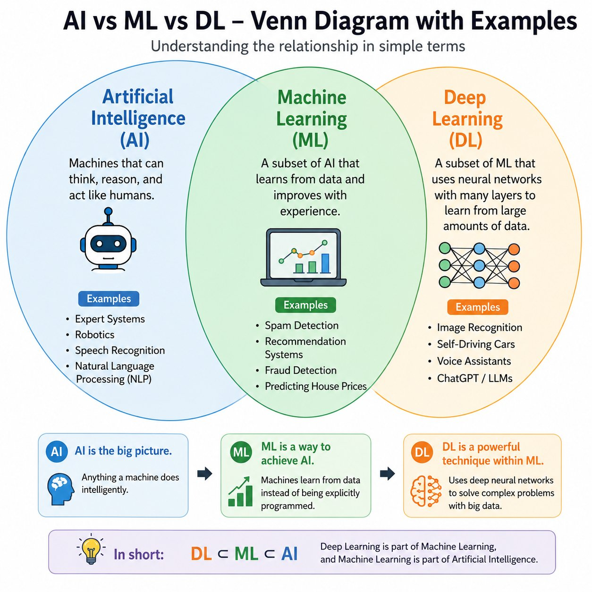
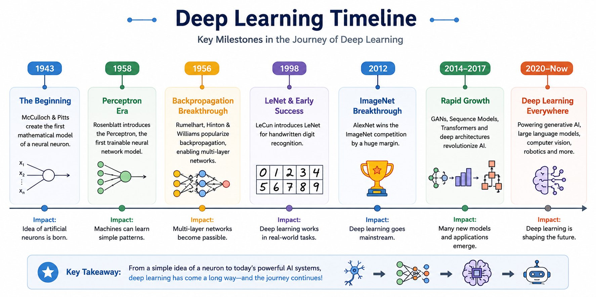
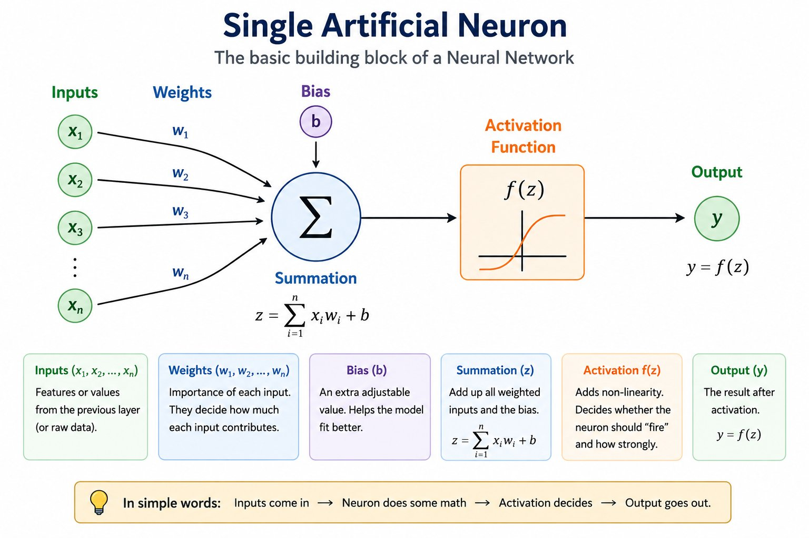
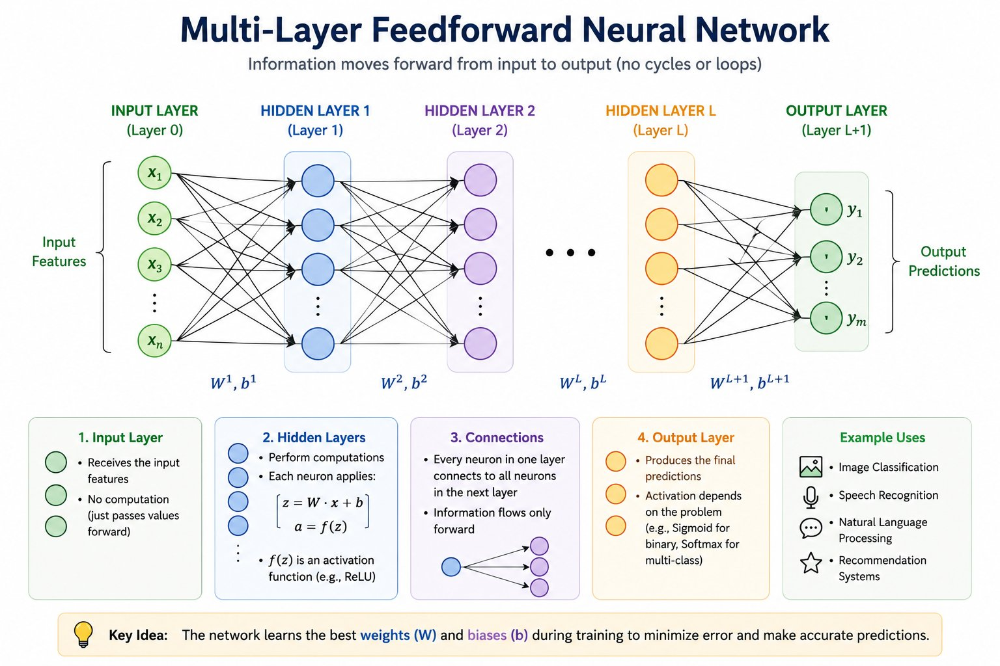
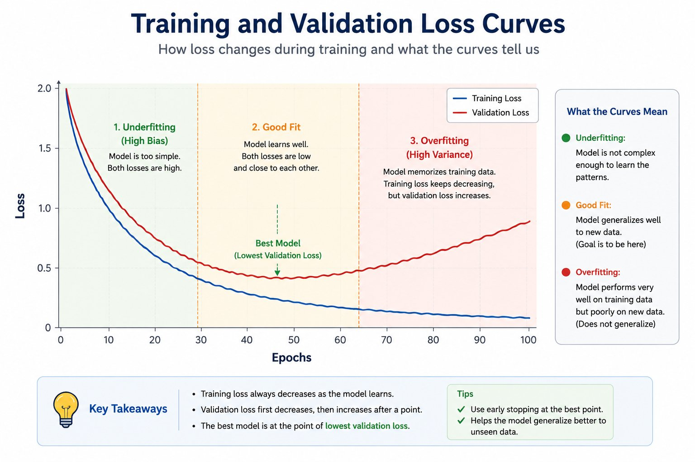
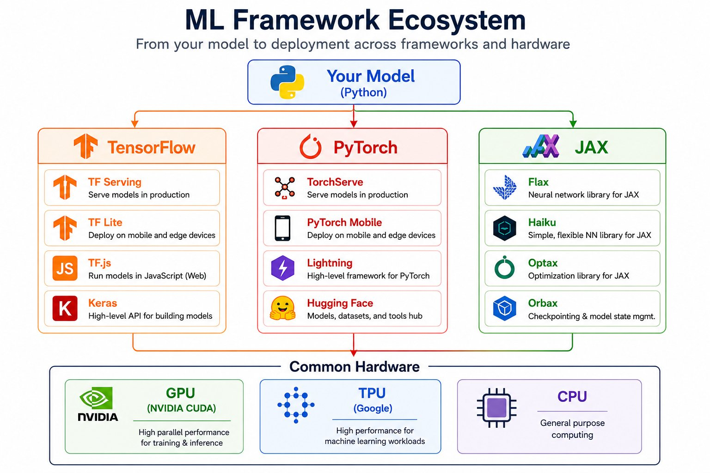
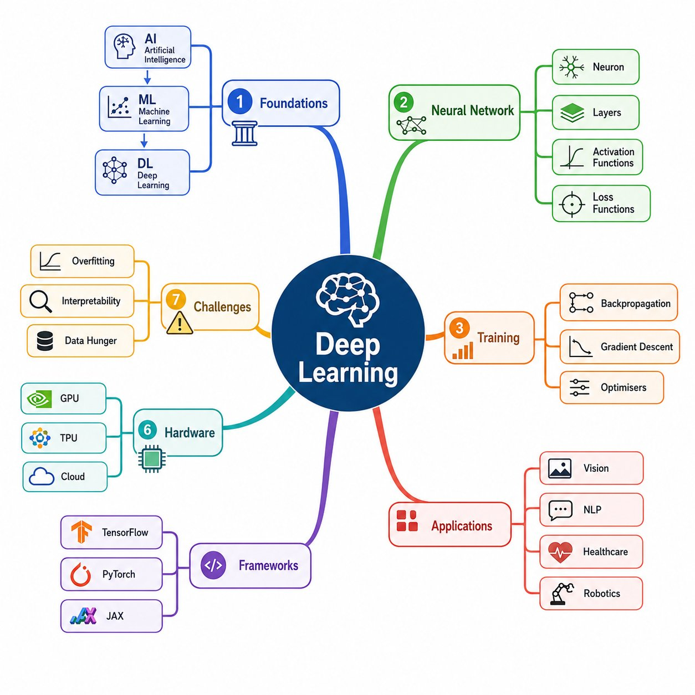

# Module 1: Introduction to Deep Learning
### A Comprehensive Technical Reference for Students, Engineers, and Researchers

---

## Executive Summary

Deep Learning is the engine powering the modern AI revolution — from the voice assistant on your phone to the algorithms diagnosing cancer in hospitals. This document provides a rigorous, layered introduction to Deep Learning: what it is, how it relates to Artificial Intelligence and Machine Learning, where it came from, and how it is used today.

Whether you are a B.Tech first-year student encountering neural networks for the first time, a final-year student preparing for placement interviews, a working engineer looking to solidify your foundations, or a researcher seeking historical and mathematical depth — this document is written for you.

---

## Learning Outcomes

After reading this document, the learner should be able to:

- Clearly define Deep Learning and distinguish it from Artificial Intelligence and Machine Learning.
- Explain the historical milestones that shaped the evolution of Deep Learning.
- Describe neural network intuition using real-world analogies and biological inspiration.
- Identify suitable real-world use cases for Deep Learning.
- Understand the high-level training pipeline, from raw data to deployed model.
- Compare and evaluate popular Deep Learning frameworks (TensorFlow, PyTorch, Keras, JAX).
- Understand the role of hardware accelerators — GPUs and TPUs — in Deep Learning.
- Confidently answer beginner-to-advanced interview questions on Deep Learning fundamentals.

---

## Table of Contents

1. [Introduction — Why Deep Learning Matters](#1-introduction)
2. [Fundamental Concepts — AI vs ML vs Deep Learning](#2-fundamental-concepts)
3. [History and Evolution](#3-history-and-evolution)
4. [Neural Network Intuition](#4-neural-network-intuition)
5. [Mathematical Foundations](#5-mathematical-foundations)
6. [The End-to-End Training Pipeline](#6-end-to-end-training-pipeline)
7. [Real-World Applications](#7-real-world-applications)
8. [Popular Frameworks](#8-popular-frameworks)
9. [GPUs and TPUs — The Hardware Behind Deep Learning](#9-gpus-and-tpus)
10. [Advantages](#10-advantages)
11. [Limitations](#11-limitations)
12. [Common Challenges](#12-common-challenges)
13. [Interview Preparation Section](#13-interview-preparation)
14. [Industry Perspective](#14-industry-perspective)
15. [Research Perspective](#15-research-perspective)
16. [Summary and Key Takeaways](#16-summary)
17. [References for Further Study](#17-references)

---

## 1. Introduction

### 1.1 Why Deep Learning Matters

Imagine you hand a photo of a cat to a three-year-old child. They immediately say "cat." Now imagine trying to write a set of rules for a computer to do the same thing: define whiskers, fur texture, ear shape, tail curvature. Within hours, you realise this task is impossibly hard to describe with explicit rules.

This is precisely the problem Deep Learning solves. Instead of writing rules, we give a Deep Learning system thousands of labelled photos of cats and non-cats, and it figures out the rules itself.

Deep Learning has transformed industries that were thought to be decades away from automation:

- A radiologist's assistant that flags tumours in X-rays with superhuman accuracy.
- Real-time language translation that breaks down communication barriers.
- Self-driving vehicles that navigate complex urban environments.
- AlphaFold solving the 50-year protein folding problem in biology.

Understanding Deep Learning is no longer optional for anyone working in technology. It is the most consequential computational paradigm of the 21st century.

### 1.2 Real-World Relevance

| Domain | Deep Learning Application |
|--------|--------------------------|
| Healthcare | Medical image diagnosis, drug discovery |
| Finance | Fraud detection, algorithmic trading |
| Automotive | Autonomous driving (Tesla, Waymo) |
| Agriculture | Crop disease detection via satellite |
| Entertainment | Netflix recommendation, deepfakes |
| Security | Face recognition, anomaly detection |
| Science | AlphaFold, climate modelling, particle physics |

---

### The AI Landscape — Concentric Circles



---

## 2. Fundamental Concepts

### 2.1 What is Artificial Intelligence?

**Intuition:**
Artificial Intelligence (AI) is the broad goal of making machines smart — smart enough to do things that normally require human intelligence: reasoning, planning, understanding language, recognising images, making decisions.

Think of AI as the overarching dream: machines that can think.

**Technical Explanation:**
AI is a field of computer science focused on building systems that can perform tasks that typically require human intelligence. AI includes rule-based expert systems, search algorithms, logic programming, and learning-based approaches.

> **Key insight:** Not all AI learns. Early AI systems were hard-coded with rules ("if temperature > 38°C, flag as fever"). They were intelligent in a limited sense, but brittle.

---

### 2.2 What is Machine Learning?

**Intuition:**
Machine Learning (ML) is a subset of AI where instead of programming the rules explicitly, we let the machine learn the rules from data.

Analogy: Imagine teaching a child to recognise spam emails. Instead of explaining every spam pattern, you show them 1,000 spam emails and 1,000 legitimate ones. They start to recognise patterns themselves. That is Machine Learning.

**Technical Explanation:**
ML is a method of data analysis that automates analytical model building. It is based on the idea that systems can learn from data, identify patterns, and make decisions with minimal human intervention.

ML algorithms include:
- **Supervised Learning:** Learn from labelled data (e.g., linear regression, SVMs, decision trees).
- **Unsupervised Learning:** Find structure in unlabelled data (e.g., k-means clustering, PCA).
- **Reinforcement Learning:** Learn through reward and punishment signals (e.g., Q-Learning, PPO).

> **Key limitation of classical ML:** Feature engineering. For images, audio, and text, humans had to manually design features (edges, frequency bins, TF-IDF). This was expensive and often failed on complex, high-dimensional data.

---

### 2.3 What is Deep Learning?

**Intuition:**
Deep Learning (DL) is a subset of ML that uses multi-layered artificial neural networks to automatically learn features from raw data — no manual feature engineering needed.

The word "deep" refers to the many layers (depth) of the neural network.

Analogy: Think of peeling an onion. Each layer of the onion reveals a deeper structure. Similarly, each layer of a deep neural network learns increasingly abstract representations of the data.
- Layer 1: Detects edges in an image.
- Layer 2: Combines edges into shapes.
- Layer 3: Combines shapes into object parts.
- Layer 4: Identifies the full object (a cat, a car, a face).

**Technical Explanation:**
Deep Learning models are artificial neural networks (ANNs) with many hidden layers. These networks learn hierarchical representations of data. The training is typically done using backpropagation and gradient descent on massive datasets, enabled by GPU acceleration.

---

### 2.4 Comparing AI, ML, and Deep Learning

| Feature | AI | Machine Learning | Deep Learning |
|--------|-----|-----------------|---------------|
| Definition | Broad goal of intelligent machines | Machines that learn from data | ML using deep neural networks |
| Approach | Rule-based or learned | Statistical patterns | Hierarchical feature learning |
| Data requirement | Low (rule-based) | Medium | Very High |
| Feature engineering | Manual | Manual | Automatic |
| Compute requirement | Low | Medium | Very High |
| Performance on unstructured data | Poor | Moderate | Excellent |
| Interpretability | High | Medium | Low |
| Examples | Chess engine, expert systems | Decision trees, SVMs | CNNs, Transformers, GANs |

---

### AI vs ML vs DL — Venn Diagram with Examples



---

### 2.5 Key Terminology

| Term | Meaning |
|------|---------|
| Neural Network (NN) | A computational model inspired by biological neurons |
| Layer | A group of neurons that process information at the same level |
| Weight | A learnable parameter that scales the input signal |
| Bias | A learnable offset added to each neuron's computation |
| Activation Function | A non-linear function applied to a neuron's output |
| Loss Function | A measure of how wrong the model's predictions are |
| Gradient Descent | Optimisation algorithm to minimise the loss function |
| Backpropagation | Algorithm to compute gradients and update weights |
| Epoch | One full pass through the entire training dataset |
| Batch Size | Number of samples processed before weights are updated |
| Learning Rate | The step size during gradient descent optimisation |
| Overfitting | Model memorises training data but fails on new data |
| Underfitting | Model fails to learn meaningful patterns from data |

---

## 3. History and Evolution

### 3.1 A Brief Timeline

Understanding the history helps you appreciate why deep learning works and why certain architectures became dominant. This is also a frequent discussion topic in research and senior-level interviews.

---

**1943 — The First Artificial Neuron (McCulloch & Pitts)**

Warren McCulloch and Walter Pitts proposed a mathematical model of a biological neuron. Their model was a binary threshold unit: if the weighted sum of inputs exceeded a threshold, the neuron "fired." This was the conceptual birth of artificial neurons.

---

**1958 — The Perceptron (Frank Rosenblatt)**

Frank Rosenblatt at Cornell University built the Perceptron — the first trainable neural network. It could learn to classify two-class linearly separable problems. Media called it "the machine that thinks." The US Navy funded the research hoping for autonomous target recognition.

---

**1969 — The First AI Winter (Minsky & Papert)**

Marvin Minsky and Seymour Papert published *Perceptrons*, proving that a single-layer perceptron cannot solve non-linearly separable problems like XOR. Funding dried up. This triggered the first "AI Winter."

> **Lesson:** A single layer of neurons is insufficient. Depth (multiple layers) is necessary for complexity.

---

**1986 — Backpropagation Rediscovered (Rumelhart, Hinton, Williams)**

David Rumelhart, Geoffrey Hinton, and Ronald Williams published the landmark paper on backpropagation — an efficient algorithm to train multi-layer networks using the chain rule of calculus. Multi-layer networks (now truly "deep") could finally be trained. This ended the first AI winter.

---

**1989 — Universal Approximation Theorem (Cybenko)**

George Cybenko proved that a neural network with just one hidden layer and sufficient neurons can approximate any continuous function to arbitrary precision. This gave theoretical justification for neural networks.

---

**1998 — LeNet-5 and Convolutional Neural Networks (LeCun)**

Yann LeCun at AT&T Bell Labs developed LeNet-5, a Convolutional Neural Network (CNN) that could read handwritten digits for cheque processing. CNNs exploit spatial structure in images through local connections and weight sharing — a revolutionary idea that reduced parameters dramatically.

---

**2006 — Deep Belief Networks and the Renaissance (Hinton)**

Geoffrey Hinton published "A Fast Learning Algorithm for Deep Belief Nets," showing that deep networks could be trained effectively by pre-training each layer greedily. This revived interest in deep networks after a second AI winter.

---

**2012 — AlexNet and the ImageNet Revolution**

Alex Krizhevsky, Ilya Sutskever, and Geoffrey Hinton trained AlexNet on two NVIDIA GTX 580 GPUs. It achieved a top-5 error rate of 15.3% on ImageNet, compared to 26.2% from the second-best entry. The gap was so large that the deep learning revolution began in earnest. Two key enablers: big data (ImageNet had 1.2M images) and GPU acceleration.

---

**2014 — Generative Adversarial Networks (Goodfellow)**

Ian Goodfellow introduced GANs — two networks competing against each other: a Generator that creates fake data and a Discriminator that tries to detect fakes. The result: photorealistic synthetic image generation.

---

**2017 — Attention is All You Need (Vaswani et al.)**

Google Brain published the Transformer architecture, replacing recurrence with pure attention mechanisms. Transformers parallelise training and capture long-range dependencies efficiently. This paper is arguably the most consequential AI paper of the decade — it led directly to BERT, GPT, T5, and the entire Large Language Model (LLM) revolution.

---

**2020–Present — Large Language Models (LLMs)**

OpenAI's GPT-3 (175 billion parameters), Google's PaLM, Anthropic's Claude, and Meta's LLaMA demonstrated that scale alone produces emergent capabilities. ChatGPT democratised access. The field entered a new era of Generative AI.

---

### Deep Learning Timeline — Key Milestones from 1943 to Now



---

## 4. Neural Network Intuition

### 4.1 The Biological Inspiration

The human brain contains approximately 86 billion neurons, each connected to thousands of other neurons. Neurons receive signals, process them, and transmit outputs to downstream neurons. The strength of the connections (synapses) changes with experience — this is how learning happens in the brain.

Artificial neural networks are a mathematical simplification of this biological system.

---

### 4.2 The Artificial Neuron (Perceptron)

**Intuition:**
Think of a neuron as a decision-making unit. It takes multiple inputs (like a committee receiving different opinions), weighs their importance, sums them up, and makes a decision: fire or not fire.

**Technical Explanation:**

A single artificial neuron computes:

```
z = w₁x₁ + w₂x₂ + ... + wₙxₙ + b
output = f(z)
```

Where:
- `x₁, x₂, ..., xₙ` are input features
- `w₁, w₂, ..., wₙ` are learnable weights
- `b` is a learnable bias
- `f` is the activation function (introduces non-linearity)
- `z` is the weighted sum (pre-activation)
- `output` is the post-activation value

---

### Single Artificial Neuron — The Basic Building Block of a Neural Network



---

### 4.3 From Single Neuron to Multi-Layer Network

**Intuition:**
One neuron is weak. A layer of neurons working together is powerful. Multiple layers of neurons, each building on the previous layer's output, is deep learning.

The structure of a standard feedforward neural network:

```
Input Layer → Hidden Layer 1 → Hidden Layer 2 → ... → Output Layer
```

- **Input Layer:** Receives raw features (pixel values, word embeddings, sensor readings).
- **Hidden Layers:** Learn intermediate representations. More layers = more abstract representations.
- **Output Layer:** Produces the final prediction (class probabilities, regression value, etc.).

---

### Multi-Layer Feedforward Neural Network — Information Flow from Input to Output



---

### 4.4 Why Depth Matters: The Power of Hierarchical Representations

Consider image recognition of faces:

| Layer | What It Learns |
|-------|---------------|
| Layer 1 | Edges and colour gradients |
| Layer 2 | Corners, curves, and simple shapes |
| Layer 3 | Eye shapes, nose outlines, lips |
| Layer 4 | Face components (eyes, nose, mouth) |
| Layer 5 | Full face identity |

This hierarchy is why deep networks outperform shallow ones on complex data. Each layer transforms the data into a more useful representation for the next layer.

---

## 5. Mathematical Foundations

### 5.1 The Neuron Equation

For a neuron in layer `l`:

```
zₗ = Wₗ · aₗ₋₁ + bₗ
aₗ = f(zₗ)
```

Where:
- `Wₗ` is the weight matrix for layer `l` (shape: [neurons_in_l × neurons_in_l-1])
- `aₗ₋₁` is the activation vector from the previous layer
- `bₗ` is the bias vector for layer `l`
- `f` is the element-wise activation function
- `aₗ` is the output activation of layer `l`

---

### 5.2 Activation Functions

Activation functions introduce non-linearity. Without them, a deep neural network collapses into a single linear transformation, no matter how many layers.

**Sigmoid:**
```
σ(z) = 1 / (1 + e^(-z))     Range: (0, 1)
```
*Used for:* Binary classification output. *Problem:* Vanishing gradients for large |z|.

**Tanh (Hyperbolic Tangent):**
```
tanh(z) = (eᶻ - e⁻ᶻ) / (eᶻ + e⁻ᶻ)     Range: (-1, 1)
```
*Used for:* Hidden layers in early networks. *Problem:* Still suffers from vanishing gradients.

**ReLU (Rectified Linear Unit):**
```
ReLU(z) = max(0, z)     Range: [0, ∞)
```
*Used for:* Default choice for hidden layers. *Problem:* Dying ReLU (neurons stuck at 0 if z always negative).

**Leaky ReLU:**
```
LeakyReLU(z) = max(αz, z)     where α is a small constant (e.g., 0.01)
```
*Used for:* Fixes dying ReLU problem.

**Softmax:**
```
Softmax(zᵢ) = e^(zᵢ) / Σⱼ e^(zⱼ)
```
*Used for:* Multi-class classification output. Converts raw scores to probabilities that sum to 1.

---

| Activation | Range | Common Use | Problem |
|-----------|-------|------------|---------|
| Sigmoid | (0,1) | Binary output | Vanishing gradient |
| Tanh | (-1,1) | Hidden layers (old) | Vanishing gradient |
| ReLU | [0,∞) | Hidden layers (default) | Dying ReLU |
| Leaky ReLU | (-∞,∞) | Hidden layers | Extra hyperparameter |
| Softmax | (0,1) sum=1 | Multi-class output | Expensive for large classes |

---

### 5.3 Loss Functions

The loss function measures how wrong the model's predictions are. Training minimises the loss.

**Mean Squared Error (MSE) — for regression:**
```
L = (1/n) Σᵢ (yᵢ - ŷᵢ)²
```
Where `yᵢ` is the true value and `ŷᵢ` is the predicted value.

**Binary Cross-Entropy — for binary classification:**
```
L = -(1/n) Σᵢ [yᵢ log(ŷᵢ) + (1-yᵢ) log(1-ŷᵢ)]
```

**Categorical Cross-Entropy — for multi-class classification:**
```
L = -(1/n) Σᵢ Σₖ yᵢₖ log(ŷᵢₖ)
```
Where the outer sum is over samples and the inner sum over classes.

*Intuition:* Cross-entropy penalises confident wrong predictions heavily. If the model says "90% chance it's a cat" but it's a dog, the penalty is large. If it says "55% chance it's a cat" and is wrong, the penalty is smaller.

---

### 5.4 Gradient Descent and Backpropagation

**Intuition:**
Imagine you are blindfolded on a hilly landscape. Your goal is to reach the lowest point (minimum loss). Gradient descent is your strategy: feel the slope beneath your feet and take a step in the downhill direction.

**Gradient Descent Update Rule:**
```
w ← w - η · (∂L/∂w)
```

Where:
- `w` is a weight parameter
- `η` (eta) is the learning rate (step size)
- `∂L/∂w` is the partial derivative of the loss with respect to `w` (the gradient)

**Backpropagation:**
Backpropagation is the algorithm that efficiently computes these gradients using the chain rule of calculus, propagating the error signal from the output layer back through the network to every weight.

```
∂L/∂w = (∂L/∂a) · (∂a/∂z) · (∂z/∂w)
```

This chain rule decomposition allows efficient computation layer by layer.

---

## 6. End-to-End Training Pipeline

### 6.1 Workflow Overview

```
Raw Data Collection
        ↓
Data Cleaning and Preprocessing
        ↓
Exploratory Data Analysis (EDA)
        ↓
Dataset Splitting (Train / Validation / Test)
        ↓
Model Architecture Design
        ↓
Weight Initialisation
        ↓
Forward Pass (Compute Predictions)
        ↓
Loss Computation
        ↓
Backward Pass (Backpropagation — Compute Gradients)
        ↓
Weight Update (Gradient Descent / Adam / RMSProp)
        ↓
Repeat for N Epochs
        ↓
Evaluation on Validation Set (Tune Hyperparameters)
        ↓
Final Evaluation on Test Set
        ↓
Model Deployment
```

---

### 6.2 Step-by-Step Explanation

**Step 1 — Raw Data Collection:**
Gather data relevant to the problem. For image tasks: image datasets (ImageNet, CIFAR-10). For NLP: text corpora (Common Crawl, Wikipedia). For tabular: CSV files from databases.

**Step 2 — Data Preprocessing:**
- Normalise pixel values to [0, 1] or [-1, 1].
- Tokenise text, pad sequences.
- Handle missing values.
- Augment data (rotations, flips) to artificially expand training set.

**Step 3 — Dataset Splitting:**

| Split | Typical Proportion | Purpose |
|-------|-------------------|---------|
| Training set | 70–80% | Teach the model (adjust weights) |
| Validation set | 10–15% | Tune hyperparameters |
| Test set | 10–15% | Final unbiased evaluation |

**Step 4 — Model Design:**
Choose the architecture based on the data type:
- Images → Convolutional Neural Networks (CNNs)
- Sequences (text, audio) → RNNs, LSTMs, or Transformers
- Tabular data → Feedforward Networks or Gradient Boosting

**Step 5 — Training Loop:**
For each epoch:
1. Sample a mini-batch of data.
2. Forward pass: compute predictions.
3. Compute loss.
4. Backward pass: compute gradients via backpropagation.
5. Update weights using the optimiser (SGD, Adam).

**Step 6 — Evaluation and Deployment:**
- Monitor training and validation loss curves.
- Detect overfitting (train loss falls, validation loss rises).
- Adjust hyperparameters: learning rate, batch size, regularisation.
- Once satisfied, evaluate on the held-out test set — this number is your model's real-world performance estimate.

---

### Training and Validation Loss Curves — How Loss Changes During Training



---

## 7. Real-World Applications

### 7.1 Computer Vision

**Industry examples:**
- **Google Photos:** Automatic photo tagging and face recognition using CNNs.
- **Tesla Autopilot:** Real-time object detection (cars, pedestrians, signs) using custom CNN architectures on embedded hardware.
- **Instagram/Facebook:** Automatic content moderation using image classifiers trained on millions of labelled examples.

**Research examples:**
- **Medical imaging:** CNNs detecting diabetic retinopathy from fundus photographs (Google Health, 2019) with ophthalmologist-level accuracy.
- **Satellite imagery:** Deep learning models detecting illegal deforestation and oil spills in near real-time.

**Product examples:**
- Apple Face ID: 3D facial recognition using neural networks on the Neural Engine chip.
- Google Lens: Real-time object identification and translation from camera images.

---

### 7.2 Natural Language Processing (NLP)

**Industry examples:**
- **Google Translate:** Transformer-based neural machine translation handling 100+ language pairs.
- **Gmail Smart Reply / Smart Compose:** LSTM and Transformer models predicting email continuations.
- **Amazon Alexa / Google Assistant:** End-to-end deep learning pipelines for speech-to-text, intent recognition, and text-to-speech.

**Research examples:**
- BERT (Bidirectional Encoder Representations from Transformers) — fine-tuned on 11 NLP benchmarks, achieving state-of-the-art on all of them in 2018.
- GPT-4 demonstrating emergent in-context learning — solving tasks never seen during training.

---

### 7.3 Healthcare and Life Sciences

- **DeepMind AlphaFold:** Predicted 3D structures of 200 million proteins — solving biology's 50-year grand challenge.
- **Paige AI:** FDA-cleared deep learning system for prostate cancer detection in pathology slides.
- **ECG interpretation:** Deep learning models (Stanford, 2019) diagnosing 14 types of arrhythmia from ECG signals with cardiologist-level accuracy.

---

### 7.4 Autonomous Systems and Robotics

- **Waymo (Google):** LIDAR point cloud processing with 3D CNNs for autonomous vehicle navigation.
- **Boston Dynamics:** Reinforcement learning for robot locomotion and task execution.
- **Drone navigation:** Deep learning for obstacle avoidance in GPS-denied environments.

---

### 7.5 Generative AI

- **DALL-E 3 / Midjourney / Stable Diffusion:** Diffusion models and Transformers generating photorealistic images from text prompts.
- **GitHub Copilot:** Code generation using GPT-based models trained on billions of lines of code.
- **Suno / Udio:** Music generation from text descriptions using transformer-based audio models.

---

## 8. Popular Frameworks

### 8.1 Framework Overview

Frameworks are libraries that abstract away the mathematical details of building and training neural networks. They handle automatic differentiation (computing gradients), GPU parallelism, and optimised low-level operations (matrix multiplications on CUDA).

---

### 8.2 TensorFlow (Google)

- **Released:** 2015
- **Philosophy:** Production-first, deployment-ready.
- **Key features:** TensorFlow Serving, TensorFlow Lite (mobile), TensorFlow.js (browser), TF Extended (ML pipelines).
- **Syntax style:** Static computation graphs (TF 1.x) → Eager execution (TF 2.x, Keras API).
- **Best for:** Industry-scale deployment, mobile and edge inference, large organisations with ML infrastructure.

```python
import tensorflow as tf

model = tf.keras.Sequential([
    tf.keras.layers.Dense(128, activation='relu'),
    tf.keras.layers.Dense(10, activation='softmax')
])
model.compile(optimizer='adam', loss='sparse_categorical_crossentropy', metrics=['accuracy'])
model.fit(X_train, y_train, epochs=10)
```

---

### 8.3 PyTorch (Meta / Facebook)

- **Released:** 2016
- **Philosophy:** Research-first, Pythonic, dynamic computation graphs.
- **Key features:** Dynamic graphs (define-by-run), torch.autograd, TorchScript for production, PyTorch Lightning for cleaner code.
- **Best for:** Academic research, rapid prototyping, custom architectures.
- **Dominance:** As of 2024, PyTorch is used in over 70% of ML research papers.

```python
import torch
import torch.nn as nn

class SimpleNet(nn.Module):
    def __init__(self):
        super().__init__()
        self.fc1 = nn.Linear(784, 128)
        self.fc2 = nn.Linear(128, 10)

    def forward(self, x):
        x = torch.relu(self.fc1(x))
        return self.fc2(x)

model = SimpleNet()
```

---

### 8.4 Keras

- Originally a standalone high-level API, now integrated as `tf.keras` within TensorFlow.
- Provides the simplest interface for building neural networks.
- Ideal for beginners and rapid experimentation.

---

### 8.5 JAX (Google DeepMind)

- **Released:** 2018
- **Philosophy:** NumPy-compatible, functional programming, extreme performance.
- **Key features:** Just-In-Time (JIT) compilation, automatic vectorisation (`vmap`), automatic differentiation (`grad`), hardware-agnostic (CPU/GPU/TPU).
- **Best for:** Research requiring extreme performance, custom gradient computations, hardware-specific optimisation.
- Used by Google DeepMind for AlphaFold and Gemini.

---

### 8.6 Framework Comparison

| Feature | TensorFlow | PyTorch | JAX |
|---------|-----------|---------|-----|
| Ease of use | Medium | High | Low (for beginners) |
| Research adoption | Medium | Very High | Growing |
| Industry adoption | Very High | High | Growing |
| Mobile deployment | Excellent (TF Lite) | Good (ExecuTorch) | Limited |
| Graph type | Static/Dynamic | Dynamic | Functional / JIT |
| Best hardware | GPU/TPU | GPU | GPU/TPU |
| Debugging | Harder | Pythonic / Easy | Moderate |

---

### ML Framework Ecosystem — From Your Model to Deployment



---

## 9. GPUs and TPUs

### 9.1 Why Special Hardware?

Training a modern deep learning model requires billions of floating-point multiplications every second. A standard CPU (Central Processing Unit) has 8–64 cores optimised for sequential, complex tasks. A GPU has thousands of simpler cores optimised for massively parallel computation — perfect for matrix multiplications that dominate neural network training.

**Analogy:** A CPU is like a handful of expert professors solving one problem at a time. A GPU is like a lecture hall of 10,000 students all solving the same simple problem simultaneously.

---

### 9.2 GPU (Graphics Processing Unit)

Originally designed for rendering graphics (video games), GPUs turned out to be perfect for deep learning because both tasks require the same operation: massive parallel matrix multiplications.

**Key GPU manufacturers for deep learning:**
- **NVIDIA:** Dominates the market. Key products: RTX 4090 (consumer), A100, H100, H200 (data centre).
- **AMD:** ROCm platform, MI300X for AI.

**CUDA:** NVIDIA's parallel computing platform and programming model that enables deep learning frameworks to run on NVIDIA GPUs.

| GPU | Use Case | Memory | Price Range |
|-----|---------|--------|-------------|
| RTX 4090 | High-end consumer / researcher | 24 GB | ~$2,000 |
| A100 | Enterprise training | 80 GB | ~$10,000+ |
| H100 | Frontier AI training | 80 GB HBM3 | ~$30,000+ |
| H200 | Latest generation | 141 GB HBM3e | ~$35,000+ |

---

### 9.3 TPU (Tensor Processing Unit)

Google designed TPUs specifically for neural network matrix operations. They use bfloat16 precision and have a unique architecture with systolic arrays optimised for tensor contractions.

- **TPU v4:** 275 TFLOPS (trillions of floating point operations per second) per chip.
- **TPU v5p:** Massive pod configurations for training 100B+ parameter models.
- **Access:** Available through Google Cloud and Google Colab (free tier offers limited TPU access).

**GPU vs TPU:**

| Feature | GPU (NVIDIA H100) | TPU (v4) |
|---------|------------------|----------|
| Vendor | NVIDIA | Google |
| Flexibility | General-purpose | Optimised for TensorFlow/JAX |
| Memory | 80 GB HBM3 | 32 GB HBM |
| Best framework | PyTorch / TF / JAX | TensorFlow / JAX |
| Availability | Cloud + on-premise | Google Cloud only |
| Cost | High | High (pay per use) |

---

### 9.4 Cloud Access for Students

You do not need to buy a $30,000 GPU to get started with deep learning.

| Platform | Free GPU/TPU | Notes |
|---------|-------------|-------|
| Google Colab | Yes (T4 GPU, limited TPU) | Time-limited sessions |
| Kaggle | Yes (P100 GPU, 30hr/week) | No session time limits |
| Hugging Face Spaces | Yes (limited) | Good for demos |
| AWS / GCP / Azure | Paid (free tier credits) | Best for serious training |

---

## 10. Advantages

- **Automatic Feature Learning:** Deep networks learn features directly from raw data, eliminating expensive manual feature engineering.
- **Scalability with Data:** Unlike traditional ML, deep learning performance continues to improve as you add more data. More data = better model.
- **Versatility:** The same fundamental architecture (Transformers) now works for text, images, audio, video, protein sequences, and more.
- **State-of-the-Art Performance:** On virtually every benchmark for vision, language, speech, and games, deep learning holds the top positions.
- **Transfer Learning:** Models pre-trained on large datasets can be fine-tuned for specific tasks with small data, dramatically reducing training cost.
- **End-to-End Learning:** The entire pipeline — from raw input to final output — can be trained jointly, optimising the full system rather than individual components.

---

## 11. Limitations

- **Data Hungry:** Deep learning requires large amounts of labelled data to perform well. In low-data regimes, classical ML often outperforms deep networks.
- **Computationally Expensive:** Training large models requires expensive GPU clusters and consumes significant energy. GPT-3 training cost approximately $4.6 million.
- **Black Box (Low Interpretability):** It is difficult to understand why a deep network makes a particular prediction. This limits adoption in high-stakes domains (healthcare, finance, law) where explanations are legally required.
- **Prone to Overfitting:** Without proper regularisation (dropout, weight decay, data augmentation), deep networks memorise the training data.
- **Adversarial Vulnerability:** Small, imperceptible perturbations to inputs can completely fool deep networks. An image of a panda can be misclassified as a gibbon with pixel-level noise.
- **Requires Expertise:** Designing, training, and debugging deep networks requires significant expertise in architecture selection, hyperparameter tuning, and distributed training.
- **Poor Uncertainty Calibration:** Deep networks are often overconfident — they assign high probabilities to wrong predictions.

---

## 12. Common Challenges

| Challenge | Description | Common Solutions |
|-----------|-------------|-----------------|
| Vanishing Gradients | Gradients become very small in early layers, slowing or stopping learning | ReLU activations, batch normalisation, residual connections |
| Exploding Gradients | Gradients become very large, causing unstable training | Gradient clipping, proper weight initialisation |
| Overfitting | Model memorises training data | Dropout, L2 regularisation, data augmentation, early stopping |
| Underfitting | Model too simple to learn patterns | Increase model capacity, train longer, improve features |
| Hyperparameter Sensitivity | Results highly sensitive to learning rate, batch size | Learning rate schedulers, systematic hyperparameter search |
| Data Imbalance | Some classes have far fewer samples | Oversampling (SMOTE), class weighting, focal loss |
| Training Instability | Loss diverges or oscillates | Gradient clipping, lower learning rate, better initialisation |
| Covariate Shift | Train and test distributions differ | Batch normalisation, domain adaptation |

---

## 13. Interview Preparation

### 13.1 Beginner Questions

**Q1: What is Deep Learning?**

*Answer:* Deep Learning is a subset of Machine Learning that uses artificial neural networks with multiple layers (hence "deep") to automatically learn hierarchical representations of data. Unlike traditional ML, deep learning does not require manual feature engineering — it learns features directly from raw data.

*Follow-up:* How is Deep Learning different from Machine Learning?
*Answer:* ML requires hand-crafted features and works well with structured, low-dimensional data. DL automatically learns features from raw, high-dimensional, unstructured data (images, text, audio) but requires large datasets and significant compute.

---

**Q2: What is an artificial neuron?**

*Answer:* An artificial neuron computes a weighted sum of its inputs, adds a bias, and passes the result through a non-linear activation function. Mathematically: `output = f(Wx + b)`. It is inspired by the biological neuron, which fires an electrical signal when the sum of incoming signals exceeds a threshold.

---

**Q3: What is the role of an activation function?**

*Answer:* Activation functions introduce non-linearity into the network. Without them, a multi-layer network is mathematically equivalent to a single linear transformation, regardless of depth. Non-linearity allows the network to learn complex, non-linear mappings from input to output.

*Frequently made mistake:* Saying activation functions "control the output range." While some do (sigmoid → (0,1), tanh → (-1,1)), the primary role is non-linearity, not range restriction.

---

**Q4: What is the difference between a parameter and a hyperparameter?**

*Answer:*
- **Parameter:** A value learned from data during training (weights and biases).
- **Hyperparameter:** A configuration choice made before training that controls the learning process (learning rate, batch size, number of layers, number of neurons, dropout rate).

---

**Q5: What is overfitting and how do you prevent it?**

*Answer:* Overfitting occurs when a model performs well on training data but poorly on unseen data — it has memorised the training set rather than learning general patterns.

Prevention strategies:
- **Dropout:** Randomly disable neurons during training, forcing redundant representations.
- **L2 Regularisation (Weight Decay):** Penalise large weights in the loss function.
- **Data Augmentation:** Artificially expand the training set with transformations.
- **Early Stopping:** Stop training when validation loss starts increasing.
- **Reduce model complexity:** Fewer layers or fewer neurons.

---

### 13.2 Intermediate Questions

**Q6: Why is ReLU preferred over Sigmoid in hidden layers?**

*Answer:* Sigmoid suffers from the vanishing gradient problem — for very large or very small inputs, the gradient (derivative) is nearly zero, causing no learning signal in early layers. ReLU has a gradient of 1 for all positive inputs, avoiding vanishing gradients. ReLU is also computationally cheaper (a simple max operation).

---

**Q7: What is backpropagation?**

*Answer:* Backpropagation is the algorithm used to compute the gradients of the loss function with respect to every weight in the network. It works by applying the chain rule of calculus from the output layer backward to the input layer. These gradients are then used by an optimiser (like gradient descent) to update the weights.

*Follow-up:* What is the vanishing gradient problem in the context of backpropagation?
*Answer:* In deep networks with sigmoid activations, gradients are multiplied repeatedly through many layers. Since sigmoid gradients are less than 1, repeated multiplication makes them exponentially small by the time they reach early layers, causing slow or no learning in those layers.

---

**Q8: What is the difference between batch gradient descent, stochastic gradient descent, and mini-batch gradient descent?**

| Type | Samples per Update | Speed | Stability |
|------|-------------------|-------|-----------|
| Batch GD | Full dataset | Slow | Stable |
| Stochastic GD (SGD) | 1 sample | Fast | Noisy |
| Mini-Batch GD | N samples (e.g., 32, 64) | Balanced | Balanced |

*In practice:* Mini-batch gradient descent (typically called "SGD" in the literature) is the standard, with batch sizes of 32–512.

---

**Q9: What is the Universal Approximation Theorem?**

*Answer:* The Universal Approximation Theorem (Cybenko, 1989; Hornik, 1991) states that a feedforward network with a single hidden layer containing a sufficient number of neurons and a non-linear activation function can approximate any continuous function to arbitrary precision, given enough neurons. This provides theoretical justification for neural networks as universal function approximators.

*Important caveat:* The theorem guarantees the existence of such a network but says nothing about how to find it (i.e., how to train it efficiently).

---

### 13.3 Advanced Questions

**Q10: What is the dying ReLU problem and how do you fix it?**

*Answer:* A ReLU neuron "dies" when it consistently receives negative inputs. Since ReLU outputs 0 for negative inputs and has a gradient of 0 there, the neuron stops learning — its weights never update. This can happen if the learning rate is too high or weights are poorly initialised.

*Solutions:*
- **Leaky ReLU:** `f(z) = max(0.01z, z)` — allows a small gradient for negative inputs.
- **Parametric ReLU (PReLU):** The negative slope is learned.
- **ELU / SELU:** Exponential variants with non-zero gradients for negative inputs.
- **Careful initialisation:** He initialisation for ReLU networks.

---

**Q11: Explain the concept of transfer learning.**

*Answer:* Transfer learning is the practice of reusing a model trained on a large dataset (source domain) as a starting point for training on a smaller, related dataset (target domain). Instead of training from scratch, we "transfer" the learned feature representations.

Types:
- **Fine-tuning:** Update all or some weights of the pre-trained model on the new dataset.
- **Feature extraction:** Freeze all pre-trained layers; train only a new classification head.

*Why it works:* Early layers of CNNs learn general features (edges, textures) that transfer well across domains. Later layers learn task-specific features that need fine-tuning.

*Example:* A model pre-trained on ImageNet (1.2M images, 1000 classes) fine-tuned on a medical imaging dataset of 500 X-rays achieves much better results than training from scratch on 500 images.

---

### 13.4 Research and Scenario Questions

**Q12: If your model has high training accuracy but low test accuracy, what would you do?**

*Scenario analysis — this is an overfitting problem. Step-by-step diagnosis:*
1. Check the train/validation/test data split — ensure no leakage.
2. Apply dropout (start with 0.2–0.5 in hidden layers).
3. Add L2 regularisation (weight decay = 1e-4 to 1e-3).
4. Augment training data (for images: random crops, flips, colour jitter).
5. Reduce model complexity (fewer layers or neurons).
6. Use early stopping based on validation loss.
7. Collect more training data if possible.

---

**Q13: Why is data preprocessing important in deep learning?**

*Answer:* Deep networks are sensitive to the scale of inputs. If one feature has values in [0, 1000] and another in [0, 1], the network will disproportionately focus on the large-scale feature. Normalisation (scaling to [0,1]) or standardisation (zero mean, unit variance) ensures all features contribute equally to learning and accelerates convergence.

Additionally, without normalisation, gradients for different weights will have vastly different magnitudes, making gradient descent unstable.

---

### 13.5 Common Interview Mistakes

| Mistake | Why It's Wrong | Correct Statement |
|---------|---------------|-------------------|
| "More layers always = better" | Can cause overfitting or vanishing gradients | More layers help up to a point; must balance depth with regularisation |
| "ReLU is always best" | Dying ReLU is real; different tasks need different activations | ReLU is a good default; use Leaky ReLU or GELU for known issues |
| "Big batch size is always better" | Large batches can hurt generalisation (sharp minima) | Smaller batches provide noisy gradients that often generalise better |
| "Loss on training set = model quality" | Overfitting is invisible from training loss alone | Always evaluate on held-out test data |
| "Deep learning works for all problems" | Small datasets, tabular data, interpretability needs may favour classical ML | Deep learning shines on large, complex, unstructured data |

---

## 14. Industry Perspective

### 14.1 How Companies Use Deep Learning

**Product companies (Google, Meta, Amazon):**
- Maintain dedicated research teams (Google Brain, Meta AI, Amazon Science).
- Train massive foundation models internally.
- Deploy models at scale through specialised inference infrastructure.
- Use A/B testing to measure model impact on business metrics.

**Healthcare companies:**
- Use FDA-cleared or CE-marked AI tools with regulatory compliance.
- Require explainability (SHAP, Grad-CAM) for clinical acceptance.
- Deal with smaller datasets due to privacy constraints — use transfer learning and federated learning.

**Startups:**
- Rarely train models from scratch.
- Fine-tune open-source foundation models (Llama, Mistral, CLIP, Stable Diffusion).
- Deploy on cloud APIs (OpenAI, Anthropic, Google Vertex AI).

---

### 14.2 Production Considerations

| Consideration | Details |
|--------------|---------|
| Latency requirements | Real-time systems need <50ms inference; batch systems are less constrained |
| Model compression | Quantisation (INT8), pruning, knowledge distillation reduce inference cost |
| Monitoring | Track data drift, model performance degradation in production |
| Versioning | ML model registries (MLflow, Weights & Biases) track model versions |
| Reproducibility | Fixed seeds, logging hyperparameters, tracking dataset versions |
| Compliance | GDPR, HIPAA may restrict data use and require model explainability |

---

### 14.3 The Modern MLOps Stack

```
Data Engineering:  Apache Spark, Databricks, dbt
Experiment Tracking:  MLflow, Weights & Biases, Neptune
Model Training:  PyTorch, TensorFlow, JAX on GPU clusters
Model Registry:  MLflow, Hugging Face Hub
Model Serving:  TorchServe, TF Serving, Triton Inference Server
Monitoring:  Evidently AI, Arize, Whylogs
Orchestration:  Airflow, Kubeflow, Prefect
```

---

## 15. Research Perspective

### 15.1 Current Limitations (Open Problems)

**1. Data Efficiency:**
Humans learn to recognise a new object from one or a few examples. Deep networks need thousands. One-shot and few-shot learning remain active research areas.

**2. Interpretability and Explainability:**
Current deep networks are black boxes. Research in Explainable AI (XAI) — SHAP, LIME, Grad-CAM, mechanistic interpretability — aims to understand what networks learn but has not yet provided complete, reliable explanations.

**3. Robustness:**
Deep networks fail catastrophically on distribution shift (train distribution ≠ test distribution) and adversarial examples. Building robustly reliable systems remains unsolved.

**4. Reasoning and Compositionality:**
LLMs can generate fluent text but often fail on multi-step logical reasoning, arithmetic, and spatial tasks. Integrating symbolic reasoning with neural networks (neurosymbolic AI) is a major open area.

**5. Catastrophic Forgetting:**
When trained on new tasks, deep networks forget previously learned tasks. Continual or lifelong learning without forgetting remains unsolved at scale.

---

### 15.2 Recent Breakthroughs (2022–2024)

- **Diffusion Models (DALL-E 3, Stable Diffusion 3):** Replaced GANs as the state-of-the-art for image generation, offering more stable training and higher quality.
- **Mixture of Experts (MoE):** Sparse models where only a subset of parameters are active per input. GPT-4 and Gemini reportedly use MoE to achieve high capacity at manageable inference cost.
- **State Space Models (Mamba):** A new recurrent architecture that matches Transformer performance with linear (instead of quadratic) complexity in sequence length.
- **Multimodal Models (GPT-4V, Gemini 1.5 Pro):** Models processing text, images, audio, and video in a unified architecture.
- **Reasoning Models (o1, o3, DeepSeek-R1):** Models trained to reason step-by-step before answering, dramatically improving complex reasoning performance.

---

### 15.3 Future Research Directions

- **Efficient architectures:** Training and inference at a fraction of current compute.
- **Grounded world models:** AI that builds internal models of the physical world for better reasoning.
- **Autonomous AI agents:** Systems that plan, use tools, and complete complex multi-step tasks.
- **Neuromorphic computing:** Hardware mimicking the brain's spiking neural networks for ultra-low power AI.
- **Formal verification:** Proving properties (safety, fairness) of neural network behaviour.

---

## 16. Summary

### 16.1 Key Takeaways

- **Deep Learning is a subset of ML, which is a subset of AI.** The distinction lies in how features are learned: manually (classical AI/ML) vs. automatically (DL).
- **The key idea of deep learning is hierarchical representation learning** — each layer learns increasingly abstract features.
- **Neural networks are composed of neurons** that compute weighted sums of inputs, add biases, and apply non-linear activation functions.
- **Training a deep network involves:** Forward pass (compute predictions), loss computation, backward pass (backpropagation), and weight updates (gradient descent).
- **Deep learning became practical** thanks to three factors: big data (ImageNet), GPU acceleration (NVIDIA CUDA), and improved algorithms (ReLU, dropout, Adam optimiser).
- **PyTorch dominates research; TensorFlow dominates production.** Both are worth learning.
- **GPUs and TPUs are essential** for training large models — a task that would take years on a CPU takes hours on a GPU cluster.
- **Deep learning has real limitations:** It is data-hungry, computationally expensive, and hard to interpret.

---

### Deep Learning Mind Map — Complete Module Summary



---

## 17. References for Further Study

### Research Papers (Foundational)

- Rumelhart, D.E., Hinton, G.E., and Williams, R.J. (1986). "Learning Representations by Back-propagating Errors." *Nature.*
- LeCun, Y., Bottou, L., Bengio, Y., and Haffner, P. (1998). "Gradient-Based Learning Applied to Document Recognition." *Proceedings of the IEEE.*
- Krizhevsky, A., Sutskever, I., and Hinton, G.E. (2012). "ImageNet Classification with Deep Convolutional Neural Networks." *NeurIPS.*
- Goodfellow, I., et al. (2014). "Generative Adversarial Nets." *NeurIPS.*
- Vaswani, A., et al. (2017). "Attention is All You Need." *NeurIPS.*

### Books

- **Goodfellow, I., Bengio, Y., Courville, A.** — *Deep Learning* (MIT Press, 2016). Available free at deeplearningbook.org. The definitive textbook.
- **Géron, A.** — *Hands-On Machine Learning with Scikit-Learn, Keras, and TensorFlow* (O'Reilly, 3rd ed., 2022). Best practical guide.
- **Zhang, A., Lipton, Z.C., Li, M., Smola, A.J.** — *Dive into Deep Learning* (d2l.ai). Free, interactive, with code in PyTorch/TensorFlow/JAX.
- **Howard, J. and Gugger, S.** — *Deep Learning for Coders with fastai and PyTorch* (O'Reilly, 2020). Top-down, code-first approach.

### University Course Materials

- **Stanford CS231n** — Convolutional Neural Networks for Visual Recognition: cs231n.stanford.edu
- **Stanford CS224N** — NLP with Deep Learning: web.stanford.edu/class/cs224n
- **MIT 6.S191** — Introduction to Deep Learning: introtodeeplearning.com
- **fast.ai** — Practical Deep Learning for Coders: course.fast.ai

### Online Platforms and Documentation

- **PyTorch Official Tutorials:** pytorch.org/tutorials
- **TensorFlow Official Tutorials:** tensorflow.org/tutorials
- **Hugging Face Course:** huggingface.co/learn
- **Weights & Biases Courses:** wandb.ai/fully-connected

### Blogs and Articles

- **Andrej Karpathy's Blog:** karpathy.github.io — Deep, practical ML insights from former Director of AI at Tesla.
- **Distill.pub** — Interactive, beautifully illustrated deep learning research articles.
- **Colah's Blog** (Christopher Olah): colah.github.io — Exceptional visual explanations of LSTMs, CNNs, attention.
- **Sebastian Ruder's Blog:** ruder.io — Excellent coverage of NLP and optimisation research.

---

*Document prepared for B.E. AIML Placement Preparation — Module 1: Introduction to Deep Learning.*

*Next Module: Perceptrons, Activation Functions, and Training Fundamentals.*
